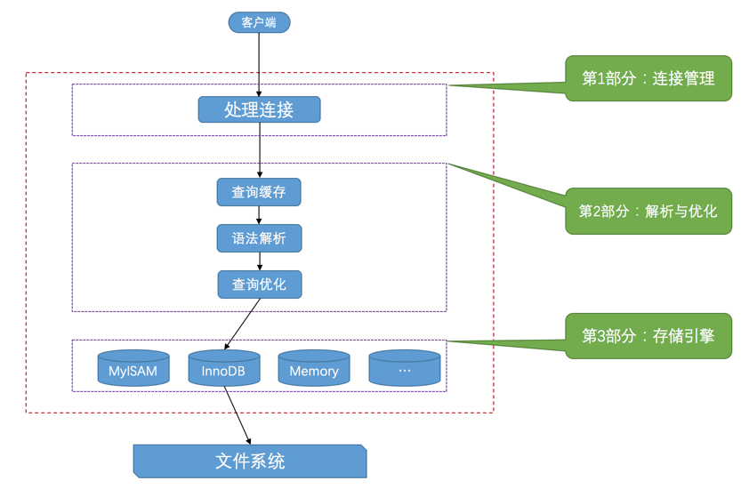

## Mysql 构成

[Mysql构成](mysql-structure.md)

## Mysql 查询处理流程





服务器程序处理来自客户端的查询请求大致需要经过三个部分，分别是连接管理、解析与优化、存储引擎

为了管理方便，人们把连接管理、查询缓存、语法解析、查询优化这些并不涉及真实数据存储的功能划分为MySQL server的功能，把真实存取数据的功能划分为存储引擎的功能。各种不同的存储引擎向上面的MySQL server层提供统一的调用接口（也就是存储引擎API），包含了几十个底层函数，像"读取索引第一条内容"、"读取索引下一条内容"、"插入记录"等等。

所以在MySQL server完成了查询优化后，只需按照生成的执行计划调用底层存储引擎提供的API，获取到数据后返回给客户端就好了。

::: tabs

<!-- -->
@tab 连接管理

>要点总结: 连接方式、线程管理、权限认证

客户端进程可以采用TCP/IP、命名管道或共享内存、Unix域套接字这几种方式之一来与服务器进程建立连接，每当有一个客户端进程连接到服务器进程时，服务器进程都会创建一个线程来专门处理与这个客户端的交互，当该客户端退出时会与服务器断开连接，服务器并不会立即把与该客户端交互的线程销毁掉，而是把它缓存起来，在另一个新的客户端再进行连接时，把这个缓存的线程分配给该新客户端。这样就起到了不频繁创建和销毁线程的效果，从而节省开销。从这一点大家也能看出，MySQL服务器会为每一个连接进来的客户端分配一个线程，但是线程分配的太多了会严重影响系统性能，所以我们也需要限制一下可以同时连接到服务器的客户端数量

在客户端程序发起连接的时候，需要携带主机信息、用户名、密码，服务器程序会对客户端程序提供的这些信息进行认证，如果认证失败，服务器程序会拒绝连接。另外，如果客户端程序和服务器程序不运行在一台计算机上，我们还可以采用使用了SSL（安全套接字）的网络连接进行通信，来保证数据传输的安全性。

当连接建立后，与该客户端关联的服务器线程会一直等待客户端发送过来的请求，MySQL服务器接收到的请求只是一个文本消息，该文本消息还要经过各种处理

<!-- -->
@tab 解析与优化

>要点总结: 查询缓存、语法解析和查询优化

当MySQL服务器已经获得了文本形式的请求后,接下来会进行一系列处理,其中的几个比较重要的部分分别是查询缓存、语法解析和查询优化


<!-- -->
@tab 存储引擎


有关存储引擎更多内容见 [Mysql 构成](./mysql-structure.md)

:::

## Mysql 使用规范

[Mysql使用规范](mysql-use.md)


## Mysql 字符集和排序规则


### 字符集分类

```mysql
SHOW (CHARACTER SET|CHARSET) [LIKE 匹配的模式];
```

其中CHARACTER SET和CHARSET是同义词，用任意一个都可以。

```mysql
mysql> SHOW CHARSET;
+----------+---------------------------------+---------------------+--------+
| Charset  | Description                     | Default collation   | Maxlen |
+----------+---------------------------------+---------------------+--------+
| big5     | Big5 Traditional Chinese        | big5_chinese_ci     |      2 |
...
| latin1   | cp1252 West European            | latin1_swedish_ci   |      1 |
| latin2   | ISO 8859-2 Central European     | latin2_general_ci   |      1 |
...
| ascii    | US ASCII                        | ascii_general_ci    |      1 |
...
| gb2312   | GB2312 Simplified Chinese       | gb2312_chinese_ci   |      2 |
...
| gbk      | GBK Simplified Chinese          | gbk_chinese_ci      |      2 |
| latin5   | ISO 8859-9 Turkish              | latin5_turkish_ci   |      1 |
...
| utf8     | UTF-8 Unicode                   | utf8_general_ci     |      3 |
| ucs2     | UCS-2 Unicode                   | ucs2_general_ci     |      2 |
...
| latin7   | ISO 8859-13 Baltic              | latin7_general_ci   |      1 |
| utf8mb4  | UTF-8 Unicode                   | utf8mb4_general_ci  |      4 |
| utf16    | UTF-16 Unicode                  | utf16_general_ci    |      4 |
| utf16le  | UTF-16LE Unicode                | utf16le_general_ci  |      4 |
...
| utf32    | UTF-32 Unicode                  | utf32_general_ci    |      4 |
| binary   | Binary pseudo charset           | binary              |      1 |
...
| gb18030  | China National Standard GB18030 | gb18030_chinese_ci  |      4 |
+----------+---------------------------------+---------------------+--------+
41 rows in set (0.01 sec)
```

>解读:
一共包括41种字符集,其中Default collation列表示这种字符集中一种默认的比较规则,Maxlen列代表该种字符集表示一个字符最多需要几个字节

以下列出几种常用的字符集:

| 字符集名称 | Maxlen |
| ---------- | ------ |
| `ascii`    | `1`    |
| `latin1`   | `1`    |
| `gb2312`   | `2`    |
| `gbk`      | `2`    |
| `utf8`     | `3`    |
| `utf8mb4`  | `4`    |


完整版如下:

```mysql
armscii8	ARMSCII-8 Armenian	armscii8_general_ci	1
ascii	US ASCII	ascii_general_ci	1
big5	Big5 Traditional Chinese	big5_chinese_ci	2
binary	Binary pseudo charset	binary	1
cp1250	Windows Central European	cp1250_general_ci	1
cp1251	Windows Cyrillic	cp1251_general_ci	1
cp1256	Windows Arabic	cp1256_general_ci	1
cp1257	Windows Baltic	cp1257_general_ci	1
cp850	DOS West European	cp850_general_ci	1
cp852	DOS Central European	cp852_general_ci	1
cp866	DOS Russian	cp866_general_ci	1
cp932	SJIS for Windows Japanese	cp932_japanese_ci	2
dec8	DEC West European	dec8_swedish_ci	1
eucjpms	UJIS for Windows Japanese	eucjpms_japanese_ci	3
euckr	EUC-KR Korean	euckr_korean_ci	2
gb18030	China National Standard GB18030	gb18030_chinese_ci	4
gb2312	GB2312 Simplified Chinese	gb2312_chinese_ci	2
gbk	GBK Simplified Chinese	gbk_chinese_ci	2
geostd8	GEOSTD8 Georgian	geostd8_general_ci	1
greek	ISO 8859-7 Greek	greek_general_ci	1
hebrew	ISO 8859-8 Hebrew	hebrew_general_ci	1
hp8	HP West European	hp8_english_ci	1
keybcs2	DOS Kamenicky Czech-Slovak	keybcs2_general_ci	1
koi8r	KOI8-R Relcom Russian	koi8r_general_ci	1
koi8u	KOI8-U Ukrainian	koi8u_general_ci	1
latin1	cp1252 West European	latin1_swedish_ci	1
latin2	ISO 8859-2 Central European	latin2_general_ci	1
latin5	ISO 8859-9 Turkish	latin5_turkish_ci	1
latin7	ISO 8859-13 Baltic	latin7_general_ci	1
macce	Mac Central European	macce_general_ci	1
macroman	Mac West European	macroman_general_ci	1
sjis	Shift-JIS Japanese	sjis_japanese_ci	2
swe7	7bit Swedish	swe7_swedish_ci	1
tis620	TIS620 Thai	tis620_thai_ci	1
ucs2	UCS-2 Unicode	ucs2_general_ci	2
ujis	EUC-JP Japanese	ujis_japanese_ci	3
utf16	UTF-16 Unicode	utf16_general_ci	4
utf16le	UTF-16LE Unicode	utf16le_general_ci	4
utf32	UTF-32 Unicode	utf32_general_ci	4
utf8mb3	UTF-8 Unicode	utf8mb3_general_ci	3
utf8mb4	UTF-8 Unicode	utf8mb4_0900_ai_ci	4
```

### 比较规则分类

- 比较规则介绍

比较规则的作用通常体现比较字符串大小的表达式以及对某个字符串列进行排序中，所以有时候也称为排序规则。比方说表t的列col使用的字符集是gbk，使用的比较规则是gbk_chinese_ci，我们向里边插入几条记录：

```mysql
mysql> INSERT INTO t(col) VALUES('a'), ('b'), ('A'), ('B');
Query OK, 4 rows affected (0.00 sec)
Records: 4  Duplicates: 0  Warnings: 0

```
我们查询的时候按照t列排序一下：

```mysql
mysql> SELECT * FROM t ORDER BY col;
+------+
| col  |
+------+
| a    |
| A    |
| b    |
| B    |
| 我   |
+------+
5 rows in set (0.00 sec)
```

可以看到在默认的比较规则gbk_chinese_ci中是不区分大小写的，我们现在把列col的比较规则修改为gbk_bin：

```mysql
mysql> ALTER TABLE t MODIFY col VARCHAR(10) COLLATE gbk_bin;
Query OK, 5 rows affected (0.02 sec)
Records: 5  Duplicates: 0  Warnings: 0
``````

由于gbk_bin是直接比较字符的编码，所以是区分大小写的，我们再看一下排序后的查询结果：

```mysql
mysql> SELECT * FROM t ORDER BY s;
+------+
| s    |
+------+
| A    |
| B    |
| a    |
| b    |
| 我   |
+------+
5 rows in set (0.00 sec)
```

所以，如果以后大家在对字符串做比较或者对某个字符串列做排序操作时，没有得到想象中的结果，需要思考一下是不是比较规则的问题。

```txt
小贴士：
列col中各个字符在使用gbk字符集编码后对应的数字如下：
'A' -> 65 （十进制）
'B' -> 66 （十进制）
'a' -> 97 （十进制）
'b' -> 98 （十进制）
'我' -> 25105 （十进制）
```

- 比较规则分类

```mysql
SHOW COLLATION [LIKE 匹配的模式];
```

由于列出各个字符集的所有比较规则占据篇幅太大，下面以utf8 为例:

```mysql
mysql> SHOW COLLATION LIKE 'utf8\_%';
+--------------------------+---------+-----+---------+----------+---------+
| Collation                | Charset | Id  | Default | Compiled | Sortlen |
+--------------------------+---------+-----+---------+----------+---------+
| utf8_general_ci          | utf8    |  33 | Yes     | Yes      |       1 |
| utf8_bin                 | utf8    |  83 |         | Yes      |       1 |
| utf8_unicode_ci          | utf8    | 192 |         | Yes      |       8 |
| utf8_icelandic_ci        | utf8    | 193 |         | Yes      |       8 |
| utf8_latvian_ci          | utf8    | 194 |         | Yes      |       8 |
| utf8_romanian_ci         | utf8    | 195 |         | Yes      |       8 |
| utf8_slovenian_ci        | utf8    | 196 |         | Yes      |       8 |
| utf8_polish_ci           | utf8    | 197 |         | Yes      |       8 |
| utf8_estonian_ci         | utf8    | 198 |         | Yes      |       8 |
| utf8_spanish_ci          | utf8    | 199 |         | Yes      |       8 |
| utf8_swedish_ci          | utf8    | 200 |         | Yes      |       8 |
| utf8_turkish_ci          | utf8    | 201 |         | Yes      |       8 |
| utf8_czech_ci            | utf8    | 202 |         | Yes      |       8 |
| utf8_danish_ci           | utf8    | 203 |         | Yes      |       8 |
| utf8_lithuanian_ci       | utf8    | 204 |         | Yes      |       8 |
| utf8_slovak_ci           | utf8    | 205 |         | Yes      |       8 |
| utf8_spanish2_ci         | utf8    | 206 |         | Yes      |       8 |
| utf8_roman_ci            | utf8    | 207 |         | Yes      |       8 |
| utf8_persian_ci          | utf8    | 208 |         | Yes      |       8 |
| utf8_esperanto_ci        | utf8    | 209 |         | Yes      |       8 |
| utf8_hungarian_ci        | utf8    | 210 |         | Yes      |       8 |
| utf8_sinhala_ci          | utf8    | 211 |         | Yes      |       8 |
| utf8_german2_ci          | utf8    | 212 |         | Yes      |       8 |
| utf8_croatian_ci         | utf8    | 213 |         | Yes      |       8 |
| utf8_unicode_520_ci      | utf8    | 214 |         | Yes      |       8 |
| utf8_vietnamese_ci       | utf8    | 215 |         | Yes      |       8 |
| utf8_general_mysql500_ci | utf8    | 223 |         | Yes      |       1 |
+--------------------------+---------+-----+---------+----------+---------+
27 rows in set (0.00 sec)
```

>解读:

比较规则名称构成: 字符集的名称 + 比较规则主要应用语言 + 比较规则是否区分语言中的重音、大小写名称等描述后缀。

例如: `utf8_polish_ci`表示以波兰语的规则比较，`utf8_spanish_ci`是以西班牙语的规则比较，`utf8_general_ci`是一种通用的比较规则

后缀描述类别表如下:

| 后缀   | 英文释义             | 描述             |
| ------ | -------------------- | ---------------- |
| `_ai`  | `accent insensitive` | 不区分重音       |
| `_as`  | `accent sensitive`   | 区分重音         |
| `_ci`  | `case insensitive`   | 不区分大小写     |
| `_cs`  | `case sensitive`     | 区分大小写       |
| `_bin` | `binary`             | 以二进制方式比较 |
|        |                      |                  |


### 字符集和比较规则级别

- 级别划分

MySQL有4个级别的字符集和比较规则，分别是：服务器级别、数据库级别、表级别、列级别

- 各级别字符集和比较规则设置

::: tabs
<!--服务器级别 -->
@tab 服务器级别

1、`MySQL`提供了两个系统变量来表示服务器级别的字符集和比较规则：

| 系统变量               | 描述                 |
| ---------------------- | -------------------- |
| `character_set_server` | 服务器级别的字符集   |
| `collation_server`     | 服务器级别的比较规则 |


2、服务器级别默认字符集、比较规则查看

```mysql
mysql> SHOW VARIABLES LIKE 'character_set_server';
+----------------------+-------+
| Variable_name        | Value |
+----------------------+-------+
| character_set_server | utf8  |
+----------------------+-------+
1 row in set (0.00 sec)

mysql> SHOW VARIABLES LIKE 'collation_server';
+------------------+-----------------+
| Variable_name    | Value           |
+------------------+-----------------+
| collation_server | utf8_general_ci |
+------------------+-----------------+
1 row in set (0.00 sec)
```

可以看到在我的计算机中服务器级别默认的字符集是`utf8`，默认的比较规则是`utf8_general_ci`。

3、修改服务器级别默认字符集、比较规则

可以在启动服务器程序时通过启动选项或者在服务器程序运行过程中使用`SET`语句修改这两个变量的值。
比如可以在配置文件中这样写：

```mysql
[server]
character_set_server=gbk
collation_server=gbk_chinese_ciCopy to clipboardErrorCopied
```

当服务器启动的时候读取这个配置文件后这两个系统变量的值便修改了。

<!--数据库级别 -->
@tab 数据库级别

1、指定数据库的字符集和比较规则

在创建和修改数据库的时候可以指定该数据库的字符集和比较规则，具体语法如下：
```
CREATE DATABASE 数据库名
    [[DEFAULT] CHARACTER SET 字符集名称]
    [[DEFAULT] COLLATE 比较规则名称];

ALTER DATABASE 数据库名
    [[DEFAULT] CHARACTER SET 字符集名称]
    [[DEFAULT] COLLATE 比较规则名称];
```

其中的`DEFAULT`可以省略，并不影响语句的语义。比方说我们新创建一个名叫`charset_demo_db`的数据库，在创建的时候指定它使用的字符集为`gb2312`，比较规则为`gb2312_chinese_ci`：

```
mysql> CREATE DATABASE charset_demo_db
    -> CHARACTER SET gb2312
    -> COLLATE gb2312_chinese_ci;
Query OK, 1 row affected (0.01 sec)Copy to clipboardErrorCopied
```

2、查看当前数据库使用的字符集和比较规则

如果想查看当前数据库使用的字符集和比较规则，可以查看下面两个系统变量的值（前提是使用`USE`语句选择当前默认数据库，如果没有默认数据库，则变量与相应的服务器级系统变量具有相同的值）：

| 系统变量                 | 描述                 |
| ------------------------ | -------------------- |
| `character_set_database` | 当前数据库的字符集   |
| `collation_database`     | 当前数据库的比较规则 |

查看一下刚刚创建的`charset_demo_db`数据库的字符集和比较规则：

```
mysql> USE charset_demo_db;
Database changed

mysql> SHOW VARIABLES LIKE 'character_set_database';
+------------------------+--------+
| Variable_name          | Value  |
+------------------------+--------+
| character_set_database | gb2312 |
+------------------------+--------+
1 row in set (0.00 sec)

mysql> SHOW VARIABLES LIKE 'collation_database';
+--------------------+-------------------+
| Variable_name      | Value             |
+--------------------+-------------------+
| collation_database | gb2312_chinese_ci |
+--------------------+-------------------+
1 row in set (0.00 sec)

```

  可以看到这个`charset_demo_db`数据库的字符集和比较规则就是我们在创建语句中指定的。需要注意的一点是： **character_set_database** 和 **collation_database** 这两个系统变量是只读的，**我们不能通过修改这两个变量的值而改变当前数据库的字符集和比较规则**。

3、使用服务器服务器级别的字符集和比较规则

数据库的创建语句中也可以不指定字符集和比较规则，比如这样：

```
CREATE DATABASE 数据库名;
```

这样的话，将使用服务器级别的字符集和比较规则作为数据库的字符集和比较规则。

<!--表级别 -->
@tab 表级别
1、指定表的字符集和比较规则

我们也可以在创建和修改表的时候指定表的字符集和比较规则，语法如下：

```
CREATE TABLE 表名 (列的信息)
    [[DEFAULT] CHARACTER SET 字符集名称]
    [COLLATE 比较规则名称]]

ALTER TABLE 表名
    [[DEFAULT] CHARACTER SET 字符集名称]
    [COLLATE 比较规则名称]
```

比方说我们在刚刚创建的`charset_demo_db`数据库中创建一个名为`t`的表，并指定这个表的字符集和比较规则：

```
mysql> CREATE TABLE t(
    ->     col VARCHAR(10)
    -> ) CHARACTER SET utf8 COLLATE utf8_general_ci;
Query OK, 0 rows affected (0.03 sec)
```

2、使用数据库级别的字符集和比较规则

如果创建和修改表的语句中没有指明字符集和比较规则，将使用该表所在数据库的字符集和比较规则作为该表的字符集和比较规则。假设我们的创建表`t`的语句是这么写的：

```
CREATE TABLE t(
    col VARCHAR(10)
);
```

因为表`t`的建表语句中并没有明确指定字符集和比较规则，则表`t`的字符集和比较规则将继承所在数据库`charset_demo_db`的字符集和比较规则，也就是`gb2312`和`gb2312_chinese_ci`。

<!--列级别 -->
@tab 列级别

1、指定列的字符集和比较规则

需要注意的是，对于存储字符串的列，同一个表中的不同的列也可以有不同的字符集和比较规则。我们在创建和修改列定义的时候可以指定该列的字符集和比较规则，语法如下：

```
CREATE TABLE 表名(
    列名 字符串类型 [CHARACTER SET 字符集名称] [COLLATE 比较规则名称],
    其他列...
);

ALTER TABLE 表名 MODIFY 列名 字符串类型 [CHARACTER SET 字符集名称] [COLLATE 比较规则名称];Copy to clipboardErrorCopied
```

比如我们修改一下表`t`中列`col`的字符集和比较规则可以这么写：

```
mysql> ALTER TABLE t MODIFY col VARCHAR(10) CHARACTER SET gbk COLLATE gbk_chinese_ci;
Query OK, 0 rows affected (0.04 sec)
Records: 0  Duplicates: 0  Warnings: 0
```

2、使用表级别的字符集和比较规则

对于某个列来说，如果在创建和修改的语句中没有指明字符集和比较规则，将使用该列所在表的字符集和比较规则作为该列的字符集和比较规则。比方说表`t`的字符集是`utf8`，比较规则是`utf8_general_ci`，修改列`col`的语句是这么写的：

```
ALTER TABLE t MODIFY col VARCHAR(10);
```

那列`col`的字符集和编码将使用表`t`的字符集和比较规则，也就是`utf8`和`utf8_general_ci`。


```
小贴士：在转换列的字符集时需要注意，如果转换前列中存储的数据不能用转换后的字符集进行表示，就会发生错误。比方说原先列使用的字符集是utf8，列中存储了一些汉字，现在把列的字符集转换为ascii的话就会出错，因为ascii字符集并不能表示汉字字符。
```

:::

- 字符集和比较规则关系

由于字符集和比较规则是互相有联系的，如果我们只修改了字符集，比较规则也会跟着变化，如果只修改了比较规则，字符集也会跟着变化，具体规则如下：

只修改字符集，则比较规则将变为修改后的字符集默认的比较规则。
只修改比较规则，则字符集将变为修改后的比较规则对应的字符集

- 各级别字符集和比较规则关系

如果创建或修改列时，没有显式的指定字符集和比较规则，则该列默认用表的字符集和比较规则
如果创建或修改表时，没有显式的指定字符集和比较规则，则该表默认用数据库的字符集和比较规则
如果创建或修改数据库时，没有显式的指定字符集和比较规则，则该数据库默认用服务器的字符集和比较规则


### 客户端和服务器通信中的字符集


### 总结

1、每种字符集对应若干种比较规则，每种字符集都有一种默认的比较规则，`SHOW COLLATION`的返回结果中的`Default`列的值为`YES`的就是该字符集的默认比较规则，比方说`utf8`字符集默认的比较规则就是`utf8_general_ci`。

2、MySQL有4个级别的字符集和比较规则，分别是：服务器级别、数据库级别、表级别、列级别,如果小级别没有设置字符集和比较规则,那么就会使用更大一级别的配置


## 参考资料

- [10.2 MySQL 中的字符集和排序规则_MySQL 8.0 参考手册](https://mysql.net.cn/doc/refman/8.0/en/charset-mysql.html)

- [第1章 装作自己是个小白-重新认识MySQL](https://relph1119.github.io/mysql-learning-notes/#/mysql/01-%E8%A3%85%E4%BD%9C%E8%87%AA%E5%B7%B1%E6%98%AF%E4%B8%AA%E5%B0%8F%E7%99%BD-%E9%87%8D%E6%96%B0%E8%AE%A4%E8%AF%86MySQL)

