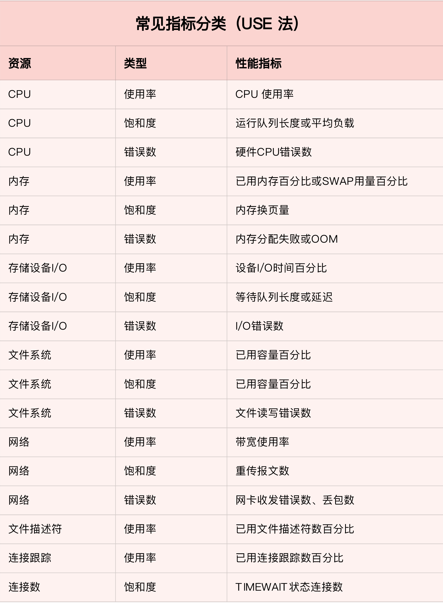
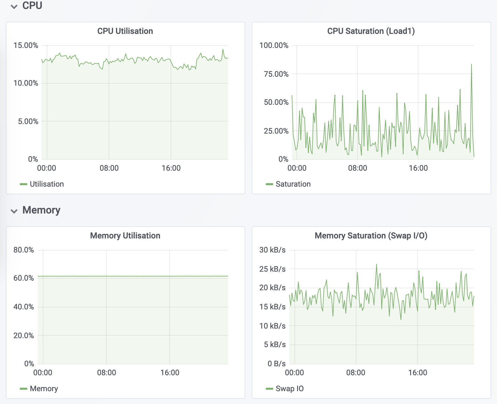
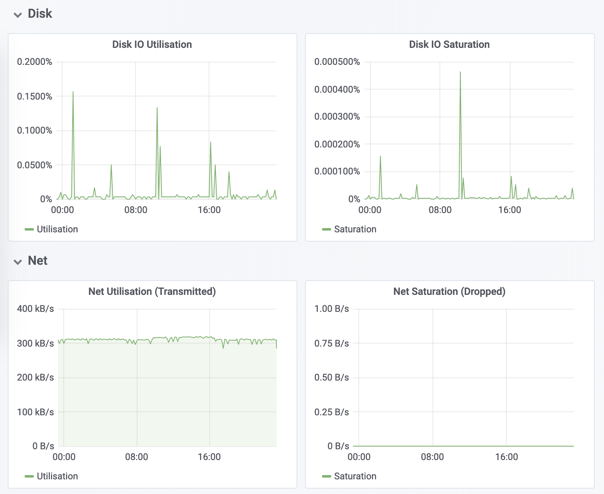
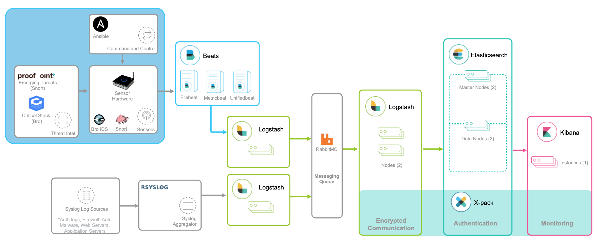
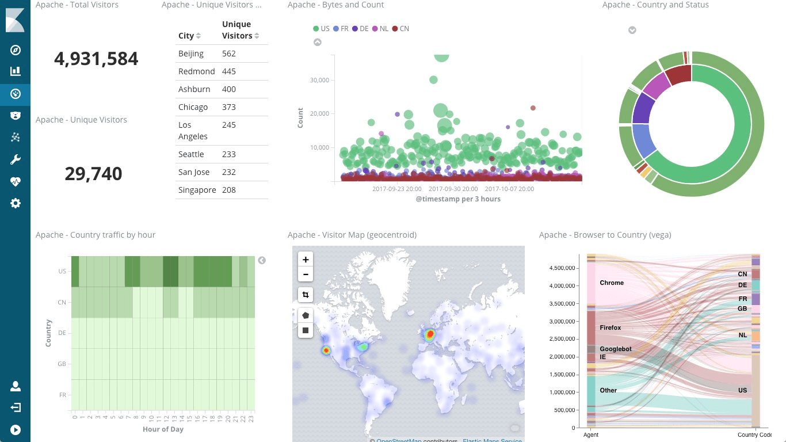

## 系统监控

### 系统监控目的

1、性能优化、故障排查

在实际的性能分析中，一个很常见的现象是，明明发生了性能瓶颈，但当你登录到服务器中想要排查的时候，却发现瓶颈已经消失了。或者说，性能问题总是时不时地发生，但却很难找出发生规律，也很难重现。

当面对这样的场景时，各种工具、方法都“失效“了。为什么呢？因为它们都需要在性能问题发生的时刻才有效，而在这些事后分析的场景中，我们就很难发挥它们的威力了。

那该怎么办呢？置之不理吗？其实以往，很多应用都是等到用户抱怨响应慢了，或者系统崩溃了后，才发现系统或者应用程序的性能出现了问题。虽然最终也能发现问题，但显然，这种方法是不可取的，因为严重影响了用户的体验。

而要解决这个问题，就要搭建监控系统，把系统和应用程序的运行状况监控起来，并定义一系列的策略，在发生问题时第一时间告警通知。一个好的监控系统，不仅可以实时暴露系统的各种问题，更可以根据这些监控到的状态，自动分析和定位大致的瓶颈来源，从而更精确地把问题汇报给相关团队处理

### 系统监控思路

要做好监控，最核心的就是全面的、可量化的指标，这包括系统和应用两个方面。

- 从系统来说，监控系统要涵盖系统的整体资源使用情况，比如我们前面讲过的 CPU、内存、磁盘和文件系统、网络等各种系统资源。

- 而从应用程序来说，监控系统要涵盖应用程序内部的运行状态，这既包括进程的CPU、磁盘I/O 等整体运行状况，更需要包括诸如接口调用耗时、执行过程中的错误、内部对象的内存使用等应用程序内部的运行状况

#### USE 法

在开始监控系统之前，你肯定最想知道，怎么才能用简洁的方法，来描述系统资源的使用情况。你当然可以使用各种性能工具，来分别收集各种资源的使用情况。不过不要忘记，每种资源的性能指标可都有很多，使用过多指标本身耗时耗力不说，也不容易为你建立起系统整体的运行状况。

而USE 法(Utilization Saturation and Errors)把系统资源的性能指标，简化成了三个类别，即使用率、饱和度以及错误数。

- 使用率: 资源用于服务的时间或容量百分比。100% 的使用率，表示容量已经用尽或者全部时间都用于服务

- 饱和度: 资源的繁忙程度，通常与等待队列的长度相关。100% 的饱和度，表示资源无法接受更多的请求

- 错误数: 发生错误的事件个数。错误数越多，表明系统的问题越严重

这三个类别的指标，涵盖了系统资源的常见性能瓶颈，所以常被用来快速定位系统资源的性能瓶颈。这样，无论是对 CPU、内存、磁盘和文件系统、网络等硬件资源，还是对文件描述符数、连接数、连接跟踪数等软件资源，USE 方法都可以帮你快速定位出，是哪一种系统资源出现了性能瓶颈。

以下总计了每种系统资源的一些常见的性能指标:

不过，需要注意的是，USE 方法只关注能体现系统资源性能瓶颈的核心指标，但这并不是说其他指标不重要。诸如系统日志、进程资源使用量、缓存使用量等其他各类指标，也都需要我们监控起来。只不过，它们通常用作辅助性能分析，而 USE 方法的指标，则直接表明了系统的资源瓶颈。

#### 监控系统

掌握 USE 方法以及需要监控的性能指标后，接下来要做的，就是建立监控系统，把这些指标保存下来；然后，根据这些监控到的状态，自动分析和定位大致的瓶颈来源；最后，再通过告警系统，把问题及时汇报给相关团队处理。

可以看出，一个完整的监控系统通常由数据采集、数据存储、数据查询和处理、告警以及可视化展示等多个模块组成。所以，要从头搭建一个监控系统，其实也是一个很大的系统工程。

不过，幸运的是，现在已经有很多开源的监控工具可以直接使用，比如最常见的 Zabbix、Nagios、Prometheus 等等。

下面，我就以 Prometheus 为例，为你介绍这几个组件的基本原理。如下图所示，就是 Prometheus 的基本架构：

）](./assets/monitor02.jpg)

先看数据采集模块。最左边的 Prometheus targets 就是数据采集的对象，而 Retrieval 则负责采集这些数据。从图中你也可以看到，Prometheus 同时支持 Push 和 Pull 两种数据采集模式。

Pull 模式，由服务器端的采集模块来触发采集。只要采集目标提供了 HTTP 接口，就可以自由接入（这也是最常用的采集模式）。

Push 模式，则是由各个采集目标主动向 Push Gateway（用于防止数据丢失）推送指标，再由服务器端从 Gateway 中拉取过去（这是移动应用中最常用的采集模式）。

由于需要监控的对象通常都是动态变化的，Prometheus 还提供了服务发现的机制，可以自动根据预配置的规则，动态发现需要监控的对象。这在 Kubernetes 等容器平台中非常有效。

第二个是数据存储模块。为了保持监控数据的持久化，图中的 TSDB（Time series database）模块，负责将采集到的数据持久化到 SSD 等磁盘设备中。TSDB 是专门为时间序列数据设计的一种数据库，特点是以时间为索引、数据量大并且以追加的方式写入。

第三个是数据查询和处理模块。刚才提到的 TSDB，在存储数据的同时，其实还提供了数据查询和基本的数据处理功能，而这也就是 PromQL 语言。PromQL 提供了简洁的查询、过滤功能，并且支持基本的数据处理方法，是告警系统和可视化展示的基础。

第四个是告警模块。右上角的 AlertManager 提供了告警的功能，包括基于 PromQL 语言的触发条件、告警规则的配置管理以及告警的发送等。不过，虽然告警是必要的，但过于频繁的告警显然也不可取。所以，AlertManager 还支持通过分组、抑制或者静默等多种方式来聚合同类告警，并减少告警数量。

最后一个是可视化展示模块。Prometheus 的 web UI 提供了简单的可视化界面，用于执行 PromQL 查询语句，但结果的展示比较单调。不过，一旦配合 Grafana，就可以构建非常强大的图形界面了。

介绍完了这些组件，想必你对每个模块都有了比较清晰的认识。接下来，我们再来继续深入了解这些组件结合起来的整体功能。

比如，以刚才提到的 USE 方法为例，我使用 Prometheus，可以收集 Linux 服务器的 CPU、内存、磁盘、网络等各类资源的使用率、饱和度和错误数指标。然后，通过 Grafana 以及 PromQL 查询语句，就可以把它们以图形界面的方式直观展示出来。

## 应用监控

### 指标监控

对系统资源的监控，USE 法简单有效，却不代表其适合应用程序的监控。举个例子，即使在 CPU 使用率很低的时候，也不能说明应用程序就没有性能瓶颈。因为应用程序可能会因为锁或者 RPC 调用等，导致响应缓慢。

所以，应用程序的核心指标，不再是资源的使用情况，而是**请求数、错误率和响应时间**。这些指标不仅直接关系到用户的使用体验，还反映应用整体的可用性和可靠性。

有了请求数、错误率和响应时间这三个黄金指标之后，我们就可以快速知道，应用是否发生了性能问题。但是，只有这些指标显然还是不够的，因为发生性能问题后，我们还希望能够快速定位“性能瓶颈区”。所以，在我看来，下面几种指标，也是监控应用程序时必不可少的。

第一个，是**应用进程的资源使用情况**，比如进程占用的 CPU、内存、磁盘 I/O、网络等。使用过多的系统资源，导致应用程序响应缓慢或者错误数升高，是一个最常见的性能问题。

第二个，是**应用程序之间调用情况**，比如调用频率、错误数、延时等。由于应用程序并不是孤立的，如果其依赖的其他应用出现了性能问题，应用自身性能也会受到影响。

第三个，是**应用程序内部核心逻辑的运行情况**，比如关键环节的耗时以及执行过程中的错误等。由于这是应用程序内部的状态，从外部通常无法直接获取到详细的性能数据。所以，应用程序在设计和开发时，就应该把这些指标提供出来，以便监控系统可以了解其内部运行状态。

有了应用进程的资源使用指标，你就可以把系统资源的瓶颈跟应用程序关联起来，从而迅速定位因系统资源不足而导致的性能问题；

有了应用程序之间的调用指标，你可以迅速分析出一个请求处理的调用链中，到底哪个组件才是导致性能问题的罪魁祸首；

而有了应用程序内部核心逻辑的运行性能，你就可以更进一步，直接进入应用程序的内部，定位到底是哪个处理环节的函数导致了性能问题。

基于这些思路，我相信你就可以构建出，描述应用程序运行状态的性能指标。再将这些指标纳入我们上一期提到的监控系统（比如 Prometheus + Grafana）中，就可以跟系统监控一样，一方面通过告警系统，把问题及时汇报给相关团队处理；另一方面，通过直观的图形界面，动态展示应用程序的整体性能。

除此之外，由于业务系统通常会涉及到一连串的多个服务，形成一个复杂的分布式调用链。为了迅速定位这类跨应用的性能瓶颈，你还可以使用 Zipkin、Jaeger、Pinpoint 等各类开源工具，来构建全链路跟踪系统。

比如，下图就是一个 Jaeger 调用链跟踪的示例。

）](./assets/monitor05.jpg)

全链路跟踪可以帮你迅速定位出，在一个请求处理过程中，哪个环节才是问题根源。比如，从上图中，你就可以很容易看到，这是 Redis 超时导致的问题。

全链路跟踪除了可以帮你快速定位跨应用的性能问题外，还可以帮你生成线上系统的调用拓扑图。这些直观的拓扑图，在分析复杂系统（比如微服务）时尤其有效。

### 日志监控

性能指标的监控，可以让你迅速定位发生瓶颈的位置，不过只有指标的话往往还不够。比如，同样的一个接口，当请求传入的参数不同时，就可能会导致完全不同的性能问题。所以，除了指标外，我们还需要对这些指标的上下文信息进行监控，而日志正是这些上下文的最佳来源。

对比来看，

指标是特定时间段的数值型测量数据，通常以时间序列的方式处理，适合于实时监控。

而日志则完全不同，日志都是某个时间点的字符串消息，通常需要对搜索引擎进行索引后，才能进行查询和汇总分析。

对日志监控来说，最经典的方法，就是使用 ELK 技术栈，即使用 Elasticsearch、Logstash 和 Kibana 这三个组件的组合。

如下图所示，就是一个经典的 ELK 架构图：

这其中，

Logstash 负责对从各个日志源采集日志，然后进行预处理，最后再把初步处理过的日志，发送给 Elasticsearch 进行索引。

Elasticsearch 负责对日志进行索引，并提供了一个完整的全文搜索引擎，这样就可以方便你从日志中检索需要的数据。

Kibana 则负责对日志进行可视化分析，包括日志搜索、处理以及绚丽的仪表板展示等。

下面这张图，就是一个 Kibana 仪表板的示例，它直观展示了 Apache 的访问概况。

值得注意的是，ELK 技术栈中的 Logstash 资源消耗比较大。所以，在资源紧张的环境中，我们往往使用资源消耗更低的 Fluentd，来替代 Logstash（也就是所谓的 EFK 技术栈）。

## 参考资料

- [Linux性能优化实战_Linux_性能调优-极客时间](https://time.geekbang.org/column/intro/140)