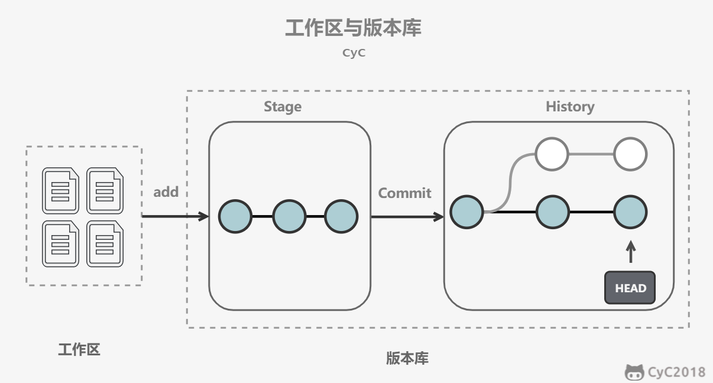

## 简介

### 版本管理演变

集中式->分布式


### 分区

git仓库分为工作区、暂存区、


## 文件组成

### .git目录


4个关键文件：HEAD、config、refs、objects

- HEAD:指向当前正在工作的分支

手动修改HEAD里的分支，效果同 git checkout

- config：本地仓库(local)配置信息 比如user信息(如果没有配置就不会显示)

手动修改config文件，效果同 git config --local

- refs:包含heads(分支)和tags(里程碑)


3个重要对象：commit、tree、blob，PS：tag


## 安装

参见 [Git - 安装 Git](https://git-scm.com/book/zh/v2/%E8%B5%B7%E6%AD%A5-%E5%AE%89%E8%A3%85-Git)


## 配置

```shell
## 添加name和email配置
git config [--local | --global | --system] user.name 'Your name'
git config [--local | --global | --system] user.email 'Your email'

##  清除
git config --unset [--local | --global | --system] user.name

## 查看现有配置
git config --list [--local | --global | --system]
## 区别
##  --local：本仓库 (git config 缺省情况下会使用这种方式)
##  --global: 当前用户的所有仓库
##  --system: 本系统的所有用户
##  优先级: local > global > system
```


- 作用:用于记录人员信息，CR（Code Review，代码审查）时也可以对应发邮件提醒

- 远程仓库配置(比如 github、 gitee、gitcode) 详见环境部署专题讲解

::: tip 配置优先级测试: 比较local、global优先级

1. 在 Git 命令⾏⽅式下，⽤ init 创建⼀个 Git 仓库

```bash
git init your_first_git_repo_name
```

2. 切换到 git 仓库 中

```bash
cd your_first_git_repo_name
```

3. 配置 global 和 local 两个级别的 user.name 和 user.email

```bash
# local
git config --local user.name 'your_local_name'
git config --local user.email 'your_local_email@.'
# global
git config --global user.name 'your_global_name'
git config --global user.name 'your_global_eamil@.'
```

4. 创建空的 commit

```bash
git commit --allow-empty -m ‘Initial’
```

5. ⽤ log 看 commit 信息 中 Author 的 name 和 email

```bash
git log
```

结论:Author 的 name 和 email 打印的是 local 配置，也就是印证了local 优先级高于global

6.测试完成后 清除配置

```bash
# local
git config --unset --local user.name 'your_local_name'
# global
git config --unset --global user.name 'your_global_name'
```

:::


## Git命令


### 创建/克隆仓库


```shell
# 1、创建新仓库
# 切换到指定项目文件夹里创建git仓库(适用于已有项目)
git init
# 在当前命令执行路径下使用 Project Name 创建git仓库(适用于初始化项目)
git init [Project Name]

# 2、克隆仓库
# 克隆本地仓库
git clone ~/existing/repo ~/new/repo
# 克隆远程仓库
git clone git://host.org/project.git
git clone ssh://you@host.org/proj.git


```

>如果需要单独配置local用户信息，使用--local配置即可，该种配置优先级最高，见配置讲解

### 添加/移除

```bash
# 添加文件到暂存区
git add <filename>
git add *

# 移除/删除文件
git rm <filename>
```


配置




git add files 把文件的修改添加到暂存区

git commit 把暂存区的修改提交到当前分支，提交之后暂存区就被清空了

git reset -- files 使用当前分支上的修改覆盖暂存区，用来撤销最后一次 git add files

git checkout -- files 使用暂存区的修改覆盖工作目录，用来撤销本地修改

### 文件重命名

方式一:

```bash
## 重命名
mv readme readme.md
## 添加新文件readme.md
git add readme.md
## 删除被跟踪的旧文件readme
git rm readme
## 提交
git commit -m"rename"
```

方式二:(更精简)

```bash
## 一条命令顶上面三条
git mv readme readme.md
## 提交
git commit -m"rename"

```

### 提交/同步


```bash
# 提交改变并提交评论
git commit -m"Commit message"
# 提交改变到远程仓库
git push orgin master
# 连接本地仓库到远程仓库
git remote add orgin <server>
# 从远程仓库拉取更新本地仓库
git pull
```

### 分支

```bash
# 创建新分支并切换到新分支
git checkout -b <branch>
eg:git checkout -b feature_x

# 切换到主分支
git checkout master

# 删除指定分支
git checkout -b <branch>
eg:git branch -d feature_x

#拉取指定分支到远程仓库
git push origin <branch>

```

### 合并

```bash
# 合并其他分支到当前分支
git merge <branch>

# 观察分支变化
git diff <source_branch> <target_branch>
eg:git diff feature_x feature_y
```

### 标签

```bash
# 创建标签
git tag <tag> <commit ID>
eg:git tag 1.0.0 Ib2e1d663ff

# 获取提交ID记录
git log

```

### 恢复


### 历史版本查看

```bash
## 查看简洁的单行历史
git log --oneline
## 查看最近的4条历史
git log -n4
git log -4 
## 查看所有分支的历史
git log --all
## 查看指定分支(名为BRANCH_NAME)的历史
git log BRANCH_NAME
## 查看图形化的版本历史
git log --graph
## 组合使用：查看所有分支最近4条图形化的单行历史
git log --all -n4 --graph --oneline
## 跳转到网页版的git log帮助文档
git help --web log
```


补充 图形界面工具查看历史版本
IDEA、gitk、


## 快速入门


## 传输协议

常用的传输协议

| 常用协议           | 语法格式                                                     | 说明                     |
| ------------------ | ------------------------------------------------------------ | ------------------------ |
| 本地协议(1)        | /path/to/repo.git                                            | 哑协议                   |
| 本地协议(2)        | file:///path/to/repo.git                                     | 智能协议                 |
| **http/https**协议 | http://git-server.com:port/path/to/repo.git<br>https://git-server.com:port/path/to/repo.git | 平时接触到的都是智能协议 |
| ssh协议            | user@git-server.com:path/to/repo.git                         | 工作中最常用的智能协议   |


## 参考资料

- [CS-Notes/notes/Git.md at master · CyC2018/CS-Notes](https://github.com/CyC2018/CS-Notes/blob/master/notes/Git.md)

- [git-cheat-sheet](http://www.cheat-sheets.org/saved-copy/git-cheat-sheet.pdf)

- [图解Git](https://marklodato.github.io/visual-git-guide/index-zh-cn.html)

