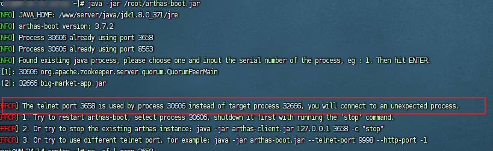

## 简介

Arthas 作为Java 应用在线诊断工具,支持 JDK 6+，支持 Linux/Mac/Windows，采用命令行交互模式，同时提供丰富的 Tab 自动补全功能，进一步方便进行问题的定位和诊断

## 解决问题场景

这个类从哪个 jar 包加载的？为什么会报各种类相关的 Exception？

我改的代码为什么没有执行到？难道是我没 commit？分支搞错了？

遇到问题无法在线上 debug，难道只能通过加日志再重新发布吗？

线上遇到某个用户的数据处理有问题，但线上同样无法 debug，线下无法重现！

是否有一个全局视角来查看系统的运行状况？

有什么办法可以监控到 JVM 的实时运行状态？

怎么快速定位应用的热点，生成火焰图？

怎样直接从 JVM 内查找某个类的实例？


::: tip 提示
以上回答来自官方
:::

## 安装、卸载

::: tip 待办
整理安装以及使用笔记
:::

1、安装

推荐使用`arthas-boot`

- 方式一 在线安装

下载`arthas-boot.jar`，然后用`java -jar`的方式启动：

```bash
curl -O https://arthas.aliyun.com/arthas-boot.jar
java -jar arthas-boot.jar
```

打印帮助信息：

```bash
java -jar arthas-boot.jar -h
```

- 如果下载速度比较慢，可以使用 aliyun 的镜像：

```bash
  java -jar arthas-boot.jar --repo-mirror aliyun --use-http
```

- 方式二 离线下载

[从 Maven 仓库下载 | 最新版本，点击此链接下载](https://arthas.aliyun.com/download/latest_version?mirror=aliyun)

[从 Github Releases 页下载| 查找指定版本下载](https://github.com/alibaba/arthas/releases)

其他更多安装方式 参见 [Arthas Install | arthas](https://arthas.aliyun.com/doc/install-detail.html#%E9%80%9A%E8%BF%87-cloud-toolkit-%E6%8F%92%E4%BB%B6%E4%BD%BF%E7%94%A8-arthas)

2、卸载

- 在 Linux/Unix/Mac 平台 删除下面文件：

  ```bash
  rm -rf ~/.arthas/
  rm -rf ~/logs/arthas
  ```

- Windows 平台直接删除 user home 下面的`.arthas`和`logs/arthas`目录


## 快速入门


[快速入门 | arthas](https://arthas.aliyun.com/doc/quick-start.html#_6-watch)

可以通过下面的方式自己动手实践，也可以通过我们的[在线教程在新窗口打开](https://arthas.aliyun.com/doc/arthas-tutorials.html?language=cn&id=arthas-basics)，跟随教程快速入门。

### 1. 启动 math-game

```bash
curl -O https://arthas.aliyun.com/math-game.jar
java -jar math-game.jar
```

`math-game`是一个简单的程序，每隔一秒生成一个随机数，再执行质因数分解，并打印出分解结果。

`math-game`源代码：[查看在新窗口打开](https://github.com/alibaba/arthas/blob/master/math-game/src/main/java/demo/MathGame.java)

### 2. 启动 arthas

在命令行下面执行（使用和目标进程一致的用户启动，否则可能 attach 失败）：

```bash
curl -O https://arthas.aliyun.com/arthas-boot.jar
java -jar arthas-boot.jar
```

- 执行该程序的用户需要和目标进程具有相同的权限。比如以`admin`用户来执行：`sudo su admin && java -jar arthas-boot.jar` 或 `sudo -u admin -EH java -jar arthas-boot.jar`。
- 如果 attach 不上目标进程，可以查看`~/logs/arthas/` 目录下的日志。
- 如果下载速度比较慢，可以使用 aliyun 的镜像：`java -jar arthas-boot.jar --repo-mirror aliyun --use-http`
- `java -jar arthas-boot.jar -h` 打印更多参数信息。

选择应用 java 进程：

```bash
$ $ java -jar arthas-boot.jar
* [1]: 35542
  [2]: 71560 math-game.jar
```

`math-game`进程是第 2 个，则输入 2，再输入`回车/enter`。Arthas 会 attach 到目标进程上，并输出日志：

```bash
[INFO] Try to attach process 71560
[INFO] Attach process 71560 success.
[INFO] arthas-client connect 127.0.0.1 3658
  ,---.  ,------. ,--------.,--.  ,--.  ,---.   ,---.
 /  O  \ |  .--. ''--.  .--'|  '--'  | /  O  \ '   .-'
|  .-.  ||  '--'.'   |  |   |  .--.  ||  .-.  |`.  `-.
|  | |  ||  |\  \    |  |   |  |  |  ||  | |  |.-'    |
`--' `--'`--' '--'   `--'   `--'  `--'`--' `--'`-----'


wiki: https://arthas.aliyun.com/doc
version: 3.0.5.20181127201536
pid: 71560
time: 2018-11-28 19:16:24

$
```

### 3. 查看 dashboard

输入[dashboard](https://arthas.aliyun.com/doc/dashboard.html)，按`回车/enter`，会展示当前进程的信息，按`ctrl+c`可以中断执行。

```bash
$ dashboard
ID     NAME                   GROUP          PRIORI STATE  %CPU    TIME   INTERRU DAEMON
17     pool-2-thread-1        system         5      WAITIN 67      0:0    false   false
27     Timer-for-arthas-dashb system         10     RUNNAB 32      0:0    false   true
11     AsyncAppender-Worker-a system         9      WAITIN 0       0:0    false   true
9      Attach Listener        system         9      RUNNAB 0       0:0    false   true
3      Finalizer              system         8      WAITIN 0       0:0    false   true
2      Reference Handler      system         10     WAITIN 0       0:0    false   true
4      Signal Dispatcher      system         9      RUNNAB 0       0:0    false   true
26     as-command-execute-dae system         10     TIMED_ 0       0:0    false   true
13     job-timeout            system         9      TIMED_ 0       0:0    false   true
1      main                   main           5      TIMED_ 0       0:0    false   false
14     nioEventLoopGroup-2-1  system         10     RUNNAB 0       0:0    false   false
18     nioEventLoopGroup-2-2  system         10     RUNNAB 0       0:0    false   false
23     nioEventLoopGroup-2-3  system         10     RUNNAB 0       0:0    false   false
15     nioEventLoopGroup-3-1  system         10     RUNNAB 0       0:0    false   false
Memory             used   total max    usage GC
heap               32M    155M  1820M  1.77% gc.ps_scavenge.count  4
ps_eden_space      14M    65M   672M   2.21% gc.ps_scavenge.time(m 166
ps_survivor_space  4M     5M    5M           s)
ps_old_gen         12M    85M   1365M  0.91% gc.ps_marksweep.count 0
nonheap            20M    23M   -1           gc.ps_marksweep.time( 0
code_cache         3M     5M    240M   1.32% ms)
Runtime
os.name                Mac OS X
os.version             10.13.4
java.version           1.8.0_162
java.home              /Library/Java/JavaVir
                       tualMachines/jdk1.8.0
                       _162.jdk/Contents/Hom
                       e/jre
```

### 4. 通过 thread 命令来获取到`math-game`进程的 Main Class

`thread 1`会打印线程 ID 1 的栈，通常是 main 函数的线程。

```bash
$ thread 1 | grep 'main('
    at demo.MathGame.main(MathGame.java:17)
```

### 5. 通过 jad 来反编译 Main Class

```java
$ jad demo.MathGame

ClassLoader:
+-sun.misc.Launcher$AppClassLoader@3d4eac69
  +-sun.misc.Launcher$ExtClassLoader@66350f69

Location:
/tmp/math-game.jar

/*
 * Decompiled with CFR 0_132.
 */
package demo;

import java.io.PrintStream;
import java.util.ArrayList;
import java.util.Iterator;
import java.util.List;
import java.util.Random;
import java.util.concurrent.TimeUnit;

public class MathGame {
    private static Random random = new Random();
    private int illegalArgumentCount = 0;

    public static void main(String[] args) throws InterruptedException {
        MathGame game = new MathGame();
        do {
            game.run();
            TimeUnit.SECONDS.sleep(1L);
        } while (true);
    }

    public void run() throws InterruptedException {
        try {
            int number = random.nextInt();
            List<Integer> primeFactors = this.primeFactors(number);
            MathGame.print(number, primeFactors);
        }
        catch (Exception e) {
            System.out.println(String.format("illegalArgumentCount:%3d, ", this.illegalArgumentCount) + e.getMessage());
        }
    }

    public static void print(int number, List<Integer> primeFactors) {
        StringBuffer sb = new StringBuffer("" + number + "=");
        Iterator<Integer> iterator = primeFactors.iterator();
        while (iterator.hasNext()) {
            int factor = iterator.next();
            sb.append(factor).append('*');
        }
        if (sb.charAt(sb.length() - 1) == '*') {
            sb.deleteCharAt(sb.length() - 1);
        }
        System.out.println(sb);
    }

    public List<Integer> primeFactors(int number) {
        if (number < 2) {
            ++this.illegalArgumentCount;
            throw new IllegalArgumentException("number is: " + number + ", need >= 2");
        }
        ArrayList<Integer> result = new ArrayList<Integer>();
        int i = 2;
        while (i <= number) {
            if (number % i == 0) {
                result.add(i);
                number /= i;
                i = 2;
                continue;
            }
            ++i;
        }
        return result;
    }
}

Affect(row-cnt:1) cost in 970 ms.
```

### 6. watch

通过[watch](https://arthas.aliyun.com/doc/watch.html)命令来查看`demo.MathGame#primeFactors`函数的返回值：


```bash
$ watch demo.MathGame primeFactors returnObj
Press Ctrl+C to abort.
Affect(class-cnt:1 , method-cnt:1) cost in 107 ms.
ts=2018-11-28 19:22:30; [cost=1.715367ms] result=null
ts=2018-11-28 19:22:31; [cost=0.185203ms] result=null
ts=2018-11-28 19:22:32; [cost=19.012416ms] result=@ArrayList[
    @Integer[5],
    @Integer[47],
    @Integer[2675531],
]
ts=2018-11-28 19:22:33; [cost=0.311395ms] result=@ArrayList[
    @Integer[2],
    @Integer[5],
    @Integer[317],
    @Integer[503],
    @Integer[887],
]
ts=2018-11-28 19:22:34; [cost=10.136007ms] result=@ArrayList[
    @Integer[2],
    @Integer[2],
    @Integer[3],
    @Integer[3],
    @Integer[31],
    @Integer[717593],
]
ts=2018-11-28 19:22:35; [cost=29.969732ms] result=@ArrayList[
    @Integer[5],
    @Integer[29],
    @Integer[7651739],
]
```

更多的功能可以查看[进阶教程在新窗口打开](https://arthas.aliyun.com/doc/arthas-tutorials.html?language=cn&id=arthas-advanced)。

### 7. 退出 arthas

如果只是退出当前的连接，可以用`quit`或者`exit`命令。Attach 到目标进程上的 arthas 还会继续运行，端口会保持开放，下次连接时可以直接连接上。

如果想完全退出 arthas，可以执行`stop`命令。


## 命令列表

### jvm 相关

- [dashboard](https://arthas.aliyun.com/doc/dashboard.html) - 当前系统的实时数据面板
- [getstatic](https://arthas.aliyun.com/doc/getstatic.html) - 查看类的静态属性
- [heapdump](https://arthas.aliyun.com/doc/heapdump.html) - dump java heap, 类似 jmap 命令的 heap dump 功能
- [jvm](https://arthas.aliyun.com/doc/jvm.html) - 查看当前 JVM 的信息
- [logger](https://arthas.aliyun.com/doc/logger.html) - 查看和修改 logger
- [mbean](https://arthas.aliyun.com/doc/mbean.html) - 查看 Mbean 的信息
- [memory](https://arthas.aliyun.com/doc/memory.html) - 查看 JVM 的内存信息
- [ognl](https://arthas.aliyun.com/doc/ognl.html) - 执行 ognl 表达式
- [perfcounter](https://arthas.aliyun.com/doc/perfcounter.html) - 查看当前 JVM 的 Perf Counter 信息
- [sysenv](https://arthas.aliyun.com/doc/sysenv.html) - 查看 JVM 的环境变量
- [sysprop](https://arthas.aliyun.com/doc/sysprop.html) - 查看和修改 JVM 的系统属性
- [thread](https://arthas.aliyun.com/doc/thread.html) - 查看当前 JVM 的线程堆栈信息
- [vmoption](https://arthas.aliyun.com/doc/vmoption.html) - 查看和修改 JVM 里诊断相关的 option
- [vmtool](https://arthas.aliyun.com/doc/vmtool.html) - 从 jvm 里查询对象，执行 forceGc

### class/classloader 相关

- [classloader](https://arthas.aliyun.com/doc/classloader.html) - 查看 classloader 的继承树，urls，类加载信息，使用 classloader 去 getResource
- [dump](https://arthas.aliyun.com/doc/dump.html) - dump 已加载类的 byte code 到特定目录
- [jad](https://arthas.aliyun.com/doc/jad.html) - 反编译指定已加载类的源码
- [mc](https://arthas.aliyun.com/doc/mc.html) - 内存编译器，内存编译`.java`文件为`.class`文件
- [redefine](https://arthas.aliyun.com/doc/redefine.html) - 加载外部的`.class`文件，redefine 到 JVM 里
- [retransform](https://arthas.aliyun.com/doc/retransform.html) - 加载外部的`.class`文件，retransform 到 JVM 里
- [sc](https://arthas.aliyun.com/doc/sc.html) - 查看 JVM 已加载的类信息
- [sm](https://arthas.aliyun.com/doc/sm.html) - 查看已加载类的方法信息

### monitor/watch/trace 相关

注意

请注意，这些命令，都通过字节码增强技术来实现的，会在指定类的方法中插入一些切面来实现数据统计和观测，因此在线上、预发使用时，请尽量明确需要观测的类、方法以及条件，诊断结束要执行 `stop` 或将增强过的类执行 `reset` 命令。

- [monitor](https://arthas.aliyun.com/doc/monitor.html) - 方法执行监控
- [stack](https://arthas.aliyun.com/doc/stack.html) - 输出当前方法被调用的调用路径
- [trace](https://arthas.aliyun.com/doc/trace.html) - 方法内部调用路径，并输出方法路径上的每个节点上耗时
- [tt](https://arthas.aliyun.com/doc/tt.html) - 方法执行数据的时空隧道，记录下指定方法每次调用的入参和返回信息，并能对这些不同的时间下调用进行观测
- [watch](https://arthas.aliyun.com/doc/watch.html) - 方法执行数据观测

### profiler / 火焰图

- [profiler](https://arthas.aliyun.com/doc/profiler.html) - 使用 [async-profiler 在新窗口打开](https://github.com/jvm-profiling-tools/async-profiler)对应用采样，生成火焰图
- [jfr](https://arthas.aliyun.com/doc/jfr.html) - 动态开启关闭 JFR 记录

### 鉴权

- [auth](https://arthas.aliyun.com/doc/auth.html) - 鉴权

### options

- [options](https://arthas.aliyun.com/doc/options.html) - 查看或设置 Arthas 全局开关

### 管道

Arthas 支持使用管道对上述命令的结果进行进一步的处理，如`sm java.lang.String * | grep 'index'`

- [grep](https://arthas.aliyun.com/doc/grep.html) - 搜索满足条件的结果
- plaintext - 将命令的结果去除 ANSI 颜色
- wc - 按行统计输出结果

### 后台异步任务

当线上出现偶发的问题，比如需要 watch 某个条件，而这个条件一天可能才会出现一次时，异步后台任务就派上用场了，详情请参考[这里](https://arthas.aliyun.com/doc/async.html)

- 使用 `>` 将结果重写向到日志文件，使用 `&` 指定命令是后台运行，session 断开不影响任务执行（生命周期默认为 1 天）
- jobs - 列出所有 job
- kill - 强制终止任务
- fg - 将暂停的任务拉到前台执行
- bg - 将暂停的任务放到后台执行

### 基础命令

- [base64](https://arthas.aliyun.com/doc/base64.html) - base64 编码转换，和 linux 里的 base64 命令类似
- [cat](https://arthas.aliyun.com/doc/cat.html) - 打印文件内容，和 linux 里的 cat 命令类似
- [cls](https://arthas.aliyun.com/doc/cls.html) - 清空当前屏幕区域
- [echo](https://arthas.aliyun.com/doc/echo.html) - 打印参数，和 linux 里的 echo 命令类似
- [grep](https://arthas.aliyun.com/doc/grep.html) - 匹配查找，和 linux 里的 grep 命令类似
- [help](https://arthas.aliyun.com/doc/help.html) - 查看命令帮助信息
- [history](https://arthas.aliyun.com/doc/history.html) - 打印命令历史
- [keymap](https://arthas.aliyun.com/doc/keymap.html) - Arthas 快捷键列表及自定义快捷键
- [pwd](https://arthas.aliyun.com/doc/pwd.html) - 返回当前的工作目录，和 linux 命令类似
- [quit](https://arthas.aliyun.com/doc/quit.html) - 退出当前 Arthas 客户端，其他 Arthas 客户端不受影响
- [reset](https://arthas.aliyun.com/doc/reset.html) - 重置增强类，将被 Arthas 增强过的类全部还原，Arthas 服务端关闭时会重置所有增强过的类
- [session](https://arthas.aliyun.com/doc/session.html) - 查看当前会话的信息
- [stop](https://arthas.aliyun.com/doc/stop.html) - 关闭 Arthas 服务端，所有 Arthas 客户端全部退出
- [tee](https://arthas.aliyun.com/doc/tee.html) - 复制标准输入到标准输出和指定的文件，和 linux 里的 tee 命令类似
- [version](https://arthas.aliyun.com/doc/version.html) - 输出当前目标 Java 进程所加载的 Arthas 版本号

## 其他特性

### Arthas 后台异步任务

当需要排查一个问题，但是这个问题的出现时间不能确定，那我们就可以把检测命令挂在后台运行，并将保存到输出日志。

- [Arthas 后台异步任务](https://arthas.aliyun.com/doc/async.html)

### 执行结果存日志

所有执行记录的结果完整保存在日志文件中，便于后续进行分析。

- [执行结果存日志](https://arthas.aliyun.com/doc/save-log.html)

### Docker

Arthas 在 docker 容器中使用配置参考。

- [Docker](https://arthas.aliyun.com/doc/docker.html)

### Web Console

通过 websocket 连接 Arthas。

- [Web Console](https://arthas.aliyun.com/doc/web-console.html)

### Arthas Tunnel

通过 Arthas Tunnel Server/Client 来远程管理/连接多个服务器下的Java服务。

- [Arthas Tunnel](https://arthas.aliyun.com/doc/tunnel.html)

### ognl 表达式用法

- [ognl 表达式的用法说明在新窗口打开](https://github.com/alibaba/arthas/issues/11)
- [一些 ognl 特殊用法在新窗口打开](https://github.com/alibaba/arthas/issues/71)

### IDEA Plugin

IntelliJ IDEA 编译器中更加快捷构建 arhtas 命令。

- [IDEA Plugin](https://arthas.aliyun.com/doc/idea-plugin.html)

### Arthas Properties

Arthas 支持配置项参考。

- [Arthas Properties](https://arthas.aliyun.com/doc/arthas-properties.html)

### 以 java agent 方式启动

- [以 java agent 方式启动](https://arthas.aliyun.com/doc/agent.html)

### Arthas Spring Boot Starter

随应用一起启动。

- [Arthas Spring Boot Starter](https://arthas.aliyun.com/doc/spring-boot-starter.html)

### HTTP API

Http API 提供结构化的数据，支持更复杂的交互功能，方便自定义界面集成 arthas。

- [HTTP API](https://arthas.aliyun.com/doc/http-api.html)

### 批处理功能

方便自定义脚本一次性批量运行多个命令，可结合 `--select` 参数可以指定进程名字一起使用。

- [批处理功能](https://arthas.aliyun.com/doc/batch-support.html)

### as.sh 和 arthas-boot 技巧

- 通过`select`功能选择 attach 的进程。

正常情况下，每次执行`as.sh`/`arthas-boot.jar`需要选择，或者指定 PID。这样会比较麻烦，因为每次启动应用，它的 PID 会变化。

比如，已经启动了`math-game.jar`，使用`jps`命令查看：


```bash
$ jps
58883 math-game.jar
58884 Jps
```

通过`select`参数可以指定进程名字，非常方便。


```bash
$ ./as.sh --select math-game
Arthas script version: 3.3.6
[INFO] JAVA_HOME: /tmp/java/8.0.222-zulu
Arthas home: /Users/admin/.arthas/lib/3.3.6/arthas
Calculating attach execution time...
Attaching to 59161 using version /Users/admin/.arthas/lib/3.3.6/arthas...

real	0m0.572s
user	0m0.281s
sys	0m0.039s
Attach success.
telnet connecting to arthas server... current timestamp is 1594280799
Trying 127.0.0.1...
Connected to localhost.
Escape character is '^]'.
  ,---.  ,------. ,--------.,--.  ,--.  ,---.   ,---.
 /  O  \ |  .--. ''--.  .--'|  '--'  | /  O  \ '   .-'
|  .-.  ||  '--'.'   |  |   |  .--.  ||  .-.  |`.  `-.
|  | |  ||  |\  \    |  |   |  |  |  ||  | |  |.-'    |
`--' `--'`--' '--'   `--'   `--'  `--'`--' `--'`-----'


wiki      https://arthas.aliyun.com/doc
tutorials https://arthas.aliyun.com/doc/arthas-tutorials.html
version   3.3.6
pid       58883
```

### 用户数据回报

在`3.1.4`版本后，增加了用户数据回报功能，方便统一做安全或者历史数据统计。

在启动时，指定`stat-url`，就会回报执行的每一行命令，比如： `./as.sh --stat-url 'http://192.168.10.11:8080/api/stat'`

在 tunnel server 里有一个示例的回报代码，用户可以自己在服务器上实现。

[StatController.java](https://github.com/alibaba/arthas/blob/master/tunnel-server/src/main/java/com/alibaba/arthas/tunnel/server/app/web/StatController.java)


## 常见问题

1、启动 arthas 选择进程进行连接时出现错误



原因分析：

上一次选择进程进行连接没有正常退出，arthas 会保存上一次监听进程，导致本次选择新进程进行连接时，与监听中记录的进程 id 不同，结果出现错误

解决方案：

继续选择上一个进程进行连接，执行成功后执行 **stop** 命令结束连接。再次启动 arthas，选择新进程即可进行连接

2、jdk 未安装 或者 版本过低导致无法启动

如果本地有多个java 为避免arthas直接通过环境找到本地低版本jdk 可以指定jdk版本 官方说法支持jdk6+ 参见 [简介 | arthas](https://arthas.aliyun.com/doc/#%E8%83%8C%E6%99%AF)

```shell
java -jar arthas-boot.jar
全写
/jdk目录/bin/java -jar /arthas目录/arthas-boot.jar
```


更多参见 官方查询

- [FAQ | arthas](https://arthas.aliyun.com/doc/faq.html#telnet-connect-to-address-127-0-0-1-connection-refused)
- [无疑 专家智能答疑 介绍 | arthas](https://arthas.aliyun.com/doc/expert/intro.html)


## 资料

官网地址：[arthas](https://arthas.aliyun.com/)

GitHub地址：[alibaba/arthas: Alibaba Java Diagnostic Tool Arthas/Alibaba Java诊断利器Arthas](https://github.com/alibaba/arthas)

用户案例: [Issues · alibaba/arthas](https://github.com/alibaba/arthas/issues?q=label%3Auser-case)

