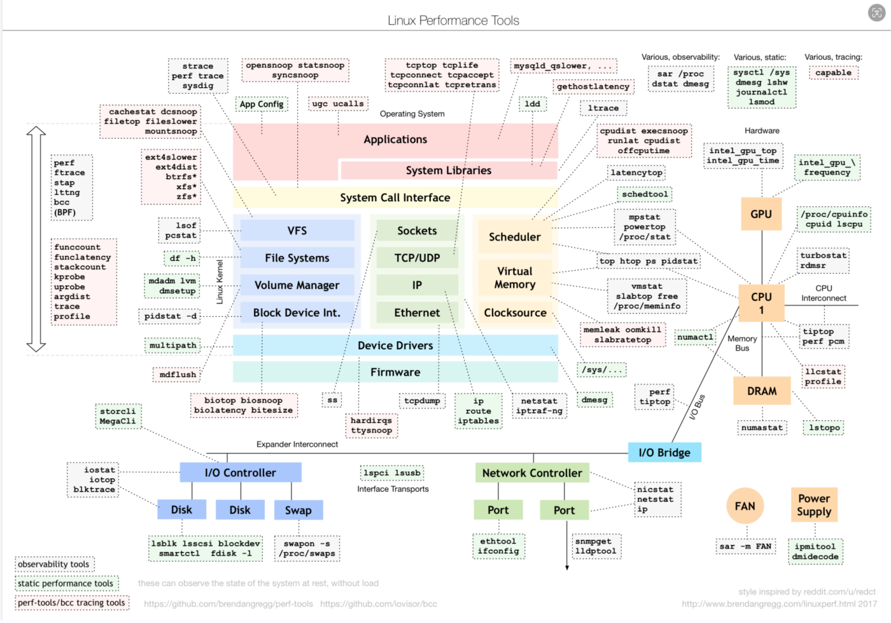

## 文件结构

## 命令查询

查询手册: [Linux命令搜索引擎](https://wangchujiang.com/linux-command/)

命令分类: [Linux命令分类汇总](https://codetoolchains.readthedocs.io/en/latest/4-Linux/2-shellcmd/index.html)

### 性能相关

这个图总结了在Linux不同子系统出现性能问题后，应该用什么样的工具来观测和分析。

比如，当遇到I/O性能问题时，可以参考图片最下方的I/O子系统，使用iostat、iotop、blktrace等工具分析磁盘I/O的瓶颈。

## 参考资料

- [Linux性能优化实战_Linux_性能调优-极客时间](https://time.geekbang.org/column/intro/140)

- [Linux Performance](https://www.brendangregg.com/linuxperf.html)

