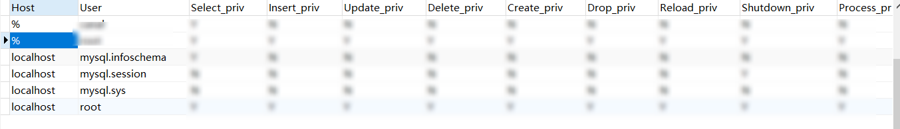

## 命令查询

### 用户管理

0、查看所有用户

```shell
SELECT User, Host FROM mysql.user;
```

1、添加用户

```shell
create user username identified by 'password';
```

其中 username 表示用户名 password表示用户登录密码,执行后用户数据将会被存储在mysql.user表内

补充: 也可以使用可视化工具进行设置 直接找到mysql.user表添加新用户数据

2、删除用户

```shell
DROP USER 'username'@'host';
```

其中host参数含义参见下面总结

3、查看所有用户

```shell
SELECT User, Host FROM mysql.user;
```

4、修改用户密码

```shell
# 方式一
ALTER USER 'username'@'host' IDENTIFIED BY 'new_password';

# 方式二
update mysql.user set password = password('newpassword') where user = 'username' and host = '%'; 
flush privileges;
```

5、授予用户权限

将Dbname数据库的所有操作权限都授权给了用户username

```shell
# 配置权限
grant privilege_type on dbName.tableName to username@host identified by 'password';

# 刷新权限变更
flush privileges;

# 查看用户的已有权限
show grants for 'username';

```

示例:

```shell
# 将zhangsanDb数据库的所有操作权限都授权给了用户zhangsan
grant all privileges on zhangsanDb.* to zhangsan@'%' identified by 'zhangsan';
flush privileges;
```

6、撤销用户权限

```shell
REVOKE privilege_type ON database_name.table_name FROM 'username'@'host';
```

示例:

```shell
REVOKE DELETE ON *.* FROM 'test'@'localhost';
```

7、查看用户权限

```shell
SHOW GRANTS FOR 'username'@'host';
```

8、限制用户资源使用


```shell
ALTER USER 'username'@'host' WITH MAX_QUERIES_PER_HOUR 100 
                              MAX_UPDATES_PER_HOUR 50
                              MAX_CONNECTIONS_PER_HOUR 5
                              MAX_USER_CONNECTIONS 2;
```

>==待验证==


参数说明：

**privilege_type** 权限类型
常用的权限类型

| 参数           | 含义                   |
| -------------- | ---------------------- |
| all privileges | 所有权限               |
| select         | 读取权限               |
| delete         | 删除权限               |
| update         | 更新权限               |
| create         | 创建权限               |
| drop           | 删除数据库、数据表权限 |

**dbName.tableName** 授权的库或特定表

| 参数           | 含义                               |
| -------------- | ---------------------------------- |
| .              | 授予该数据库服务器所有数据库的权限 |
| dbName.*       | 授予dbName数据库所有表的权限       |
| dbName.dbTable | 授予数据库dbName中dbTable表的权限  |

**username@host** 授予的用户以及允许该用户登录的IP地址

其中host参数选择
| 参数          | 含义                                   |
| ------------- | -------------------------------------- |
| localhost     | 只允许该用户在本地登录，不能远程登录   |
| %             | 允许在除本机之外的任何一台机器远程登录 |
| 192.168.52.32 | 具体的IP表示只允许该用户从特定IP登录   |


::: tip 说明

可以直接使用可视化工具操作数据库中的user表 包括添加用户以及分配用户权限



:::


### 客户端登录/退出

```shell
# 客户端连接服务器
# 使用mysql可执行文件连接服务器
mysql -h主机名  -u用户名 -p密码 (不推荐)
mysql -h主机名  -u用户名 -p  (推荐)

# 客户端断开连接
quit / exit / \q 

```

参数含义:

| 参数名 | 含义                                                         |
| ------ | ------------------------------------------------------------ |
| `-h`   | 表示服务器进程所在计算机的域名或者IP地址，如果服务器进程就运行在本机的话，可以省略这个参数，或者填`localhost`或者`127.0.0.1`。也可以写作 `--host=主机名`的形式。 |
| `-u`   | 表示用户名。也可以写作 `--user=用户名`的形式。               |
| `-p`   | 表示密码。也可以写作 `--password=密码`的形式。               |


有关bin目录可执行文件详细介绍详见 [Mysql 构成](../database/mysql-structure.md)

::: tip 注意事项
1、密码输入方式: 使用 mysql -hlocahhost -uroot -p  替代 mysql -hlocahhost -uroot -p密码

2、如果直接输入密码，-p和密码值之间不能有空白字符（其他参数名之间可以有空白字符,包括-h、-u)

3、mysql的各个参数的摆放顺序没有硬性规定

4、如果你的服务器和客户端安装在同一台机器上，-h参数可以省略，就像这样：mysql -u root -p  

5、如果使用的是类UNIX系统，并且省略-u参数后，会把登陆操作系统的用户名当作MySQL的用户名去处理; 对于Windows系统来说，默认的用户名是ODBC，可以通过设置环境变量USER来添加一个默认用户名

6、像 h、u、p 这样名称只有一个英文字母的参数称为短形式的参数，使用时前面需要加单短划线，像 host、user、password 这样大于一个英文字母的参数称为长形式的参数，使用时前面需要加双短划线
:::

- 数据库连接数查询、设置

```shell
# 
SHOW VARIABLES LIKE 'max_connections';
SET GLOBAL max_connections = 152;
```


### 数据库备份以及还原

备份
```shell
mysqldump -u root -p db_name > file.sql
mysqldump -u root -p db_name table_name > file.sql
```

还原
```shell
mysql -u root -p < C:\file.sql
```


### 执行引擎

```shell
# 查询数据库执行引擎类别
SHOW ENGINES;

# 查询指定数据库中指定数据表的状态(包含执行引擎类型)
SHOW TABLE STATUS FROM database_name WHERE Name = 'table_name';

# 修改表 的 执行引擎类别
ALTER TABLE table_name ENGINE = InnoDB;
```

### 数据库操作

1、显示所有数据库

```shell
SHOW DATABASES;
```

2、创建新数据库

```shell
# 不设置 字符集 以及 比较规则 (会使用服务器级别)
CREATE DATABASE database_name;

# 设置 字符集 以及 比较规则
CREATE DATABASE database_name CHARACTER SET utf8mb4 COLLATE utf8mb4_unicode_ci;

```

3、使用特定数据库

```shell
# 切换到指定的数据库,后续操作将在该数据库中执行
USE database_name;
```

4、删除数据库

```shell
# 永久删除指定的数据库及其所有表。使用时需谨慎
DROP DATABASE database_name;
```

5、查看数据库创建语句

```shell
# 显示创建指定数据库时使用的SQL语句
SHOW CREATE DATABASE database_name;
```

6、修改数据库字符集以及比较规则

```shell
ALTER DATABASE database_name CHARACTER SET utf8mb4 COLLATE utf8mb4_unicode_ci;
```

7、查看当前使用的数据库

```shell
SELECT DATABASE();
```

8、备份数据库

```shell
# 这是在命令行中执行的,不是SQL命令。它会创建一个包含数据库结构和数据的SQL文件
mysqldump -u username -p database_name > backup.sql
```

9、恢复数据库

```shell
mysql -u username -p database_name < backup.sql
```

10、查看数据库大小

```shell
# 显示每个数据库的大小（以MB为单位）
SELECT table_schema "Database Name", 
SUM(data_length + index_length) / 1024 / 1024 "Size in MB" 
FROM information_schema.TABLES 
GROUP BY table_schema;
```


### 数据表操作


1. 基础操作:

a) 显示所有表:
```sql
SHOW TABLES;
```

b) 查看表结构:
```sql
DESCRIBE table_name;
-- 或
SHOW COLUMNS FROM table_name;
```

c) 查看表创建语句:
```sql
SHOW CREATE TABLE table_name;
```

2. 结构操作:

a) 创建表:
```sql
CREATE TABLE table_name (
    column1 datatype,
    column2 datatype,
    column3 datatype,
    ...
);
```

b) 删除表:
```sql
DROP TABLE table_name;
```

c) 添加列:
```sql
ALTER TABLE table_name ADD column_name datatype;
```

d) 修改列:
```sql
ALTER TABLE table_name MODIFY column_name new_datatype;


```

e) 删除列:
```sql
ALTER TABLE table_name DROP COLUMN column_name;
```


f) 重命名表:
```sql
RENAME TABLE old_table_name TO new_table_name;
```

g) 添加主键:
```sql
ALTER TABLE table_name ADD PRIMARY KEY (column_name);
```

h) 添加索引:
```sql
CREATE INDEX index_name ON table_name (column_name);
```

3. 数据操作:

a) 插入数据:
```sql
INSERT INTO table_name (column1, column2, ...) VALUES (value1, value2, ...);
```

b) 查询数据:
```sql
SELECT column1, column2, ... FROM table_name WHERE condition;
```

c) 更新数据:
```sql
UPDATE table_name SET column1 = value1, column2 = value2, ... WHERE condition;
```

d) 删除数据:

```sql
DELETE FROM table_name WHERE condition;
```

e) 截断表（删除所有数据）:

```sql
TRUNCATE TABLE table_name;
```

f) 复制表结构:

```sql
CREATE TABLE new_table LIKE existing_table;
```

g) 复制表结构和数据:

```sql
CREATE TABLE new_table AS SELECT * FROM existing_table;
```

h) 查看表信息:

```sql
SHOW TABLE STATUS WHERE Name = 'table_name';
```

i) 查看表的索引:
```sql
SHOW INDEX FROM table_name;
```

这些命令涵盖了数据库表的创建、修改、删除以及数据的增删改查等主要操作。使用这些命令时,请确保您有足够的权限,并谨慎操作,特别是涉及删除或修改表结构和数据时。

您是否需要我对其中某个命令或某类操作进行更详细的解释?


### 数据表联结操作


1. 内连接 (INNER JOIN):

```sql
SELECT * FROM table1
INNER JOIN table2 ON table1.column = table2.column;
```
注意: 只返回两个表中都匹配的行。

2. 左外连接 (LEFT JOIN):

```sql
SELECT * FROM table1
LEFT JOIN table2 ON table1.column = table2.column;
```

注意: 返回左表的所有行,即使右表中没有匹配。

3. 右外连接 (RIGHT JOIN):

```sql
SELECT * FROM table1
RIGHT JOIN table2 ON table1.column = table2.column;
```
注意: 返回右表的所有行,即使左表中没有匹配。

4. 全外连接 (FULL OUTER JOIN):

MySQL不直接支持FULL OUTER JOIN,但可以使用UNION模拟:

```sql
SELECT * FROM table1
LEFT JOIN table2 ON table1.column = table2.column
UNION
SELECT * FROM table1
RIGHT JOIN table2 ON table1.column = table2.column;
```

注意: 返回两个表中的所有行,无论是否匹配。

5. 交叉连接 (CROSS JOIN):

```sql
-- 标准写法
SELECT * FROM table1
CROSS JOIN table2;

-- 简写形式

SELECT * FROM table1,table2;

```

注意: 返回两个表的笛卡尔积,即所有可能的组合。

6. 自连接 (Self JOIN):

```sql
SELECT a.column, b.column
FROM table1 a
JOIN table1 b ON a.column = b.column;
```

注意: 表与自身进行连接,通常用于处理层级数据。

使用注意事项:

1. 性能考虑:
   - 连接操作可能很耗资源,特别是对大表进行连接。
   - 使用适当的索引可以显著提高连接性能。
   - 尽量在WHERE子句中添加条件来减少连接的数据量。

2. 列名冲突:
   - 当两个表有相同的列名时,使用表名或别名来区分:
     ```sql
     SELECT table1.column, table2.column
     FROM table1
     JOIN table2 ON table1.id = table2.id;
     ```

3. 多表连接:
   - 可以连接多个表,但要注意连接顺序可能影响性能:
     ```sql
     SELECT * FROM table1
     JOIN table2 ON table1.id = table2.id
     JOIN table3 ON table2.id = table3.id;
     ```

4. ON vs WHERE:
   - 在JOIN中使用ON子句指定连接条件。
   - 使用WHERE子句来过滤结果集。

5. 外连接注意事项:
   - 在外连接中,未匹配的行会用NULL填充。
   - 注意NULL值在条件判断中的行为。

6. 避免笛卡尔积:
   - 除非必要,避免使用CROSS JOIN,因为它会产生大量的结果行。

7. 使用子查询作为连接表:
   - 可以使用子查询作为连接表,但要注意性能影响:
     ```sql
     SELECT * FROM table1
     JOIN (SELECT * FROM table2 WHERE condition) AS subquery
     ON table1.id = subquery.id;
     ```

8. 连接优化:
   - 使用EXPLAIN命令分析查询执行计划。
   - 考虑使用覆盖索引来提高连接性能。

9. 正确使用连接类型:
   - 根据需求选择正确的连接类型(内连接、外连接等)。

10. 连接条件:
    - 确保连接条件正确,避免产生意外的结果集。


### 数据库锁

1. MySQL锁类型:

- 表级锁 (Table-level locks):

```txt
- 读锁 (Read lock) 
- 写锁 (Write lock)
```

- 行级锁 (Row-level locks) - 主要在InnoDB中使用:

```txt
- 共享锁 (Shared lock, S)
- 排他锁 (Exclusive lock, X)
- 意向共享锁 (Intention shared lock, IS)
- 意向排他锁 (Intention exclusive lock, IX)
```

- 页级锁 (Page-level locks) - 主要在BDB存储引擎中使用

- 全局锁 (Global Lock) - 全局锁是MySQL中最大范围的锁，会对整个数据库实例加锁

- 元数据锁 (Metadata Lock) - 保护数据库对象的元数据，如表结构。当对表结构进行修改时会自动加锁

- 命名锁 (Name Lock) - 用于对数据库、表、存储过程等对象命名时的并发控制。

- 备份锁 (Backup Lock) - MySQL 8.0引入，用于在线备份

- 自增锁 (Auto-increment Lock) - 特殊的表级锁，用于管理自增列的值

- 记录锁 (Record Lock) - 锁定索引记录。

- 间隙锁 (Gap Lock) - 锁定索引记录之间的间隙

- 临键锁 (Next-Key Lock) - 记录锁和间隙锁的组合


2. 锁相关命令和操作:

- 全局锁

```sql

FLUSH TABLES WITH READ LOCK;

-- 解锁命令
UNLOCK TABLES;
```

主要用于整个数据库的备份操作。

- 备份锁

```sql
LOCK INSTANCE FOR BACKUP;
UNLOCK INSTANCE;
```

- 元数据锁

a) 查看当前的元数据锁

```sql
SELECT * FROM performance_schema.metadata_locks;
```

b) 调整元数据锁超时

```sql
SET GLOBAL lock_wait_timeout = 3600;
```

- 表锁


a) 手动加表锁:

```sql
LOCK TABLES table_name READ;  -- 读锁
LOCK TABLES table_name WRITE; -- 写锁
```

b) 释放表锁:

```sql
UNLOCK TABLES;
```

c) 查看当前的表锁

```sql
SHOW OPEN TABLES WHERE In_use > 0;
```


- InnoDB行锁

a) InnoDB行锁 (在SELECT语句中):

```sql
SELECT ... FOR SHARE;      -- 共享锁
SELECT ... FOR UPDATE;     -- 排他锁
```

b) 查看InnoDB当前的锁:

```sql
SELECT * FROM information_schema.INNODB_TRX;
SELECT * FROM information_schema.INNODB_LOCKS;
SELECT * FROM information_schema.INNODB_LOCK_WAITS;
```

c) 设置锁等待超时:

```sql
SET innodb_lock_wait_timeout = 50;  -- 单位为秒
```

d) 开启死锁检测:

```sql
SET GLOBAL innodb_deadlock_detect = ON;
```

- 死锁检查和处理:

a) 查看最后一次死锁信息:

```sql
SHOW ENGINE INNODB STATUS;
```

b) 设置死锁自动回滚:

```sql
SET GLOBAL innodb_deadlock_detect = ON;
SET GLOBAL innodb_rollback_on_timeout = ON;
```

- 其他

a) 显示当前的锁:

```sql
SHOW OPEN TABLES;
```

b) 查看当前锁等待:

```sql
SHOW PROCESSLIST;
```

5. 使用注意事项:

a) InnoDB行锁是基于索引的,如果没有使用索引,可能会升级为表锁。

b) 避免长时间持有锁,特别是在事务中。

c) 合理设计索引以支持行级锁。

d) 使用合适的隔离级别:

```sql
SET TRANSACTION ISOLATION LEVEL READ COMMITTED;
```

e) 监控锁等待和死锁情况:
可以使用MySQL企业监视器或第三方工具。

f) 在高并发环境下,考虑使用乐观锁（如版本号机制）代替悲观锁。

g) 对于频繁更新的热点行,考虑使用应用层缓存来减少数据库锁争用。

其他
监控全局锁：全局锁可能会严重影响系统性能，应谨慎使用并密切监控。
优化元数据操作：大型 DDL 操作可能会长时间持有元数据锁，考虑使用在线 DDL 或分批处理。

6. 锁优化建议:

a) 尽量使用低级别的锁（如行锁而非表锁）。

b) 保持事务简短,减少锁的持有时间。

c) 按照固定的顺序访问表和行,以减少死锁。

d) 使用 `SELECT ... FOR UPDATE NOWAIT` 或 `SKIP LOCKED` (MySQL 8.0+) 来避免长时间的锁等待。

e) 在开发和测试阶段使用工具模拟高并发场景,及早发现潜在的锁问题。


### 索引操作

>说明:以下大部分操作可以直接使用可视化工具操作

1. 查询索引:

a) 查看表的所有索引:

```sql
SHOW INDEX FROM table_name;
```

b) 查看特定数据库中表的索引:

```sql
SHOW INDEX FROM table_name IN database_name;
```

c) 通过信息架构查询索引:

```sql
SELECT * FROM information_schema.STATISTICS WHERE TABLE_NAME = 'table_name';
```

2. 添加索引:

a) 添加普通索引:

```sql

ALTER TABLE index_name ADD INDEX (column1, column2, ...);

ALTER TABLE index_name ADD INDEX i_age (column1, column2, ...);

CREATE INDEX index_name ON table_name(column1, column2, ...);

```

b) 添加唯一索引:

```sql

ALTER TABLE table_name ADD UNIQUE (column1, column2, ...);

ALTER TABLE table_name ADD UNIQUE index_name (column1, column2, ...);

ALTER TABLE table_name ADD UNIQUE INDEX index_name (column1, column2, ...);

ALTER TABLE table_name ADD CONSTRAINT index_name UNIQUE (column1, column2, ...);

CREATE UNIQUE INDEX index_name ON table_name(column1, column2, ...);

```

c) 添加主键索引:
```sql
ALTER TABLE table_name ADD PRIMARY KEY (column1, column2, ...);
```

d) 添加全文索引:
```sql
CREATE FULLTEXT INDEX index_name ON table_name (column1, column2, ...);
```

e) 在创建表时添加索引:
```sql
CREATE TABLE table_name (
    id INT PRIMARY KEY,
    name VARCHAR(50),
    email VARCHAR(50),
    INDEX name_index (name)
);
```

3. 修改索引:

a) 删除索引:

```sql
DROP INDEX index_name ON table_name;

# 删除主键索引
ALTER TABLE TBname DROP PRIMARY KEY
```

b) 重命名索引:
```sql
ALTER TABLE table_name RENAME INDEX old_index_name TO new_index_name;
```

c) 修改索引类型:
```sql
-- 先删除旧索引
DROP INDEX old_index_name ON table_name;
-- 然后添加新索引
CREATE UNIQUE INDEX new_index_name ON table_name (column1, column2, ...);
```

4. 其他索引操作:

a) 禁用索引:
```sql
ALTER TABLE table_name DISABLE KEYS;
```

b) 启用索引:
```sql
ALTER TABLE table_name ENABLE KEYS;
```

c) 检查索引使用情况:
```sql
EXPLAIN SELECT * FROM table_name WHERE indexed_column = 'value';
```

d) 强制使用特定索引:
```sql
SELECT * FROM table_name FORCE INDEX (index_name) WHERE condition;
```

e) 查看索引的基数（cardinality）:
```sql
SHOW INDEX FROM table_name;
```

f) 重建索引:
```sql
OPTIMIZE TABLE table_name;
```

使用这些命令时,请注意以下几点:
1. 添加或删除索引可能会暂时锁定表,影响数据库性能。
2. 在大型表上执行索引操作可能需要较长时间。
3. 索引能提高查询性能,但也会增加写入和更新操作的开销。
4. 过多的索引可能会降低性能,应根据实际查询需求来创建索引。


### 性能相关

1. 缓存相关:

a) 查看查询缓存大小:
```sql
SHOW VARIABLES LIKE 'query_cache_size';
```

b) 设置查询缓存大小:
```sql
SET GLOBAL query_cache_size = 268435456; -- 设置为256MB
```

c) 查看InnoDB缓冲池大小:

```sql
SHOW VARIABLES LIKE 'innodb_buffer_pool_size';
```

d) 设置InnoDB缓冲池大小:

```sql
SET GLOBAL innodb_buffer_pool_size = 1073741824; -- 设置为1GB
```

2. 连接数相关:

a) 查看最大连接数:
```sql
SHOW VARIABLES LIKE 'max_connections';
```

b) 设置最大连接数:
```sql
SET GLOBAL max_connections = 1000;
```

c) 查看当前连接数:
```sql
SHOW STATUS LIKE 'Threads_connected';
```

3. 日志相关:

a) 查看日志文件位置:

```sql
SHOW VARIABLES LIKE 'log_error';
```

b) 查看慢查询日志状态:

```sql
SHOW VARIABLES LIKE 'slow_query_log';
```

c) 开启慢查询日志:

```sql
SET GLOBAL slow_query_log = 1;
```

d) 设置慢查询阈值:

```sql
SET GLOBAL long_query_time = 2; -- 设置为2秒
```

e) 查看二进制日志状态:

```sql
SHOW VARIABLES LIKE 'log_bin';
```

f) 查看二进制日志文件大小:

```sql
SHOW BINARY LOGS;
```

4. 日志写入方式:

a) 查看InnoDB日志缓冲区大小:

```sql
SHOW VARIABLES LIKE 'innodb_log_buffer_size';
```

b) 设置InnoDB日志缓冲区大小:

```sql
SET GLOBAL innodb_log_buffer_size = 16777216; -- 设置为16MB
```

c) 查看InnoDB日志文件大小:

```sql
SHOW VARIABLES LIKE 'innodb_log_file_size';
```

5. 其他性能相关设置:

a) 查看表缓存大小:
```sql
SHOW VARIABLES LIKE 'table_open_cache';
```

b) 查看线程缓存大小:
```sql
SHOW VARIABLES LIKE 'thread_cache_size';
```

c) 查看临时表大小限制:
```sql
SHOW VARIABLES LIKE 'tmp_table_size';
```

d) 查看最大堆表大小:

```sql
SHOW VARIABLES LIKE 'max_heap_table_size';
```

6. 性能监控:

a) 查看当前正在执行的查询:

```sql
SHOW PROCESSLIST;
```

b) 查看InnoDB状态:

```sql
SHOW ENGINE INNODB STATUS;
```

c) 查看全局状态变量:

```sql
SHOW GLOBAL STATUS;
```


## 配置查询


## 参考资料

- [MYSQL语句大全 - Mycroft's Blog](https://mycroftcooper.github.io/2021/03/15/MYSQL%E8%AF%AD%E5%8F%A5%E5%A4%A7%E5%85%A8/)

