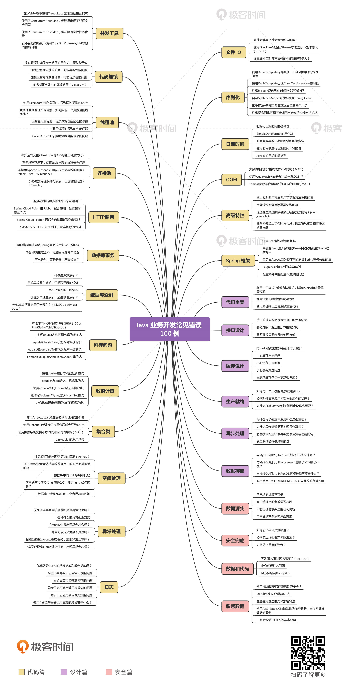

## 大纲

配套课程源码地址 [JosephZhu1983/java-common-mistakes](https://github.com/JosephZhu1983/java-common-mistakes)

## 代码篇

## 参考资料

- [Java 业务开发常见错误 100 例](https://time.geekbang.org/column/intro/100047701)

