# 性能分析

# 性能分析大纲

性能问题的本质，就是系统资源已经达到瓶颈，但请求的处理却还不够快，无法支撑更多的请求

性能分析，其实就是找出应用或系统的瓶颈，并设法去避免或者缓解它们，从而更高效地利用系统资源处理更多的请求。这包含了一系列的步骤，比如下面这六个步骤。

- 选择指标评估应用程序和系统的性能；

- 为应用程序和系统设置性能目标；

- 进行性能基准测试；

- 性能分析定位瓶颈；

- 优化系统和应用程序；

- 性能监控和告警

性能优化最好逐步完善，动态进行。不要追求一步到位，而要首先保证能满足当前的性能要求。性能优化通常意味着复杂度的提升，也意味着可维护性的降低。

如果你发现单机的性能调优带来过高复杂度，一定不要沉迷于单机的极限性能，而要从软件架构的角度，以水平扩展的方法来提升性能。

切记千万不要把性能工具当成学习的全部。工具只是解决问题的手段，关键在于你的用法。只有真正理解了它们背后的原理，并且结合具体场景，融会贯通系统的不同组件，你才能真正掌握它们

使用工具前要思考几个问题

- 有哪些指标可以衡量性能？
- 使用什么样的性能工具来观察指标？
- 导致这些指标变化的因素等

## 性能分析指标

笼统的讲：
应用负载的视角: 吞吐、延时(高并发、响应快)

系统资源的视角: 资源使用率、饱和度等

具体而言：

## 监控系统搭建

在实际的性能分析中，一个很常见的现象是，明明发生了性能瓶颈，但当你登录到服务器中想要排查的时候，却发现瓶颈已经消失了。或者说，性能问题总是时不时地发生，但却很难找出发生规律，也很难重现。

当面对这样的场景时，各种工具、方法都“失效“了。为什么呢？因为它们都需要在性能问题发生的时刻才有效，而在这些事后分析的场景中，我们就很难发挥它们的威力了。

那该怎么办呢？置之不理吗？其实以往，很多应用都是等到用户抱怨响应慢了，或者系统崩溃了后，才发现系统或者应用程序的性能出现了问题。虽然最终也能发现问题，但显然，这种方法是不可取的，因为严重影响了用户的体验。

而要解决这个问题，就要搭建监控系统，把系统和应用程序的运行状况监控起来，并定义一系列的策略，在发生问题时第一时间告警通知。一个好的监控系统，不仅可以实时暴露系统的各种问题，更可以根据这些监控到的状态，自动分析和定位大致的瓶颈来源，从而更精确地把问题汇报给相关团队处理

详情参见 [监控系统大纲](../../deploy/monitor/outline.md)

## 性能瓶颈定位

在搭建好监控系统后，如果你收到监控系统的告警，发现系统资源或者应用程序出现性能瓶颈，又该如何进一步分析它的根源呢？本小节将分别从系统资源瓶颈和应用程序瓶颈这两个角度, 总结性能分析的一般步骤。

### 系统资源瓶颈

首先来看系统资源的瓶颈，这也是最为常见的性能问题。

在系统监控的综合思路篇中，我曾经介绍过，系统资源的瓶颈，可以通过 USE 法，即**使用率、饱和度以及错误数**这三类指标来衡量。系统的资源，可以分为硬件资源和软件资源两类。

- 如 CPU、内存、磁盘和文件系统以及网络等，都是最常见的硬件资源。

- 而文件描述符数、连接跟踪数、套接字缓冲区大小等，则是典型的软件资源。

这样，在你收到监控系统告警时，就可以对照这些资源列表，再根据指标的不同来进行定位。

接下来，从 CPU 性能、内存性能、磁盘和文件系统 I/O 性能以及网络性能等四个方面，讲解下分析步骤。

#### CPU性能分析

利用 top、vmstat、pidstat、strace 以及 perf 等几个最常见的工具，获取 CPU 性能指标后，再结合进程与 CPU 的工作原理，就可以迅速定位出 CPU 性能瓶颈的来源。

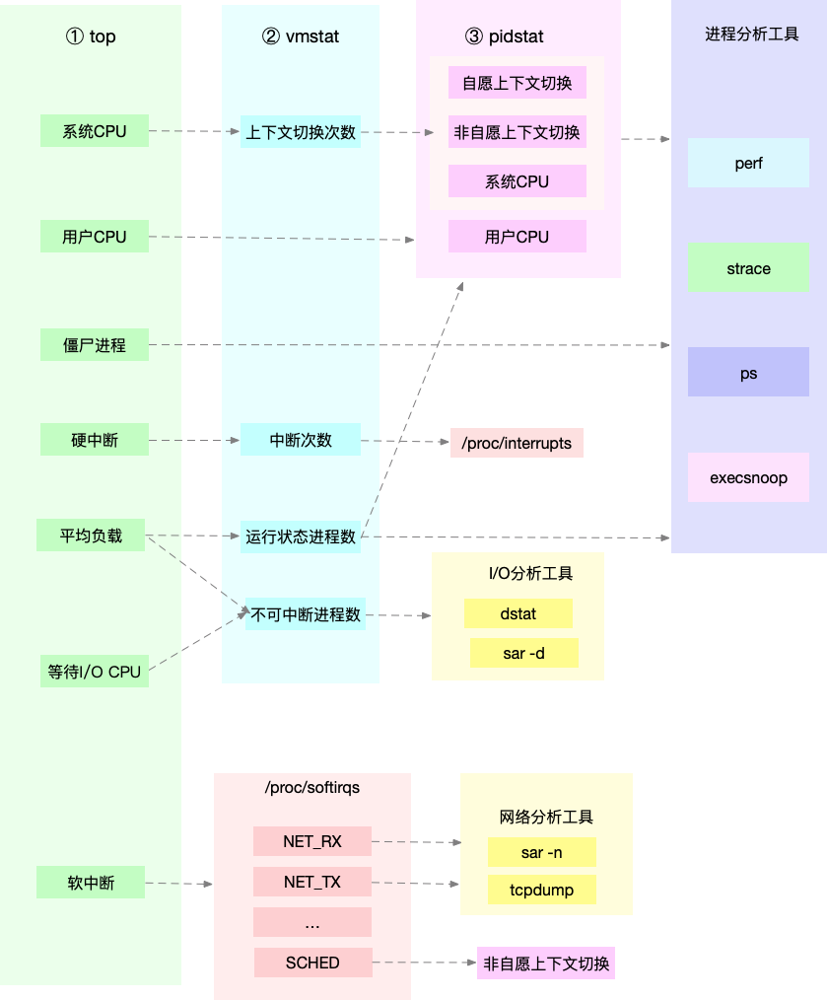

实际上，top、pidstat、vmstat 这类工具所汇报的 CPU 性能指标，都源自 /proc 文件系统（比如/proc/loadavg、/proc/stat、/proc/softirqs 等）。这些指标，都应该通过监控系统监控起来。虽然并非所有指标都需要报警，但这些指标却可以加快性能问题的定位分析。

比如说，当你收到系统的用户 CPU 使用率过高告警时，从监控系统中直接查询到，导致 CPU 使用率过高的进程；然后再登录到进程所在的 Linux 服务器中，分析该进程的行为。

你可以使用 strace，查看进程的系统调用汇总；也可以使用 perf 等工具，找出进程的热点函数；甚至还可以使用动态追踪的方法，来观察进程的当前执行过程，直到确定瓶颈的根源

#### 内存性能分析

下面这张图，就是一个迅速定位内存瓶颈的流程。我们可以通过 free 和 vmstat 输出的性能指标，确认内存瓶颈；然后，再根据内存问题的类型，进一步分析内存的使用、分配、泄漏以及缓存等，最后找出问题的来源。

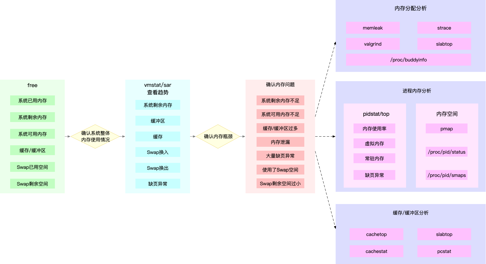

同 CPU 性能一样，很多内存的性能指标，也来源于 /proc 文件系统（比如 /proc/meminfo、/proc/slabinfo等），它们也都应该通过监控系统监控起来。这样，当你收到内存告警时，就可以从监控系统中，直接得到上图中的各项性能指标，从而加快性能问题的定位过程。

比如说，当你收到内存不足的告警时，首先可以从监控系统中。找出占用内存最多的几个进程。然后，再根据这些进程的内存占用历史，观察是否存在内存泄漏问题。确定出最可疑的进程后，再登录到进程所在的 Linux 服务器中，分析该进程的内存空间或者内存分配，最后弄清楚进程为什么会占用大量内存。

#### 磁盘和文件系统I/O性能分析

当你使用 iostat ，发现磁盘I/O 存在性能瓶颈（比如 I/O 使用率过高、响应时间过长或者等待队列长度突然增大等）后，可以再通过 pidstat、 vmstat 等，确认 I/O 的来源。接着，再根据来源的不同，进一步分析文件系统和磁盘的使用率、缓存以及进程的 I/O 等，从而揪出 I/O 问题的真凶。

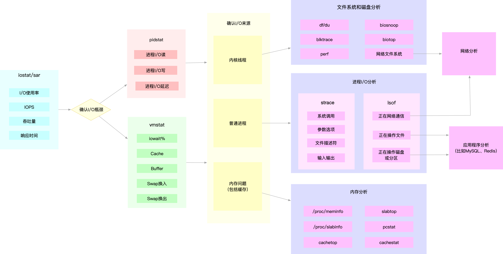

同 CPU 和内存性能类似，很多磁盘和文件系统的性能指标，也来源于 /proc 和 /sys 文件系统（比如 /proc/diskstats、/sys/block/sda/stat 等）。自然，它们也应该通过监控系统监控起来。这样，当你收到 I/O 性能告警时，就可以从监控系统中，直接得到上图中的各项性能指标，从而加快性能定位的过程。

比如说，当你发现某块磁盘的 I/O 使用率为 100% 时，首先可以从监控系统中，找出 I/O 最多的进程。然后，再登录到进程所在的 Linux 服务器中，借助 strace、lsof、perf 等工具，分析该进程的 I/O 行为。最后，再结合应用程序的原理，找出大量 I/O 的原因。

#### 网络性能分析

网络性能包含两类资源，即网络接口和内核资源。网络性能的分析，要从 Linux 网络协议栈的原理来切入。下面这张图，就是 Linux 网络协议栈的基本原理，包括应用层、套机字接口、传输层、网络层以及链路层等。

而要分析网络的性能，自然也是要从这几个协议层入手，通过使用率、饱和度以及错误数这几类性能指标，观察是否存在性能问题。比如 ：

- 在链路层，可以从网络接口的吞吐量、丢包、错误以及软中断和网络功能卸载等角度分析；

- 在网络层，可以从路由、分片、叠加网络等角度进行分析；

- 在传输层，可以从 TCP、UDP 的协议原理出发，从连接数、吞吐量、延迟、重传等角度进行分析；

- 在应用层，可以从应用层协议（如 HTTP 和 DNS）、请求数（QPS）、套接字缓存等角度进行分析。

同前面几种资源类似，网络的性能指标也都来源于内核，包括 /proc 文件系统（如 /proc/net）、网络接口以及conntrack等内核模块。这些指标同样需要被监控系统监控。这样，当你收到网络告警时，就可以从监控系统中，查询这些协议层的各项性能指标，从而更快定位出性能问题。

比如，当你收到网络不通的告警时，就可以从监控系统中，查找各个协议层的丢包指标，确认丢包所在的协议层。然后，从监控系统的数据中，确认网络带宽、缓冲区、连接跟踪数等软硬件，是否存在性能瓶颈。最后，再登录到发生问题的 Linux 服务器中，借助 netstat、tcpdump、bcc 等工具，分析网络的收发数据，并且结合内核中的网络选项以及 TCP 等网络协议的原理，找出问题的来源。

### 应用程序瓶颈

除了以上这些来自网络资源的瓶颈外，还有很多瓶颈，其实直接来自应用程序。比如，最典型的应用程序性能问题，就是吞吐量（并发请求数）下降、错误率升高以及响应时间增大。

不过，在我看来，这些应用程序性能问题虽然各种各样，但就其本质来源，实际上只有三种，也就是**资源瓶颈、依赖服务瓶颈以及应用自身的瓶颈**。

第一种资源瓶颈，其实还是指刚才提到的 CPU、内存、磁盘和文件系统 I/O、网络以及内核资源等各类软硬件资源出现了瓶颈，从而导致应用程序的运行受限。对于这种情况，我们就可以用前面系统资源瓶颈模块提到的各种方法来分析。

第二种依赖服务的瓶颈，也就是诸如数据库、分布式缓存、中间件等应用程序，直接或者间接调用的服务出现了性能问题，从而导致应用程序的响应变慢，或者错误率升高。这说白了就是跨应用的性能问题，使用全链路跟踪系统，就可以帮你快速定位这类问题的根源。

最后一种，应用程序自身的性能问题，包括了多线程处理不当、死锁、业务算法的复杂度过高等等。对于这类问题，在我们前面讲过的应用程序指标监控以及日志监控中，观察关键环节的耗时和内部执行过程中的错误，就可以帮你缩小问题的范围。

不过，由于这是应用程序内部的状态，外部通常不能直接获取详细的性能数据，所以就需要应用程序在设计和开发时，就提供出这些指标，以便监控系统可以了解应用程序的内部运行状态。

如果这些手段过后还是无法找出瓶颈，你还可以用系统资源模块提到的各类进程分析工具，来进行分析定位。比如：

- 你可以用 strace，观察系统调用；

- 使用 perf 和火焰图，分析热点函数；

- 甚至使用动态追踪技术，来分析进程的执行状态。

当然，系统资源和应用程序本来就是相互影响、相辅相成的一个整体。实际上，很多资源瓶颈，也是应用程序自身运行导致的。比如，进程的内存泄漏，会导致系统内存不足；进程过多的 I/O 请求，会拖慢整个系统的 I/O 请求等。

所以，很多情况下，资源瓶颈和应用自身瓶颈，其实都是同一个问题导致的，并不需要我们重复分析。

## 性能工具使用

在上一步骤的分析中可以看到,当监控系统检测到发生性能问题时，可能还需要配合使用各种性能工具来进一步更细致地分析问题原因。

==更多介绍详见[系统性能优化](./sys.md)==

### 性能工具速查表

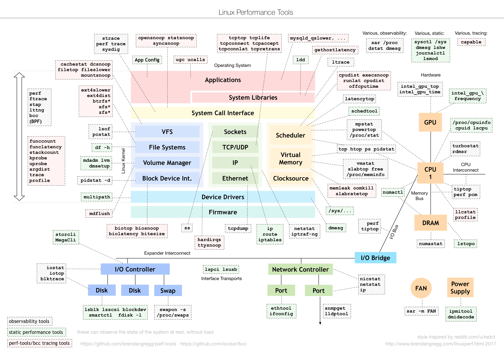

这张图从 Linux 内核的各个子系统出发，汇总了对各个子系统进行性能分析时，你可以选择的工具。

不过，虽然这个图是性能分析最好的参考资料之一，它其实还不够具体。比如，当你需要查看某个性能指标时，这张图里对应的子系统部分，可能有多个性能工具可供选择。但实际上，并非所有这些工具都适用，具体要用哪个，还需要你去查找每个工具的手册，对比分析做出选择。

那么，有没有更好的方法来理解这些工具呢？我的建议，还是**从性能指标出发，根据性能指标的不同，将性能工具划分为不同类型**。比如，最常见的就是可以根据 CPU、内存、磁盘 I/O 以及网络的各类性能指标，将这些工具进行分类。

以下将从 CPU、内存、磁盘 I/O 以及网络等几个角度，梳理这些常见的 Linux 性能工具，特别是从性能指标的角度出发，理清楚到底有哪些工具，可以用来监测特定的性能指标。

注意事项以及使用说明:

1、在选择性能工具时，除了要考虑性能指标这个目的外，还要结合待分析的环境来综合考虑。

比如，实际环境是否允许安装软件包，是否需要新的内核版本等。有些工具不需要额外安装，就可以直接使用，比如内核的 /proc 文件系统；而有些工具，则需要安装额外的软件包，比如 sar、pidstat、iostat 等。

2、如果对工具不太清楚，可以使用 man 以及 info 查询工具的详细使用方法。( info 可以理解为 man 的详细版本，提供了诸如节点跳转等更强大的功能。相对来说，man 的输出比较简洁，而 info 的输出更详细。所以，我们通常使用 man 来查询工具的使用方法，只有在man 的输出不太好理解时，才会再去参考 info 文档)

#### CPU性能工具

首先，从 CPU 的角度来说，主要的性能指标就是 CPU 的使用率、上下文切换以及 CPU Cache 的命中率等。下面这张图就列出了常见的 CPU 性能指标。-

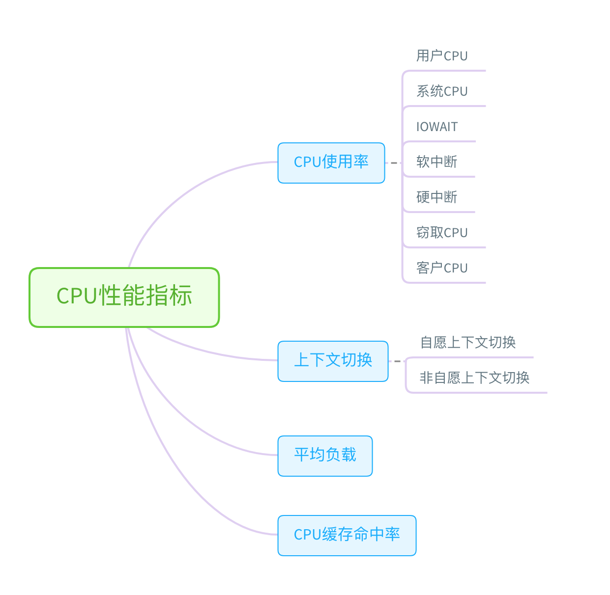

从这些指标出发，再把 CPU 使用率，划分为系统和进程两个维度，就可以得到CPU 性能工具速查表。

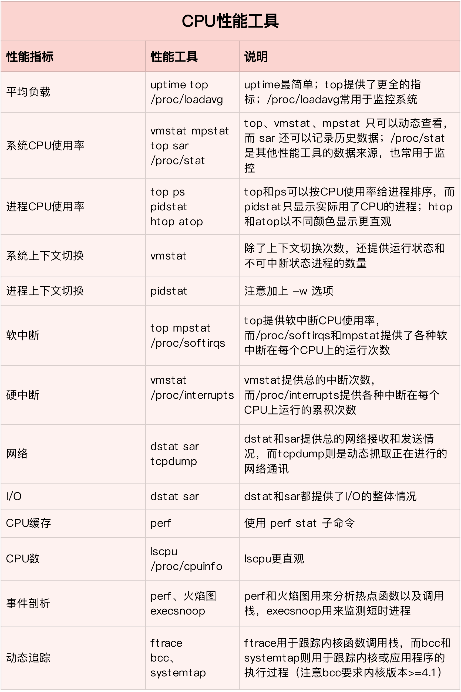

#### 内存性能工具

下图列出了常见的内存性能指标

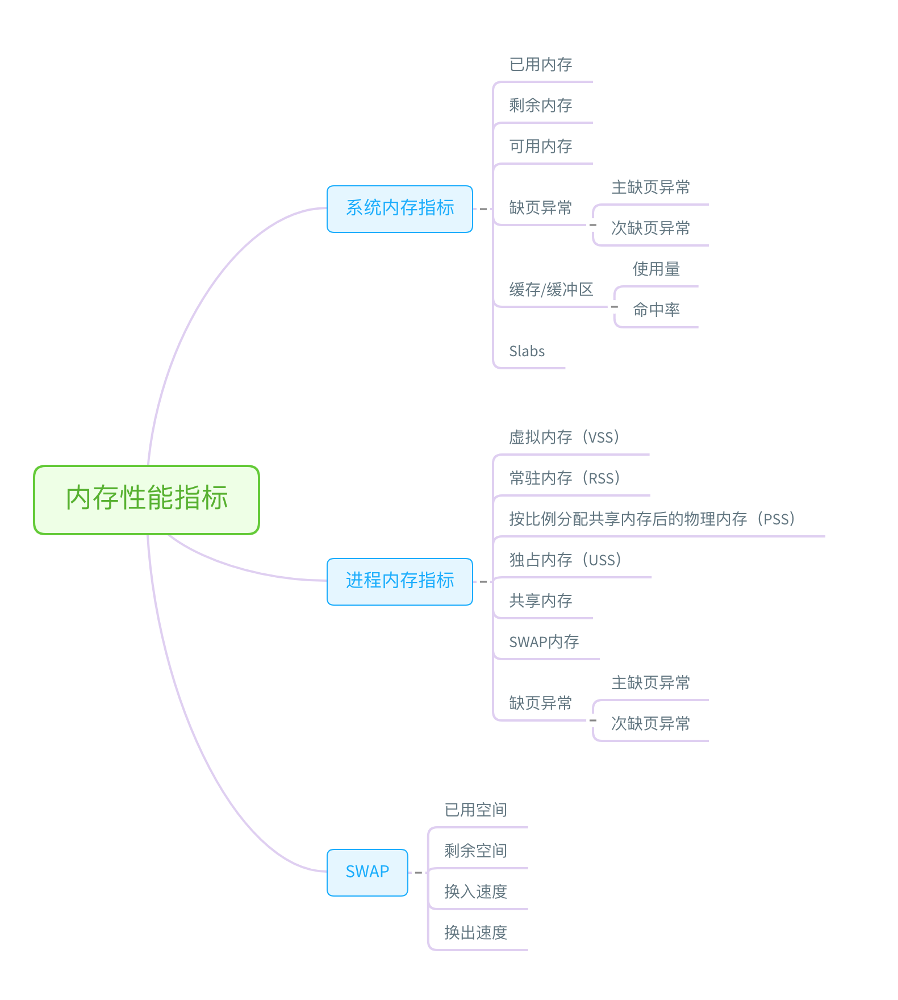

下图总结了一些内存性能工具

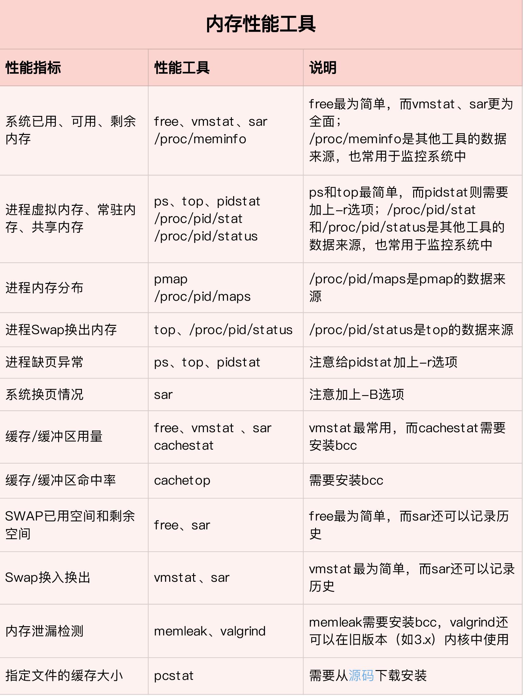

注：最后一行pcstat的源码链接为 https://github.com/tobert/pcstat

#### 磁盘I/O性能工具

下面图列出了常见的 I/O 性能指标

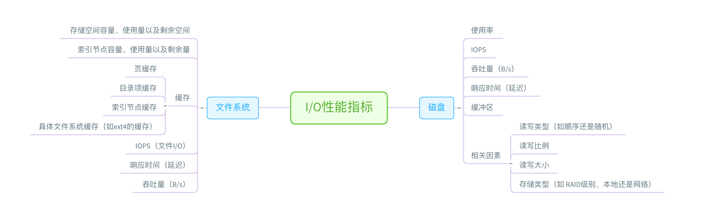

下图总结了一些磁盘I/O性能工具

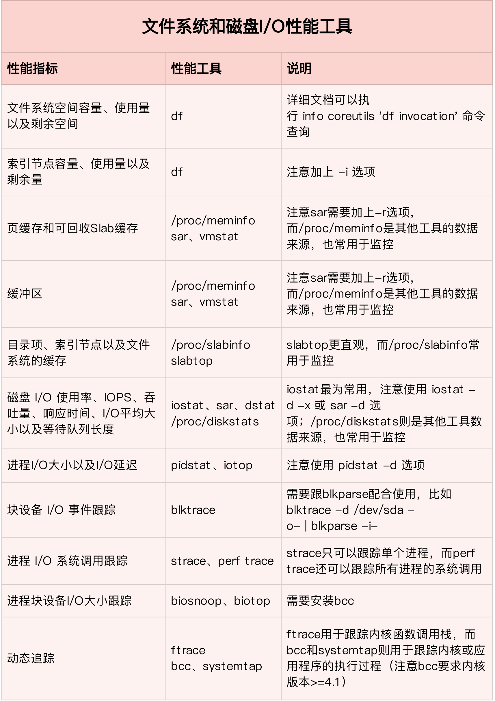

#### 网络性能工具

下图列出了常见的各层网络协议的性能指标

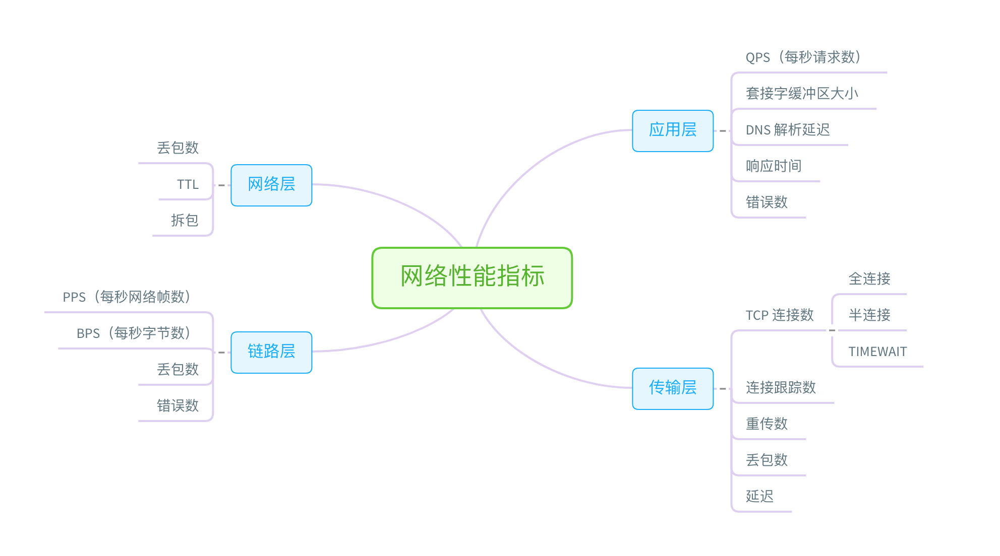

下图总结了一些网络性能工具

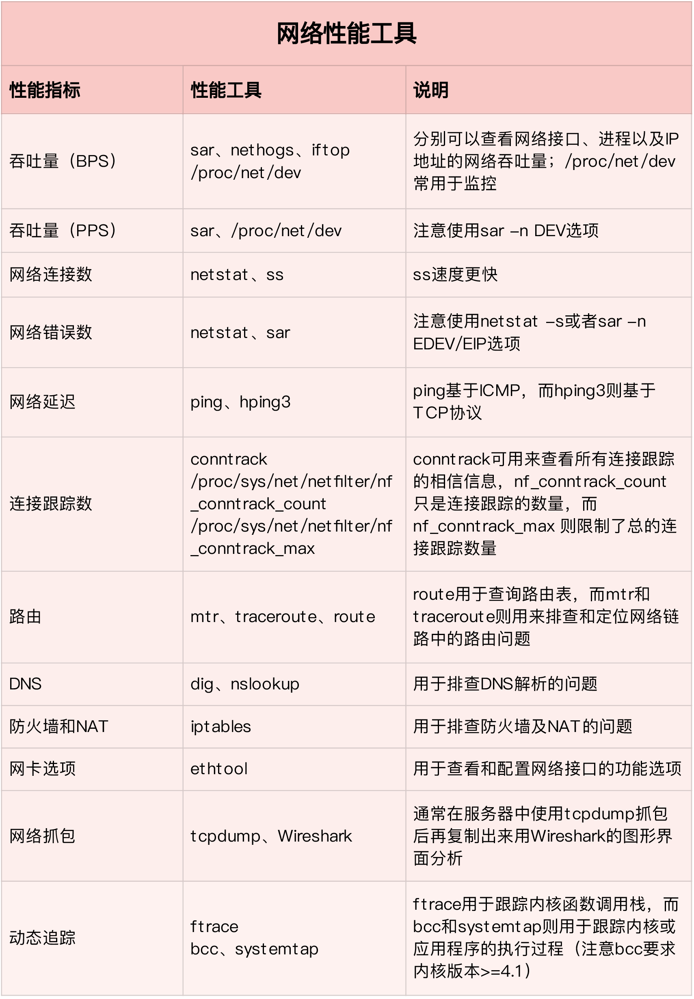

#### 基准测试工具

除了性能分析外，很多时候，我们还需要对系统性能进行基准测试。

- 比如，在文件系统和磁盘 I/O 模块中，我们使用 fio 工具，测试了磁盘 I/O 的性能。

- 在网络模块中，使用 iperf、pktgen 等，测试了网络的性能

- 而在很多基于 Nginx 的案例中，我们则使用 ab、wrk 等，测试 Nginx 应用的性能。

下图总结了一些linux基准测试工具

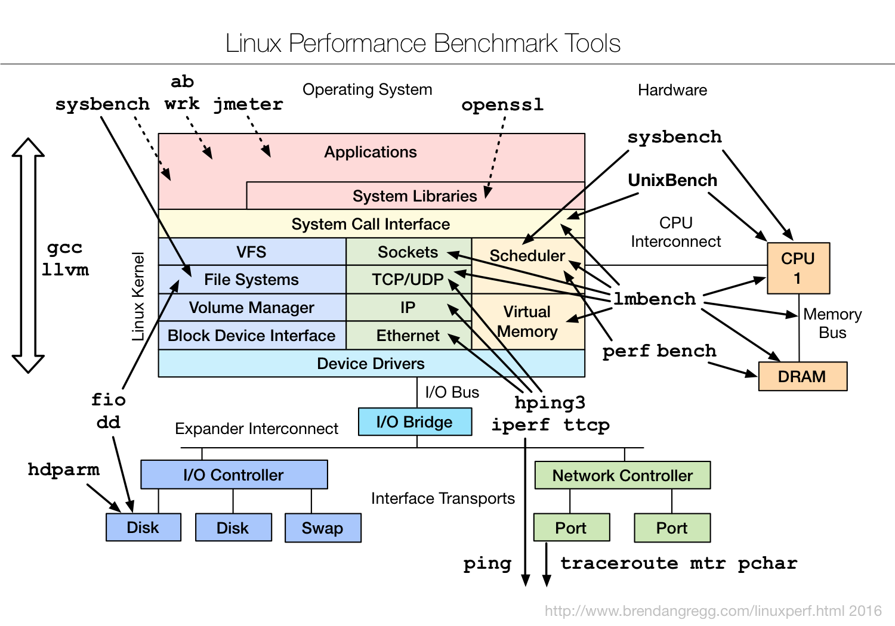

## 性能优化方法

==有关优化方法更多内容详见[系统性能优化](./sys.md)==

### 优化定位

在通过各种性能分析方法，找到引发性能问题的瓶颈后，先要思考以下几个问题:

- 首先，既然要做性能优化，那要怎么判断它是不是有效呢？特别是优化后，到底能提升多少性能呢？

- 第二，性能问题通常不是独立的，如果有多个性能问题同时发生，你应该先优化哪一个呢？

- 第三，提升性能的方法并不是唯一的，当有多种方法可以选择时，你会选用哪一种呢？是不是总选那个最大程度提升性能的方法就行了呢？

比如，在前面的不可中断进程案例中，通过性能分析，我们发现是因为一个进程的直接 I/O ，导致了 iowait 高达 90%。那是不是用“直接 I/O 换成缓存 I/O”的方法，就可以立即优化了呢？

按照上面讲的，你可以先自己思考下那三点。如果不能确定，我们一起来看看。

- 第一个问题，直接 I/O 换成缓存 I/O，可以把 iowait 从 90% 降到接近 0，性能提升很明显。

- 第二个问题，我们没有发现其他性能问题，直接 I/O 是唯一的性能瓶颈，所以不用挑选优化对象。

- 第三个问题，缓存 I/O 是我们目前用到的最简单的优化方法，而且这样优化并不会影响应用的功能。

好的，这三个问题很容易就能回答，所以立即优化没有任何问题。

但是，很多现实情况，并不像上面举的例子那么简单。性能评估可能有多重指标，性能问题可能会多个同时发生，而且，优化某一个指标的性能，可能又导致其他指标性能的下降。

下面将针对上面的问题一一分析:

#### 性能优化效果评估

我们解决性能问题的目的，自然是想得到一个性能提升的效果。为了评估这个效果，我们需要对系统的性能指标进行量化，并且要分别测试出优化前、后的性能指标，用前后指标的变化来对比呈现效果。我把这个方法叫做性能评估“三步走”。

- 确定性能的量化指标

性能的量化指标有很多，比如 CPU 使用率、应用程序的吞吐量、客户端请求的延迟等，都可以评估性能。那我们应该选择什么指标来评估呢

建议是不要局限在单一维度的指标上，你至少要从应用程序和系统资源这两个维度，分别选择不同的指标。比如，以 Web 应用为例：

1、应用程序的维度，我们可以用吞吐量和请求延迟来评估应用程序的性能

2、系统资源的维度，我们可以用 CPU 使用率来评估系统的 CPU 使用情况

之所以从这两个不同维度选择指标，主要是因为应用程序和系统资源这两者间相辅相成的关系

好的应用程序是性能优化的最终目的和结果，系统优化总是为应用程序服务的。所以，必须要使用应用程序的指标，来评估性能优化的整体效果。

系统资源的使用情况是影响应用程序性能的根源。所以，需要用系统资源的指标，来观察和分析瓶颈的来源。

- 测试优化前的性能指标

- 测试优化后的性能指标
测试环节,主要是为了对比优化前后的性能，更直观地呈现效果。如果你的第一步，是从两个不同维度选择了多个指标，那么在性能测试时，你就需要获得这些指标的具体数值。

还是以刚刚的 Web 应用为例，对应上面提到的几个指标，我们可以选择 ab 等工具，测试 Web 应用的并发请求数和响应延迟。而测试的同时，还可以用 vmstat、pidstat 等性能工具，观察系统和进程的 CPU 使用率。这样，我们就同时获得了应用程序和系统资源这两个维度的指标数值。

性能测试注意事项:

1、要避免性能测试工具干扰应用程序的性能。

通常，对 Web 应用来说，性能测试工具跟目标应用程序要在不同的机器上运行。

比如，在之前的 Nginx 案例中，我每次都会强调要用两台虚拟机，其中一台运行 Nginx 服务，而另一台运行模拟客户端的工具，就是为了避免这个影响。

2、避免外部环境的变化影响性能指标的评估。

这要求优化前、后的应用程序，都运行在相同配置的机器上，并且它们的外部依赖也要完全一致。

比如还是拿 Nginx 来说，就可以运行在同一台机器上，并用相同参数的客户端工具来进行性能测试。

对于压测而言重要的有这么几点：

**（1）重中之重，要有合理的压测方案和周知下游、qa、op，也就是下面的说的几点，切勿啥都不准备上来就开干。**

**（2）数据完全隔离**

如果想切实的了解系统在生产环境的抗压能力，那就必须要在生产环境进行压测，那么数据隔离是首要的，不能影响线上不能因为压测产生故障或者资损，隔离的方式很简单：用户id区分。

我们可以使用现在没有在用及近一段时间也不会有的用户账号进行压测，但是这样需要面临清理数据（一个相当头疼的活）打压测表示，这需要我们在系统设计时就需要做到的，每个系统都要天然的支持压测。

第二种方式无疑是日常压测中最合适的，也是系统设计时需要考虑的。

**（3）灵活高效的压测系统，需要qps实时可控，要有红线触发机制，比如说压测前确定最大值，压测qps调节过程无论如何都不能超过预值。**

对于流量控制，也就是qps的调控所依赖的算法其实很简单，就是限流算法的变相使用，常见的有计数器控制法、令牌通控制法、漏桶控制，并且基于滑动窗口对于流量进行整形，保证均匀，不出现过高的瞬发峰值，这部分内容之前单独写过，可以看一下Go系列文章中限流算法实战，还有高性能系统中的限流算法原理。

**（4）压测的核心关注点**

压测过程中需要有合理的指标：

关于你的服务：cpu（cpu idel、user、cpu.load）、内存（这个通常来说问题不大），剩下的你需要看下游系统的压力，切勿把下游打挂。

除此之外，压测的目的是发现问题解决问题，而不是仅仅是测试系统能扛多少，所以一定要关注核心依赖，比如说mysql、redis等，发现各种问题才能避免线上挂的惨，大多时候通常是代码写的有问题，但是在三方应用上暴露出来，比如说hgetall。但是有时候线上机器也是可能存在问题的，需要压测来检验。

**（5）合理的压测过程**

压测需要循序渐进的来，有问题能及时发现，并且一上来流量太大高估了自己的系统，可能瞬间打挂。

压测的流量规律需要根据线上真实流量的变化趋势，或者预测趋势来进行压测，不能想当然。建议对线上流量进行复制，以供压测使用，这样压测的链路才是真实的。

**（6）完整的留存**

压测数据完整留存、压测日志完整留存、火焰图记录完整留存。

这一块儿是关键也是我们压测的最终产出，发现那些地方存在问题或风险之后，我们需要根据这些来具体分析，以此得出优化结论。

#### 多个性能问题如何优化

再来看第二个问题，开篇词里我们就说过，系统性能总是牵一发而动全身，所以性能问题通常也不是独立存在的。那当多个性能问题同时发生的时候，应该先去优化哪一个呢？

在性能测试的领域，流传很广的一个说法是==二八原则==，也就是说 80% 的问题都是由 20% 的代码导致的。只要找出这 20% 的位置，你就可以优化 80% 的性能。所以，我想表达的是，并不是所有的性能问题都值得优化。

我的建议是，动手优化之前先动脑，先把所有这些性能问题给分析一遍，找出最重要的、可以最大程度提升性能的问题，从它开始优化。这样的好处是，不仅性能提升的收益最大，而且很可能其他问题都不用优化，就已经满足了性能要求。

那关键就在于，怎么判断出哪个性能问题最重要。这其实还是我们性能分析要解决的核心问题，只不过这里要分析的对象，从原来的一个问题，变成了多个问题，思路其实还是一样的。

所以，你依然可以用我前面讲过的方法挨个分析，分别找出它们的瓶颈。分析完所有问题后，再按照因果等关系，排除掉有因果关联的性能问题。最后，再对剩下的性能问题进行优化。

如果剩下的问题还是好几个，你就得分别进行性能测试了。比较不同的优化效果后，选择能明显提升性能的那个问题进行修复。这个过程通常会花费较多的时间，这里，我推荐两个可以简化这个过程的方法。

第一，如果发现是系统资源达到了瓶颈，比如 CPU 使用率达到了 100%，那么首先优化的一定是系统资源使用问题。完成系统资源瓶颈的优化后，我们才要考虑其他问题。

第二，针对不同类型的指标，首先去优化那些由瓶颈导致的，性能指标变化幅度最大的问题。比如产生瓶颈后，用户 CPU 使用率升高了 10%，而系统 CPU 使用率却升高了 50%，这个时候就应该首先优化系统 CPU 的使用。

#### 多种优化方法选择

当多种方法都可用时，应该选择哪一种呢？是不是最大提升性能的方法，一定最好呢？

一般情况下，我们当然想选能最大提升性能的方法，这其实也是性能优化的目标。

但要注意，现实情况要考虑的因素却没那么简单。最直观来说，性能优化并非没有成本。性能优化通常会带来复杂度的提升，降低程序的可维护性，还可能在优化一个指标时，引发其他指标的异常。也就是说，很可能你优化了一个指标，另一个指标的性能却变差了。

一个很典型的例子是我将在网络部分讲到的 DPDK（Data Plane Development Kit）。DPDK 是一种优化网络处理速度的方法，它通过绕开内核网络协议栈的方法，提升网络的处理能力。

不过它有一个很典型的要求，就是要独占一个 CPU 以及一定数量的内存大页，并且总是以 100% 的 CPU 使用率运行。所以，如果你的 CPU 核数很少，就有点得不偿失了。

所以，在考虑选哪个性能优化方法时，你要综合多方面的因素。切记，不要想着“一步登天”，试图一次性解决所有问题；也不要只会“拿来主义”，把其他应用的优化方法原封不动拿来用，却不经过任何思考和分析。

### 系统优化

#### CPU 优化

这里，主要强调一下，最典型的三种优化方法。

- 第一种，把进程绑定到一个或者多个 CPU 上，充分利用 CPU 缓存的本地性，并减少进程间的相互影响。

- 第二种，为中断处理程序开启多 CPU 负载均衡，以便在发生大量中断时，可以充分利用多 CPU 的优势分摊负载。

- 第三种，使用 Cgroups 等方法，为进程设置资源限制，避免个别进程消耗过多的 CPU。同时，为核心应用程序设置更高的优先级，减少低优先级任务的影响。

#### 内存优化

在我看来，你可以通过以下几种方法，来优化内存的性能。

- 第一种，除非有必要，Swap 应该禁止掉。这样就可以避免 Swap 的额外 I/O ，带来内存访问变慢的问题。

- 第二种，使用 Cgroups 等方法，为进程设置内存限制。这样就可以避免个别进程消耗过多内存，而影响了其他进程。对于核心应用，还应该降低 oom_score，避免被 OOM 杀死。

- 第三种，使用大页、内存池等方法，减少内存的动态分配，从而减少缺页异常。

#### 磁盘和文件系统I/O优化

接下来，我们再来看第三类系统资源，即磁盘和文件系统 I/O 的优化方法。在磁盘 I/O 性能优化的几个思路 中，我已经为你梳理了一些常见的优化思路，这其中有三种最典型的方法。

- 第一种，也是最简单的方法，通过 SSD 替代 HDD、或者使用 RAID 等方法，提升I/O性能。

- 第二种，针对磁盘和应用程序 I/O 模式的特征，选择最适合的 I/O 调度算法。比如，SSD 和虚拟机中的磁盘，通常用的是 noop 调度算法；而数据库应用，更推荐使用 deadline 算法。

- 第三，优化文件系统和磁盘的缓存、缓冲区，比如优化脏页的刷新频率、脏页限额，以及内核回收目录项缓存和索引节点缓存的倾向等等。

除此之外，使用不同磁盘隔离不同应用的数据、优化文件系统的配置选项、优化磁盘预读、增大磁盘队列长度等，也都是常用的优化思路。

#### 网络优化

在网络性能优化的几个思路中，我也已经为你梳理了一些常见的优化思路。这些优化方法都是从 Linux 的网络协议栈出发，针对每个协议层的工作原理进行优化。这里，我同样强调一下，最典型的几种网络优化方法。

首先，从内核资源和网络协议的角度来说，我们可以对内核选项进行优化，比如：

- 你可以增大套接字缓冲区、连接跟踪表、最大半连接数、最大文件描述符数、本地端口范围等内核资源配额；

- 也可以减少 TIMEOUT 超时时间、SYN+ACK 重传数、Keepalive 探测时间等异常处理参数；

- 还可以开启端口复用、反向地址校验，并调整 MTU 大小等降低内核的负担。

这些都是内核选项优化的最常见措施。

其次，从网络接口的角度来说，我们可以考虑对网络接口的功能进行优化，比如：

- 你可以将原来 CPU 上执行的工作，卸载到网卡中执行，即开启网卡的 GRO、GSO、RSS、VXLAN 等卸载功能；

- 也可以开启网络接口的多队列功能，这样，每个队列就可以用不同的中断号，调度到不同 CPU 上执行；

- 还可以增大网络接口的缓冲区大小以及队列长度等，提升网络传输的吞吐量。

最后，在极限性能情况（比如 C10M）下，内核的网络协议栈可能是最主要的性能瓶颈，所以，一般会考虑绕过内核协议栈。

- 你可以使用 DPDK 技术，跳过内核协议栈，直接由用户态进程用轮询的方式，来处理网络请求。同时，再结合大页、CPU 绑定、内存对齐、流水线并发等多种机制，优化网络包的处理效率。

- 你还可以使用内核自带的 XDP 技术，在网络包进入内核协议栈前，就对其进行处理。这样，也可以达到目的，获得很好的性能

### 应用程序优化

虽然系统的软硬件资源，是保证应用程序正常运行的基础，但你要知道，**性能优化的最佳位置，还是应用程序内部**。为什么这么说呢？我简单举两个例子你就明白了。

第一个例子，是系统 CPU 使用率（sys%）过高的问题。有时候出现问题，虽然表面现象是系统CPU 使用率过高，但待你分析过后，很可能会发现，应用程序的不合理系统调用才是罪魁祸首。这种情况下，优化应用程序内部系统调用的逻辑，显然要比优化内核要简单也有用得多。

再比如说，数据库的 CPU 使用率高、I/O 响应慢，也是最常见的一种性能问题。这种问题，一般来说，并不是因为数据库本身性能不好，而是应用程序不合理的表结构或者 SQL 查询语句导致的。这时候，优化应用程序中数据库表结构的逻辑或者 SQL 语句，显然要比优化数据库本身，能带来更大的收益。

所以，在观察性能指标时，你应该先查看**应用程序的响应时间、吞吐量以及错误率**等指标，因为它们才是性能优化要解决的终极问题。以终为始，从这些角度出发，你一定能想到很多优化方法，而我比较推荐下面几种方法。

- 第一，从 CPU 使用的角度来说，简化代码、优化算法、异步处理以及编译器优化等，都是常用的降低 CPU 使用率的方法，这样可以利用有限的 CPU处理更多的请求。

- 第二，从数据访问的角度来说，使用缓存、写时复制、增加 I/O 尺寸等，都是常用的减少磁盘 I/O 的方法，这样可以获得更快的数据处理速度。

- 第三，从内存管理的角度来说，使用大页、内存池等方法，可以预先分配内存，减少内存的动态分配，从而更好地内存访问性能。

- 第四，从网络的角度来说，使用 I/O 多路复用、长连接代替短连接、DNS 缓存等方法，可以优化网络 I/O 并减少网络请求数，从而减少网络延时带来的性能问题。

- 第五，从进程的工作模型来说，异步处理、多线程或多进程等，可以充分利用每一个 CPU 的处理能力，从而提高应用程序的吞吐能力。

除此之外，你还可以使用消息队列、CDN、负载均衡等各种方法，来优化应用程序的架构，将原来单机要承担的任务，调度到多台服务器中并行处理。这样也往往能获得更好的整体性能。

### 千万避免过早优化

掌握上面这些优化方法后，我估计，很多人即使没发现性能瓶颈，也会忍不住把各种各样的优化方法带到实际的开发中。

不过，我想你一定听说过高德纳的这句名言， “过早优化是万恶之源”，我也非常赞同这一点，过早优化不可取。

因为，一方面，优化会带来复杂性的提升，降低可维护性；另一方面，需求不是一成不变的。针对当前情况进行的优化，很可能并不适应快速变化的新需求。这样，在新需求出现时，这些复杂的优化，反而可能阻碍新功能的开发。

所以，性能优化最好是逐步完善，动态进行，不追求一步到位，而要首先保证能满足当前的性能要求。当发现性能不满足要求或者出现性能瓶颈时，再根据性能评估的结果，选择最重要的性能问题进行优化。

## 参考资料

- [Linux性能优化实战_Linux_性能调优-极客时间](https://time.geekbang.org/column/intro/140)

- [我认知中的营销活动及其系统 | 人人都是产品经理](https://www.woshipm.com/marketing/5373629.html)