## 系统篇: CPU性能分析

### CPU 性能指标

CPU 使用率、平均负载（Load Average）、进程上下文切换、CPU缓存的命中率

```markmap
# CPU性能指标

## CPU 使用率

- 用户CPU
- 系统CPU
- IOWAIT
- 软中断
- 硬中断
- 窃取CPU
- 客户CPU

## 进程上下文切换
- 自愿上下文切换
- 非自愿上下文切换

## 平均负载

## CPU缓存的命中率

```

### CPU 性能分析工具

根据指标找工具

| 性能指标          | 工具                                           | 说明                                                         | 备注 |
| ----------------- | ---------------------------------------------- | ------------------------------------------------------------ | ---- |
| 平均负载          | uptime<br>top                                  | uptime<br/>top指标更全面                                     |      |
| 系统整体CPU使用率 | vmstat<br>mpstat<br>top<br/>sar<br/>/proc/stat | top、vmstat、mpstat只可以动态查看 sar还可以记录历史数据      |      |
| 进程CPU使用率     | top<br/>pidstat<br>ps<br>htop<br>atop          | top、ps可以按照CPU使用率给进程排序，而pidstat只显示实际用了CPU的进程 |      |
| 系统上下文切换    | vmstat                                         | 不仅提供上下文切换次数,还提供运行状态以及不可中断状态进程的数量 |      |
| 进程上下文切换    | pidstat                                        | 注意加上 -w 选项                                             |      |
| 软中断            | top<br>/proc/softirqs<br/> mpstat              | top 提供软中断CPU使用率；/proc/softirqs和mpstat提供中断在每个CPU上的运行次数 |      |
| 硬中断            | vmstat<br>/proc/interrupts                     | vmstat 提供总的中断次数; /proc/interrupts提供各种中断在每个CPU上运行的累计次数 |      |
| 网络              | dstat<br/>sar<br>tcpdump                       | dstat、sar 提供总的网络接收和发送情况; tcpdump动态抓取正在进行的网络通信 |      |
| I/O               | dstat<br/>sar                                  | dstat、sar提供I/O整体情况                                    |      |
| CPU个数           | /proc/cpuinfo<br>iscpu                         | iscpu更直观                                                  |      |
| 事件剖析          | perf<br>execsnoop                              | perf可以用于分析CPU的缓存以及内核调用链,execsnoop用来监控短时进程 |      |


根据工具查指标

| 性能工具                                                     | CPU性能指标                                                  | 备注 |
| ------------------------------------------------------------ | ------------------------------------------------------------ | ---- |
| [uptime](https://wangchujiang.com/linux-command/c/uptime.html) | 平均负载                                                     |      |
| [top](https://wangchujiang.com/linux-command/c/top.html)     | 平均负载、运行队列 整体CPU使用率以及每个进程的状态和CPU使用率 |      |
| [htop](https://wangchujiang.com/linux-command/c/htop.html)   | top增强版 以不同颜色区分不同类型的进程 更直观                |      |
| [atop](https://wangchujiang.com/linux-command/c/atop.html)   | CPU 内存 磁盘 和网络等各种资源的全面监控                     |      |
| [vmstat](https://wangchujiang.com/linux-command/c/vmstat.html) | 系统整体的CPU使用率 上下文切换次数 中断次数 还包括处于运行和不可中断状态的进程数量 |      |
| [mpstat](https://wangchujiang.com/linux-command/c/mpstat.html) | 每个CPU的使用率和软中断次数                                  |      |
| [pidstat](https://wangchujiang.com/linux-command/c/pidstat.html) | 进程和线程的CPU使用率 中断上下文切换次数                     |      |
| /proc/softirqs                                               | 软中断类型以及在每个CPU上的累积中断次数                      |      |
| /proc/interrupts                                             | 硬中断类型以及在每个CPU上的累积中断次数                      |      |
| [ps](https://wangchujiang.com/linux-command/c/ps.html)       | 每个进程的状态的CPU使用率                                    |      |
| [pstree](https://wangchujiang.com/linux-command/c/pstree.html) | 进程的父子关系                                               |      |
| [dstat](https://wangchujiang.com/linux-command/c/dstat.html) | 系统整体的CPU使用率                                          |      |
| [sar](https://wangchujiang.com/linux-command/c/sar.html)     | 系统整体的CPU使用率 以及 可配置的历史数据                    |      |
| [strace](https://wangchujiang.com/linux-command/c/strace.html) | 进程的系统调用                                               |      |
| perf                                                         | CPU性能时间剖析 如调用链分析 CPU缓存 CPU调度                 |      |
| execsnoop                                                    | 监控短时进程                                                 |      |


### CPU 性能瓶颈定位

在清楚CPU 的性能指标以及每种性能指标的获取工具后,如果更有效率的分析出CPU性能瓶颈？毕竟指标以及指标工具非常庞大,不可能一一列出

实际上,很多指标间都有一定的关联。想弄清楚性能指标的关联性，就要通晓每种性能指标的工作原理

举个例子，用户 CPU 使用率高，我们应该去排查进程的用户态而不是内核态。因为用户 CPU 使用率反映的就是用户态的 CPU 使用情况，而内核态的 CPU 使用情况只会反映到系统 CPU 使用率上。

你看，有这样的基本认识，我们就可以缩小排查的范围，省时省力。

所以，为了缩小排查范围，可以先运行几个支持指标较多的工具，如 top、vmstat 和 pidstat 。为什么是这三个工具呢？仔细看看下面这张图，你就清楚了。

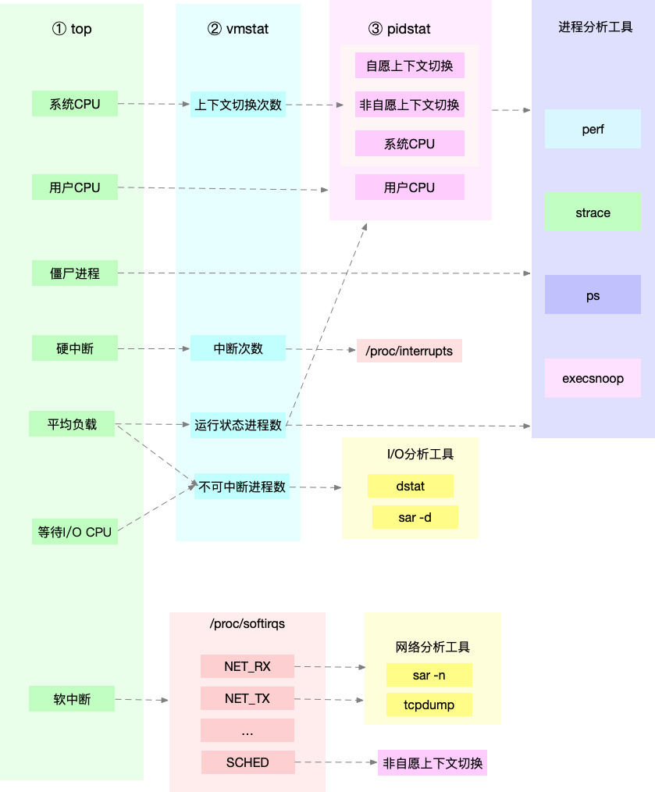


这张图里，列出了 top、vmstat 和 pidstat 分别提供的重要的 CPU 指标，并用虚线表示关联关系，对应出了性能分析下一步的方向。

1、这三个命令，几乎包含了所有重要的 CPU 性能指标，比如：

- 从 top 的输出可以得到各种 CPU 使用率以及僵尸进程和平均负载等信息。

- 从 vmstat 的输出可以得到上下文切换次数、中断次数、运行状态和不可中断状态的进程数。

- 从 pidstat 的输出可以得到进程的用户 CPU 使用率、系统 CPU 使用率、以及自愿上下文切换和非自愿上下文切换情况


2、这三个工具输出的很多指标是相互关联的，使用虚线表示了它们的关联关系，举几个例子说明:

- 例1:

pidstat 输出的进程用户 CPU 使用率升高，会导致 top 输出的用户 CPU 使用率升高。所以，当发现 top 输出的用户 CPU 使用率有问题时，可以跟 pidstat 的输出做对比，观察是否是某个进程导致的问题。

而找出导致性能问题的进程后，就要用进程分析工具来分析进程的行为，比如使用 strace 分析系统调用情况，以及使用 perf 分析调用链中各级函数的执行情况。

- 例2:

top 输出的平均负载升高，可以跟 vmstat 输出的运行状态和不可中断状态的进程数做对比，观察是哪种进程导致的负载升高。

如果是不可中断进程数增多了，那么就需要做 I/O 的分析，也就是用 dstat 或 sar 等工具，进一步分析 I/O 的情况。

如果是运行状态进程数增多了，那就需要回到 top 和 pidstat，找出这些处于运行状态的到底是什么进程，然后再用进程分析工具，做进一步分析。

- 例3:

当发现 top 输出的软中断 CPU 使用率升高时，可以查看 /proc/softirqs 文件中各种类型软中断的变化情况，确定到底是哪种软中断出的问题。比如，发现是网络接收中断导致的问题，那就可以继续用网络分析工具 sar 和 tcpdump 来分析

### CPU 性能优化思路

#### 应用程序优化

首先，从应用程序的角度来说，降低 CPU 使用率的最好方法当然是，排除所有不必要的工作，只保留最核心的逻辑。比如减少循环的层次、减少递归、减少动态内存分配等等。

除此之外，应用程序的性能优化也包括很多种方法，我在这里列出了最常见的几种，你可以记下来。

**编译器优化**：很多编译器都会提供优化选项，适当开启它们，在编译阶段你就可以获得编译器的帮助，来提升性能。比如， gcc 就提供了优化选项 -O2，开启后会自动对应用程序的代码进行优化。

**算法优化**：使用复杂度更低的算法，可以显著加快处理速度。比如，在数据比较大的情况下，可以用 O(nlogn) 的排序算法（如快排、归并排序等），代替 O(n^2) 的排序算法（如冒泡、插入排序等）。

**异步处理**：使用异步处理，可以避免程序因为等待某个资源而一直阻塞，从而提升程序的并发处理能力。比如，把轮询替换为事件通知，就可以避免轮询耗费 CPU 的问题。

**多线程代替多进程**：前面讲过，相对于进程的上下文切换，线程的上下文切换并不切换进程地址空间，因此可以降低上下文切换的成本。

**善用缓存**：经常访问的数据或者计算过程中的步骤，可以放到内存中缓存起来，这样在下次用时就能直接从内存中获取，加快程序的处理速度。


#### 系统优化

从系统的角度来说，优化 CPU 的运行，一方面要充分利用 CPU 缓存的本地性，加速缓存访问；另一方面，就是要控制进程的 CPU 使用情况，减少进程间的相互影响。

具体来说，系统层面的 CPU 优化方法也有不少，这里我同样列举了最常见的一些方法，方便你记忆和使用。

**CPU 绑定**：把进程绑定到一个或者多个 CPU 上，可以提高 CPU 缓存的命中率，减少跨 CPU 调度带来的上下文切换问题。

**CPU 独占**：跟 CPU 绑定类似，进一步将 CPU 分组，并通过 CPU 亲和性机制为其分配进程。这样，这些 CPU 就由指定的进程独占，换句话说，不允许其他进程再来使用这些CPU。

**优先级调整**：使用 nice 调整进程的优先级，正值调低优先级，负值调高优先级。优先级的数值含义前面我们提到过，忘了的话及时复习一下。在这里，适当降低非核心应用的优先级，增高核心应用的优先级，可以确保核心应用得到优先处理。

**为进程设置资源限制**：使用 Linux cgroups 来设置进程的 CPU 使用上限，可以防止由于某个应用自身的问题，而耗尽系统资源。

**NUMA（Non-Uniform Memory Access）优化**：支持 NUMA 的处理器会被划分为多个 node，每个 node 都有自己的本地内存空间。NUMA 优化，其实就是让 CPU 尽可能只访问本地内存。

**中断负载均衡**：无论是软中断还是硬中断，它们的中断处理程序都可能会耗费大量的CPU。开启 irqbalance 服务或者配置 smp_affinity，就可以把中断处理过程自动负载均衡到多个 CPU 上。


### CPU 性能分析案例


## 系统篇: 内存性能分析

### 内存性能指标


```markmap
# 内存性能指标

## 系统内存指标

- 已用内存
- 剩余内存
- 可用内存
- 缺页异常
  - 主缺页异常
  - 次缺页异常
- 缓存/缓冲区
  - 使用量
  - 命中率
- 窃取CPU
- 客户CPU

## 进程内存指标

- 虚拟内存(VSS)
- 常驻内存(RSS)
- 按比例分配共享内存后的物理内存(PSS)
- 独占内存
- 共享内存
- SWAP内存
- 缺页异常
  - 主缺页异常
  - 次缺页异常

## SWAP

- 已用空间
- 剩余空间
- 换入速度
- 换出速度

```


- 系统内存使用情况

已用内存、剩余内存: 已经使用和还未使用的内存。

共享内存: 通过tmpfs实现的，所以它的大小也就是tmpfs使用的内存大小。tmpfs其实也是一种特殊的缓存。

可用内存: 新进程可以使用的最大内存，它包括剩余内存和可回收缓存。

缓存: 包括两部分，一部分是磁盘读取文件的页缓存，用来缓存从磁盘读取的数据，可以加快以后再次访问的速度。另一部分，则是Slab分配器中的可回收内存。

缓冲区: 原始磁盘块的临时存储，用来缓存将要写入磁盘的数据。这样，内核就可以把分散的写集中起来，统一优化磁盘写入。

- 进程内存使用情况

虚拟内存: 包括了进程代码段、数据段、共享内存、已经申请的堆内存和已经换出的内存等。这里要注意，已经申请的内存，即使还没有分配物理内存，也算作虚拟内存。

常驻内存: 进程实际使用的物理内存，不过，它不包括Swap和共享内存。(常驻内存一般会换算成占系统总内存的百分比，也就是进程的内存使用率)

共享内存: 既包括与其他进程共同使用的真实的共享内存，还包括了加载的动态链接库以及程序的代码段等。

Swap内存: 通过Swap换出到磁盘的内存

- Swap使用情况

已用空间和剩余空间: 已经使用和没有使用的内存空间。

换入和换出速度: 表示每秒钟换入和换出内存的大小。


### 内存性能分析工具

根据指标找工具

| 内存指标                       | 性能工具                               | 备注 |
| ------------------------------ | -------------------------------------- | ---- |
| 系统已用 可用 剩余内存         | free<br>vmstat<br>sar<br>/proc/meminfo |      |
| 进程虚拟内存 常驻内存 共享内存 | ps<br/>top                             |      |
| 进程内存分布                   | pmap                                   |      |
| 进程SWAP换出内存               | top<br>/proc/pid/status                |      |
| 进程缺页异常                   | ps<br/>top                             |      |
| 系统换页情况                   | sar                                    |      |
| 缓存/缓冲区用量                | free<br/>vmstat<br/>sar<br/>cachestat  |      |
| 缓存/缓冲区命中率              | cachetop                               |      |
| SWAP已用空间和剩余空间         | free<br/>sar                           |      |
| Swap换入和换出                 | vmstat                                 |      |
| 内存泄露检测                   | memleak<br>valgrind                    |      |
| 指定文件的缓存大小             | pcstat                                 |      |

根据工具查指标

| 性能工具                | 内存指标                                                     | 备注 |
| ----------------------- | ------------------------------------------------------------ | ---- |
| [free](https://wangchujiang.com/linux-command/c/free.html)<br>/proc/meminfo   | 系统已用 可用 剩余内存 缓存/缓冲区用量                       |      |
| ps<br/>top              | 进程虚拟内存 常驻内存 共享内存 缺页异常                      |      |
| vmstat                  | 系统剩余内存 缓存 缓冲区 换入 换出                           |      |
| sar                     | 系统内存换页情况 内存使用率 缓存以及缓冲区用量 Swap使用情况  |      |
| cachestat               | 系统缓存和缓冲区的命中率                                     |      |
| cachetop                | 进程缓存和缓冲区的命中率                                     |      |
| [slabtop](https://wangchujiang.com/linux-command/c/slabtop.html)                 | 系统Slab缓存使用情况                                         |      |
| /proc/pid/status        | 进程Swap内存等                                               |      |
| /proc/pid/smaps<br>[pmap](https://wangchujiang.com/linux-command/c/pmap.html) | 进程地址空间和内存状态                                       |      |
| valgrind                | 进程内存错误检查器 用来检测内存初始化 泄露 越界访问等各种内存错误 |      |
| memleak                 | 内存泄露检测                                                 |      |
| pcstat                  | 查看指定文件的缓存情况                                       |      |

### 内存性能瓶颈定位

类似于CPU性能瓶颈定位,可以先运行几个覆盖面比较大的性能工具，比如free、top、vmstat、pidstat等。

具体的分析思路主要有这几步。

- 先用free和top，查看系统整体的内存使用情况。

- 再用vmstat和pidstat，查看一段时间的趋势，从而判断出内存问题的类型。

- 最后进行详细分析，比如内存分配分析、缓存/缓冲区分析、具体进程的内存使用分析等。

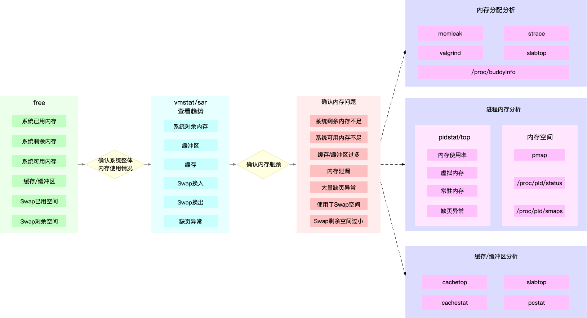

图中列出了最常用的几个内存工具，和相关的分析流程。其中，箭头表示分析的方向，下面列举几个例子进行说明:

- 例1：

当你通过free，发现大部分内存都被缓存占用后，可以使用vmstat或者sar观察一下缓存的变化趋势，确认缓存的使用是否还在继续增大。

如果继续增大，则说明导致缓存升高的进程还在运行，那你就能用缓存/缓冲区分析工具（比如cachetop、slabtop等），分析这些缓存到底被哪里占用。

- 例2:

当你free一下，发现系统可用内存不足时，首先要确认内存是否被缓存/缓冲区占用。排除缓存/缓冲区后，你可以继续用pidstat或者top，定位占用内存最多的进程。

找出进程后，再通过进程内存空间工具（比如pmap），分析进程地址空间中内存的使用情况就可以了。

- 例3:

当你通过vmstat或者sar发现内存在不断增长后，可以分析中是否存在内存泄漏的问题。

比如你可以使用内存分配分析工具 memleak ，检查是否存在内存泄漏。如果存在内存泄漏问题，memleak会为你输出内存泄漏的进程以及调用堆栈


### 内存性能优化思路

- 最好禁止 Swap。如果必须开启Swap，降低swappiness的值，减少内存回收时Swap的使用倾向。

- 减少内存的动态分配。比如，可以使用内存池、大页（HugePage）等。

- 尽量使用缓存和缓冲区来访问数据。比如，可以使用堆栈明确声明内存空间，来存储需要缓存的数据；或者用Redis 这类的外部缓存组件，优化数据的访问。

- 使用cgroups等方式限制进程的内存使用情况。这样，可以确保系统内存不会被异常进程耗尽。

- 通过 /proc/pid/oom_adj ，调整核心应用的oom_score。这样，可以保证即使内存紧张，核心应用也不会被OOM杀死。

### 内存性能分析案例

## 系统篇: 系统I/O性能分析

### 系统I/O性能指标

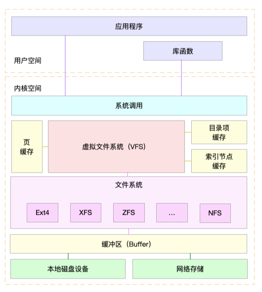

我们要区分开文件系统和磁盘，分别用不同指标来描述它们的性能。


```markmap
# I/O性能指标

## 文件系统

- 存储空间容量、使用量以及剩余空间
- 索引节点容量、使用量以及剩余量
- 缓存
  - 页缓存
  - 目录项缓存
  - 索引节点缓存
- IOPS(文件I/O)
- 响应时间(延迟)
- 吞吐量(B/s)

## 磁盘

- 使用率
- IOPS
- 吞吐量(B/s)
- 响应时间(延迟)
- 缓冲区
- 相关因素
  - 读写类型(如顺序/随机)
  - 读写比例
  - 读写大小
  - 存储类型(如RAID级别、本地还是网络)

```

#### 文件系统I/O性能指标

- 存储空间使用情况

包括容量、使用量以及剩余空间等。我们通常也称这些为磁盘空间的使用量，因为文件系统的数据最终还是存储在磁盘上

不过要注意，这些只是文件系统向外展示的空间使用，而非在磁盘空间的真实用量，因为文件系统的元数据也会占用磁盘空间。

而且，如果你配置了 RAID，从文件系统看到的使用量跟实际磁盘的占用空间，也会因为 RAID 级别的不同而不一样。比方说，配置 RAID10 后，你从文件系统最多也只能看到所有磁盘容量的一半。

- 索引节点使用情况

也包括容量、使用量以及剩余量等三个指标。如果文件系统中存储过多的小文件，就可能碰到索引节点容量已满的问题。

- 缓存使用情况

包括页缓存、目录项缓存、索引节点缓存以及各个具体文件系统（如 ext4、XFS 等）的缓存。这些缓存会使用速度更快的内存，用来临时存储文件数据或者文件系统的元数据，从而可以减少访问慢速磁盘的次数。

- 文件 I/O

包括 IOPS（包括 r/s 和 w/s）、响应时间（延迟）以及吞吐量（B/s）等。在考察这类指标时，通常还要考虑实际文件的读写情况。比如，结合文件大小、文件数量、I/O 类型等，综合分析文件 I/O 的性能。

>Linux 文件系统并没提供，直接查看这些指标的方法。我们只能通过系统调用、动态跟踪或者基准测试等方法，间接进行观察、评估。

不过，实际上，这些指标在我们考察磁盘性能时更容易见到，因为 Linux 为磁盘性能提供了更详细的数据。


#### 磁盘I/O性能指标

- 使用率

指磁盘忙处理I/O请求的百分比。过高的使用率（比如超过60%）通常意味着磁盘I/O存在性能瓶颈

- IOPS（Input/Output Per Second）

每秒的 I/O 请求数。

- 吞吐量

每秒的 I/O 请求大小

- 响应时间

从发出 I/O 请求到收到响应的间隔时间。

- 缓冲区（Buffer）

经常出现在内存和磁盘问题的分析中。

>考察这些指标时，一定要注意综合 I/O 的具体场景来分析，比如读写类型（顺序还是随机）、读写比例、读写大小、存储类型（有无RAID以及RAID级别、本地存储还是网络存储）等。

>不过，这里有个大忌，就是把不同场景的 I/O 性能指标，直接进行分析对比。这是很常见的一个误区，你一定要避免。


### 系统I/O性能分析工具

根据指标找工具

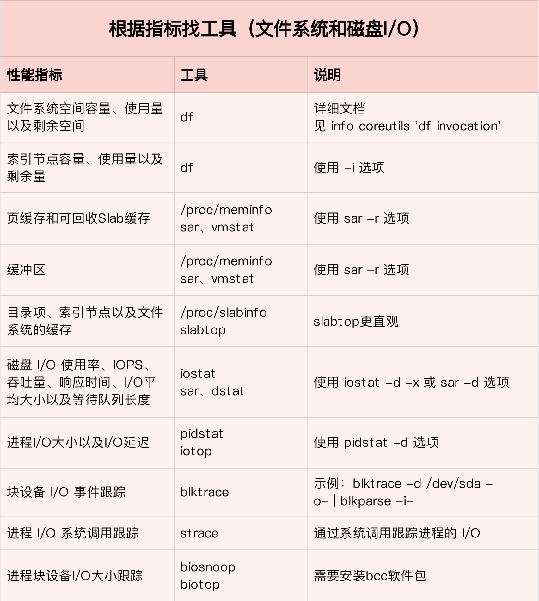

根据工具查指标

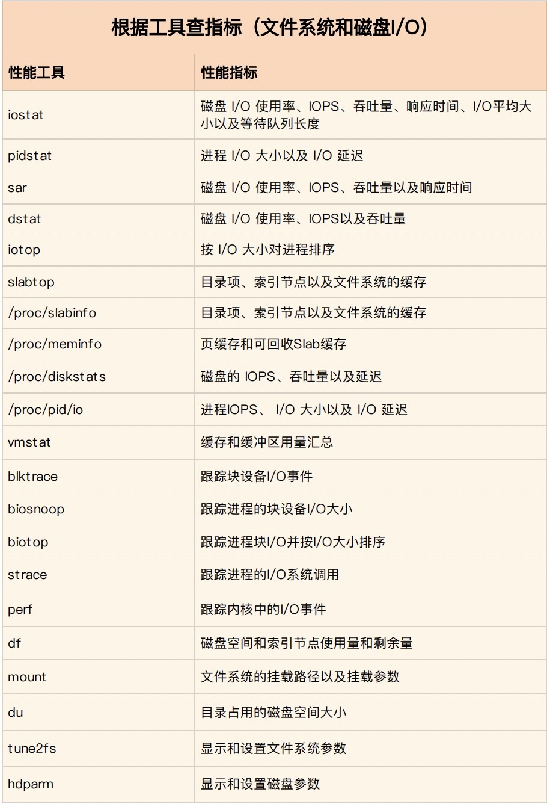


### 系统I/O性能瓶颈定位

从I/O 角度来分析，最开始的分析思路基本上类似，都是：

- 先用 iostat 发现磁盘 I/O 性能瓶颈；

- 再借助 pidstat ，定位出导致瓶颈的进程；

- 随后分析进程的 I/O 行为；

- 最后，结合应用程序的原理，分析这些 I/O 的来源。

所以，为了缩小排查范围，可以先运行那几个支持指标较多的工具，如 iostat、vmstat、pidstat 等。然后再根据观察到的现象，结合系统和应用程序的原理，寻找下一步的分析方向。

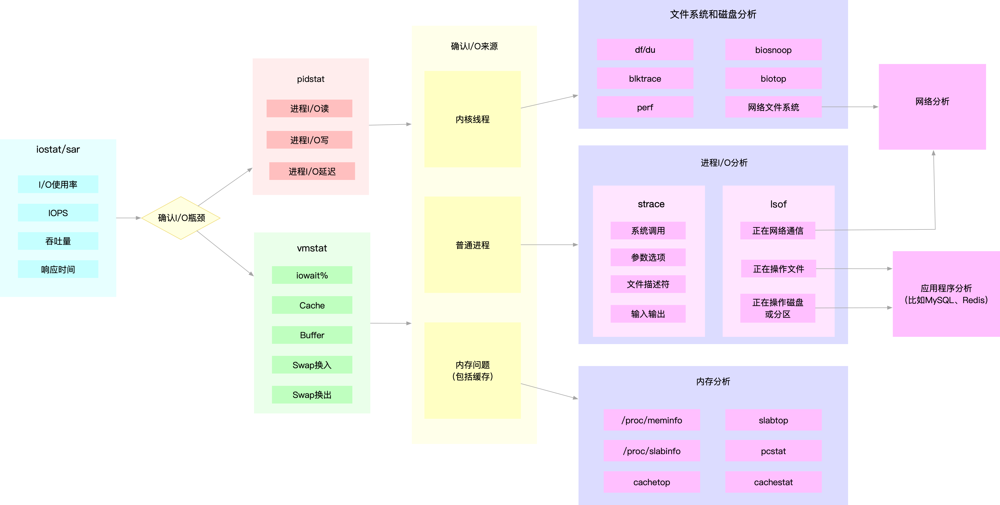

图中列出了最常用的几个文件系统和磁盘 I/O 性能分析工具，以及相应的分析流程，箭头则表示分析方向。这其中，iostat、vmstat、pidstat 是最核心的几个性能工具，它们也提供了最重要的 I/O 性能指标。以下列举案例说明:

- MySQL 和 Redis 案例中，我们就是通过 iostat 确认磁盘出现 I/O 性能瓶颈，然后用 pidstat 找出 I/O 最大的进程，接着借助 strace 找出该进程正在读写的文件，最后结合应用程序的原理，找出大量 I/O 的原因。

- 当你用 iostat 发现磁盘有 I/O 性能瓶颈后，再用 pidstat 和 vmstat 检查，可能会发现 I/O 来自内核线程，如 Swap 使用大量升高。这种情况下，你就得进行内存分析了，先找出占用大量内存的进程，再设法减少内存的使用。

### 系统I/O性能优化思路

#### I/O基准测试

优化前,应当确认清楚I/O 性能优化的目标,换句话说，需要确认观察的这些I/O 性能指标（比如 IOPS、吞吐量、延迟等）的目标值

为了更客观合理地评估优化效果，首先应该对磁盘和文件系统进行基准测试，得到文件系统或者磁盘 I/O 的极限性能。

基准测试工具: [fio（Flexible I/O Tester）](https://github.com/axboe/fio)   安装及使用教程参见 [Linux](../../deploy/environment/linux.md)


得到 I/O 基准测试报告后，再结合性能分析套路，就能够找出 I/O 的性能瓶颈并进行优化

从应用程序、文件系统以及磁盘角度，分别看看 I/O 性能优化的基本思路 可以结合Linux 系统的 I/O 栈图来辅助理解


#### 应用程序优化

应用程序处于整个 I/O 栈的最上端，它可以通过系统调用，来调整 I/O 模式（如顺序还是随机、同步还是异步）， 同时，它也是 I/O 数据的最终来源。在我看来，可以有这么几种方式来优化应用程序的 I/O 性能。

- 可以用追加写代替随机写，减少寻址开销，加快 I/O 写的速度。

- 可以借助缓存 I/O ，充分利用系统缓存，降低实际 I/O 的次数。

- 可以在应用程序内部构建自己的缓存，或者用 Redis 这类外部缓存系统。这样，一方面，能在应用程序内部，控制缓存的数据和生命周期；另一方面，也能降低其他应用程序使用缓存对自身的影响。

比如，在前面的 MySQL 案例中，我们已经见识过，只是因为一个干扰应用清理了系统缓存，就会导致 MySQL 查询有数百倍的性能差距（0.1s vs 15s）。

再如， C 标准库提供的 fopen、fread 等库函数，都会利用标准库的缓存，减少磁盘的操作。而你直接使用 open、read 等系统调用时，就只能利用操作系统提供的页缓存和缓冲区等，而没有库函数的缓存可用。

- 在需要频繁读写同一块磁盘空间时，可以用 mmap 代替 read/write，减少内存的拷贝次数。

- 在需要同步写的场景中，尽量将写请求合并，而不是让每个请求都同步写入磁盘，即可以用 fsync() 取代 O_SYNC。

- 在多个应用程序共享相同磁盘时，为了保证 I/O 不被某个应用完全占用，推荐你使用 cgroups 的 I/O 子系统，来限制进程 / 进程组的 IOPS 以及吞吐量。

- 在使用 CFQ 调度器时，可以用 ionice 来调整进程的 I/O 调度优先级，特别是提高核心应用的 I/O 优先级。ionice 支持三个优先级类：Idle、Best-effort 和 Realtime。其中， Best-effort 和 Realtime 还分别支持 0-7 的级别，数值越小，则表示优先级别越高。

#### 文件系统优化

应用程序访问普通文件时，实际是由文件系统间接负责，文件在磁盘中的读写。所以，跟文件系统中相关的也有很多优化 I/O 性能的方式。

- 你可以根据实际负载场景的不同，选择最适合的文件系统。比如Ubuntu 默认使用 ext4 文件系统，而 CentOS 7 默认使用 xfs 文件系统。

相比于 ext4 ，xfs 支持更大的磁盘分区和更大的文件数量，如 xfs 支持大于16TB 的磁盘。但是 xfs 文件系统的缺点在于无法收缩，而 ext4 则可以。

- 在选好文件系统后，还可以进一步优化文件系统的配置选项，包括文件系统的特性（如ext_attr、dir_index）、日志模式（如journal、ordered、writeback）、挂载选项（如noatime）等等。

  - 比如， 使用tune2fs 这个工具，可以调整文件系统的特性（tune2fs 也常用来查看文件系统超级块的内容）。 而通过 /etc/fstab ，或者 mount 命令行参数，我们可以调整文件系统的日志模式和挂载选项等。

- 可以优化文件系统的缓存。

  - 比如，你可以优化 pdflush 脏页的刷新频率（比如设置 dirty_expire_centisecs 和 dirty_writeback_centisecs）以及脏页的限额（比如调整 dirty_background_ratio 和 dirty_ratio等）。

  - 再如，你还可以优化内核回收目录项缓存和索引节点缓存的倾向，即调整 vfs_cache_pressure（/proc/sys/vm/vfs_cache_pressure，默认值100），数值越大，就表示越容易回收。

- 在不需要持久化时，你还可以用内存文件系统 tmpfs，以获得更好的 I/O性能 。tmpfs 把数据直接保存在内存中，而不是磁盘中。比如 /dev/shm/ ，就是大多数 Linux 默认配置的一个内存文件系统，它的大小默认为总内存的一半。

#### 磁盘优化

数据的持久化存储，最终还是要落到具体的物理磁盘中，同时，磁盘也是整个 I/O 栈的最底层。从磁盘角度出发，自然也有很多有效的性能优化方法。

- 最简单有效的优化方法，就是换用性能更好的磁盘，比如用 SSD 替代 HDD。

- 我们可以使用 RAID ，把多块磁盘组合成一个逻辑磁盘，构成冗余独立磁盘阵列。这样做既可以提高数据的可靠性，又可以提升数据的访问性能。

- 针对磁盘和应用程序 I/O 模式的特征，我们可以选择最适合的 I/O 调度算法。比方说，SSD 和虚拟机中的磁盘，通常用的是 noop 调度算法。而数据库应用，我更推荐使用 deadline 算法。

- 我们可以对应用程序的数据，进行磁盘级别的隔离。比如，我们可以为日志、数据库等 I/O 压力比较重的应用，配置单独的磁盘。

- 在顺序读比较多的场景中，我们可以增大磁盘的预读数据，比如，你可以通过下面两种方法，调整 /dev/sdb 的预读大小。

  - 调整内核选项 /sys/block/sdb/queue/read_ahead_kb，默认大小是 128 KB，单位为KB。

  - 使用 blockdev 工具设置，比如 blockdev –setra 8192 /dev/sdb，注意这里的单位是 512B（0.5KB），所以它的数值总是 read_ahead_kb 的两倍。

- 我们可以优化内核块设备 I/O 的选项。比如，可以调整磁盘队列的长度 /sys/block/sdb/queue/nr_requests，适当增大队列长度，可以提升磁盘的吞吐量（当然也会导致 I/O 延迟增大）。

- 要注意，磁盘本身出现硬件错误，也会导致 I/O 性能急剧下降，所以发现磁盘性能急剧下降时，你还需要确认，磁盘本身是不是出现了硬件错误。

  - 比如，你可以查看 dmesg 中是否有硬件 I/O 故障的日志。 还可以使用 badblocks、smartctl等工具，检测磁盘的硬件问题，或用 e2fsck 等来检测文件系统的错误。如果发现问题，你可以使用 fsck 等工具来修复

## 系统篇: 网络性能分析

### 网络性能指标

- 带宽

链路的最大传输速率，单位是 b/s（比特/秒）。在你为服务器选购网卡时，带宽就是最核心的参考指标。常用的带宽有 1000M、10G、40G、100G 等。

- 吞吐量

没有丢包时的最大数据传输速率，单位通常为 b/s （比特/秒）或者 B/s（字节/秒）。吞吐量受带宽的限制，吞吐量/带宽也就是该网络链路的使用率。

- 延时

从网络请求发出后，一直到收到远端响应，所需要的时间延迟。这个指标在不同场景中可能会有不同的含义。它可以表示建立连接需要的时间（比如 TCP 握手延时），或者一个数据包往返所需时间（比如 RTT）。

- PPS

Packet Per Second（包/秒）的缩写，表示以网络包为单位的传输速率。PPS 通常用来评估网络的转发能力，而基于 Linux 服务器的转发，很容易受到网络包大小的影响（交换机通常不会受到太大影响，即交换机可以线性转发）。


这四个指标中，带宽跟物理网卡配置是直接关联的。一般来说，网卡确定后，带宽也就确定了（当然，实际带宽会受限于整个网络链路中最小的那个模块）。

另外，你可能在很多地方听说过“网络带宽测试”，这里测试的实际上不是带宽，而是网络吞吐量。Linux 服务器的网络吞吐量一般会比带宽小，而对交换机等专门的网络设备来说，吞吐量一般会接近带宽

最后的 PPS，则是以网络包为单位的网络传输速率，通常用在需要大量转发的场景中。而对 TCP 或者 Web 服务来说，更多会用并发连接数和每秒请求数（QPS，Query per Second）等指标，它们更能反应实际应用程序的性能

### 网络性能分析工具

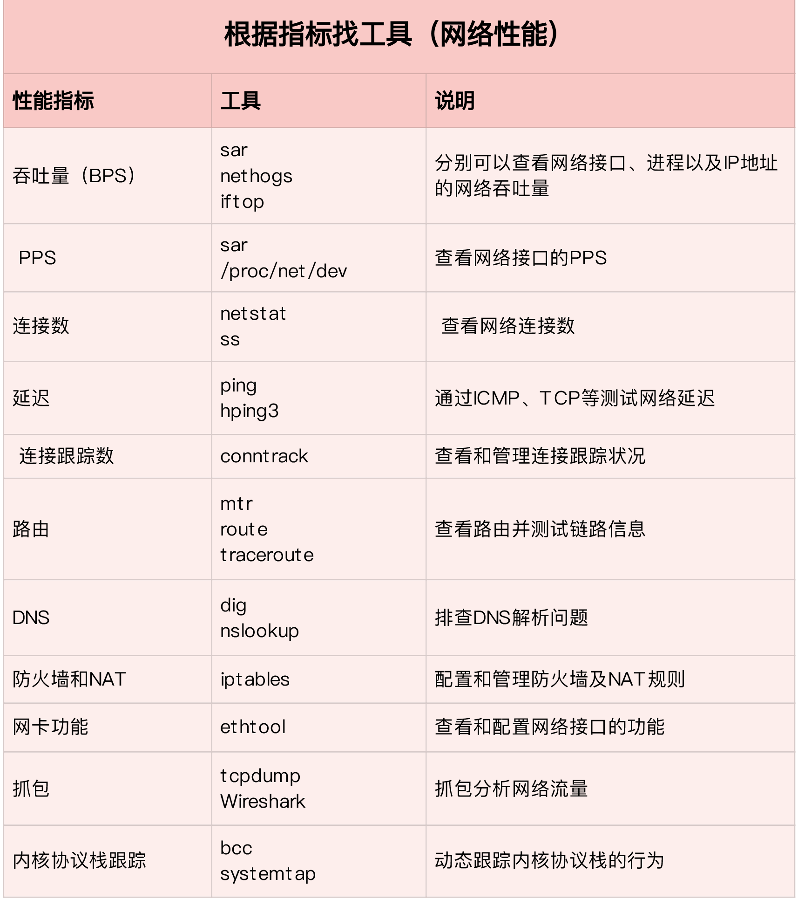

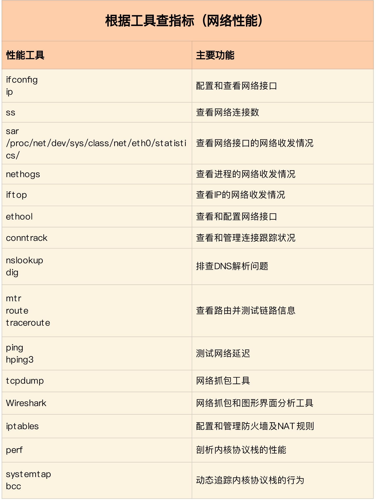

### 网络性能瓶颈定位

### 网络性能优化思路

#### 网络基准测试说明

实际上，虽然网络性能优化的整体目标，是降低网络延迟（如 RTT）和提高吞吐量（如 BPS 和 PPS），==但具体到不同应用中，每个指标的优化标准可能会不同，优先级顺序也大相径庭==。

- 对于NAT 网关来说，由于其直接影响整个数据中心的网络出入性能，所以 NAT 网关通常需要达到或接近线性转发，也就是说， PPS 是最主要的性能目标

- 对于数据库、缓存等系统，快速完成网络收发，即低延迟，是主要的性能目标

- 基于 HTTP 或者 HTTPS 的 Web 应用程序，显然属于应用层，需要同时兼顾吞吐量和延迟, 需要我们测试 HTTP/HTTPS 的性能

- 而对大多数游戏服务器来说，为了支持更大的同时在线人数，通常会基于 TCP 或 UDP ，与客户端进行交互，这时就需要我们测试 TCP/UDP 的性能

- 当然，还有一些场景，是把 Linux 作为一个软交换机或者路由器来用的。这种情况下，你更关注网络包的处理能力（即 PPS），重点关注网络层的转发性能

所以，为了更客观合理地评估优化效果，首先应该明确优化的标准，即要对系统和应用程序进行基准测试，得到网络协议栈各层的基准性能。

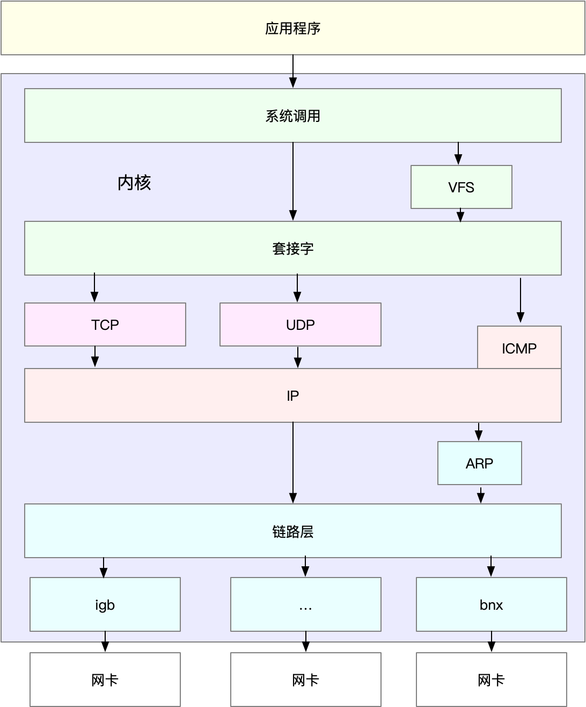

明白了这一点，在进行基准测试时，我们就可以按照协议栈的每一层来测试。由于底层是其上方各层的基础，底层性能也就决定了高层性能。所以我们要清楚，底层性能指标，其实就是对应高层的极限性能。我们从下到上来理解这一点。

首先是网络接口层和网络层，它们主要负责网络包的封装、寻址、路由，以及发送和接收。每秒可处理的网络包数 PPS，就是它们最重要的性能指标（特别是在小包的情况下）。你可以用内核自带的发包工具 pktgen ，来测试 PPS 的性能。

再向上到传输层的 TCP 和 UDP，它们主要负责网络传输。对它们而言，吞吐量（BPS）、连接数以及延迟，就是最重要的性能指标。你可以用 iperf 或 netperf ，来测试传输层的性能。

不过要注意，网络包的大小，会直接影响这些指标的值。所以，通常，你需要测试一系列不同大小网络包的性能。

最后，再往上到了应用层，最需要关注的是吞吐量（BPS）、每秒请求数以及延迟等指标。你可以用 wrk、ab 等工具，来测试应用程序的性能。

不过，这里要注意的是，测试场景要尽量模拟生产环境，这样的测试才更有价值。比如，你可以到生产环境中，录制实际的请求情况，再到测试中回放。

总之，根据这些基准指标，再结合已经观察到的性能瓶颈，我们就可以明确性能优化的目标。

#### 各协议层性能测试

以下所有的测试方法，都需要两台 Linux 虚拟机。其中一台，可以当作待测试的目标机器；而另一台，则可以当作正在运行网络服务的客户端，用来运行测试工具

##### **转发性能**

网络接口层和网络层，它们主要负责网络包的封装、寻址、路由以及发送和接收。

1、测试指标选择

在这两个网络协议层中，每秒可处理的网络包数 PPS，就是最重要的性能指标。特别是 64B 小包的处理能力，值得我们特别关注。那么，如何来测试网络包的处理能力呢？

2、测试工具选择

- 工具1: [hping3 命令](https://wangchujiang.com/linux-command/c/hping3.html)

用途: 可以用于SYN 攻击、测试网络包处理能力等

- 工具2: pktgen 使用详见 [Linux](../../deploy/environment/linux.md)

##### **TCP/UDP 性能**

- 工具1: [iperf](https://wangchujiang.com/linux-command/c/iperf.html) 使用详见 [Linux](../../deploy/environment/linux.md)

- 工具2: netperf

##### **HTTP 性能**

从传输层再往上，到了应用层。有的应用程序，会直接基于 TCP 或 UDP 构建服务。当然，也有大量的应用，基于应用层的协议来构建服务，HTTP 就是最常用的一个应用层协议。比如，常用的 Apache、Nginx 等各种 Web 服务，都是基于 HTTP。


要测试 HTTP 的性能，也有大量的工具可以使用，比如 ab、webbench 等，都是常用的 HTTP 压力测试工具。其中，ab 是 Apache 自带的 HTTP 压测工具，主要测试 HTTP 服务的每秒请求数、请求延迟、吞吐量以及请求延迟的分布情况等。 ab使用详见 [Linux](../../deploy/environment/linux.md)

##### **应用负载性能**

当你用 iperf 或者 ab 等测试工具，得到 TCP、HTTP 等的性能数据后，这些数据是否就能表示应用程序的实际性能呢？我想，你的答案应该是否定的。

比如，你的应用程序基于 HTTP 协议，为最终用户提供一个 Web 服务。这时，使用 ab 工具，可以得到某个页面的访问性能，但这个结果跟用户的实际请求，很可能不一致。因为用户请求往往会附带着各种各种的负载（payload），而这些负载会影响 Web 应用程序内部的处理逻辑，从而影响最终性能。

那么，为了得到应用程序的实际性能，就要求性能工具本身可以模拟用户的请求负载，而iperf、ab 这类工具就无能为力了。幸运的是，我们还可以用 wrk、TCPCopy、Jmeter 或者 LoadRunner 等实现这个目标。

以 wrk 为例，它是一个 HTTP 性能测试工具，内置了 LuaJIT，方便你根据实际需求，生成所需的请求负载，或者自定义响应的处理方法。 使用详见 [Linux](../../deploy/environment/linux.md)


#### 网络性能优化思路

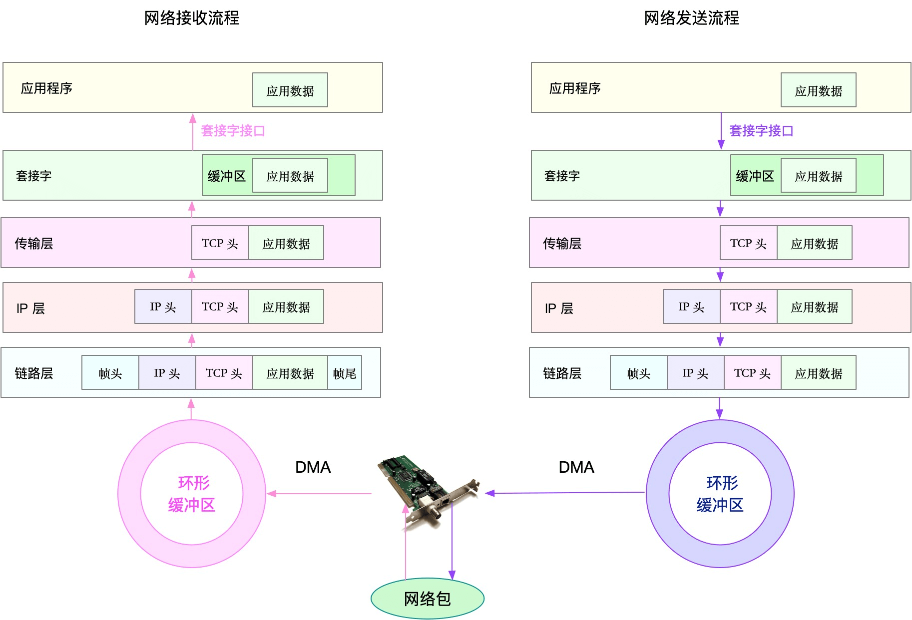


##### 应用程序

应用程序，通常通过套接字接口进行网络操作。由于网络收发通常比较耗时，所以应用程序的优化，主要就是对网络 I/O 和进程自身的工作模型的优化。

从网络 I/O 的角度来说，主要有下面两种优化思路。

- 第一种是最常用的 I/O 多路复用技术 epoll，主要用来取代 select 和 poll。这其实是解决 C10K 问题的关键，也是目前很多网络应用默认使用的机制。

- 第二种是使用异步 I/O（Asynchronous I/O，AIO）。AIO 允许应用程序同时发起很多 I/O 操作，而不用等待这些操作完成。等到 I/O完成后，系统会用事件通知的方式，告诉应用程序结果。不过，AIO 的使用比较复杂，你需要小心处理很多边缘情况。

而从进程的工作模型来说，也有两种不同的模型用来优化。

- 第一种，主进程+多个 worker 子进程。其中，主进程负责管理网络连接，而子进程负责实际的业务处理。这也是最常用的一种模型。

- 第二种，监听到相同端口的多进程模型。在这种模型下，所有进程都会监听相同接口，并且开启 SO_REUSEPORT 选项，由内核负责，把请求负载均衡到这些监听进程中去。

除了网络 I/O 和进程的工作模型外，应用层的网络协议优化，也是至关重要的一点。我总结了常见的几种优化方法。

- 使用长连接取代短连接，可以显著降低 TCP 建立连接的成本。在每秒请求次数较多时，这样做的效果非常明显。

- 使用内存等方式，来缓存不常变化的数据，可以降低网络 I/O 次数，同时加快应用程序的响应速度。

- 使用 Protocol Buffer 等序列化的方式，压缩网络 I/O 的数据量，可以提高应用程序的吞吐。

- 使用 DNS 缓存、预取、HTTPDNS 等方式，减少 DNS 解析的延迟，也可以提升网络 I/O 的整体速度。

##### 套接字

套接字可以屏蔽掉 Linux 内核中不同协议的差异，为应用程序提供统一的访问接口。每个套接字，都有一个读写缓冲区。

- 读缓冲区，缓存了远端发过来的数据。如果读缓冲区已满，就不能再接收新的数据。

- 写缓冲区，缓存了要发出去的数据。如果写缓冲区已满，应用程序的写操作就会被阻塞。

所以，为了提高网络的吞吐量，你通常需要调整这些缓冲区的大小。比如：

- 增大每个套接字的缓冲区大小 net.core.optmem_max；

- 增大套接字接收缓冲区大小 net.core.rmem_max 和发送缓冲区大小 net.core.wmem_max；

- 增大 TCP 接收缓冲区大小 net.ipv4.tcp_rmem 和发送缓冲区大小 net.ipv4.tcp_wmem。

至于套接字的内核选项，我把它们整理成了一个表格，方便你在需要时参考：

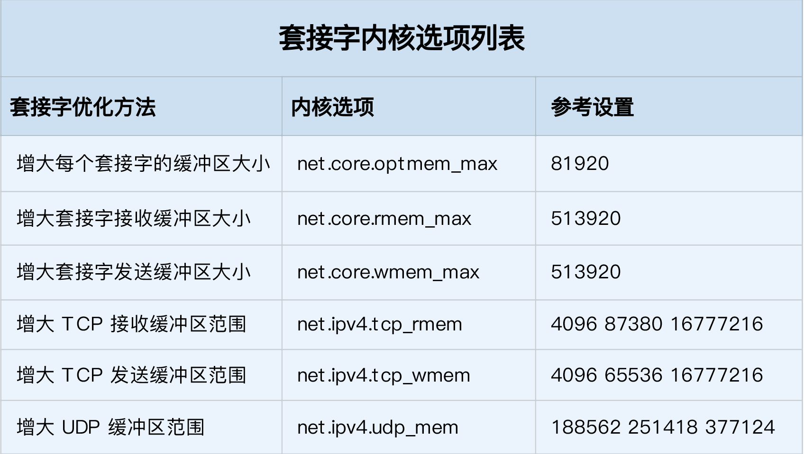

注意事项:

- tcp_rmem 和 tcp_wmem 的三个数值分别是 min，default，max，系统会根据这些设置，自动调整TCP接收/发送缓冲区的大小。

- udp_mem 的三个数值分别是 min，pressure，max，系统会根据这些设置，自动调整UDP发送缓冲区的大小。

当然，表格中的数值只提供参考价值，具体应该设置多少，还需要你根据实际的网络状况来确定。比如，发送缓冲区大小，理想数值是吞吐量*延迟，这样才可以达到最大网络利用率。

除此之外，套接字接口还提供了一些配置选项，用来修改网络连接的行为：

- 为 TCP 连接设置 TCP_NODELAY 后，就可以禁用 Nagle 算法；

- 为 TCP 连接开启 TCP_CORK 后，可以让小包聚合成大包后再发送（注意会阻塞小包的发送）；

- 使用 SO_SNDBUF 和 SO_RCVBUF ，可以分别调整套接字发送缓冲区和接收缓冲区的大小。

##### 传输层

传输层最重要的是 TCP 和 UDP 协议，所以这儿的优化，其实主要就是对这两种协议的优化。

1、**TCP协议优化**

TCP 提供了面向连接的可靠传输服务。要优化 TCP，我们首先要掌握 TCP 协议的基本原理，比如流量控制、慢启动、拥塞避免、延迟确认以及状态流图（如下图所示）等。

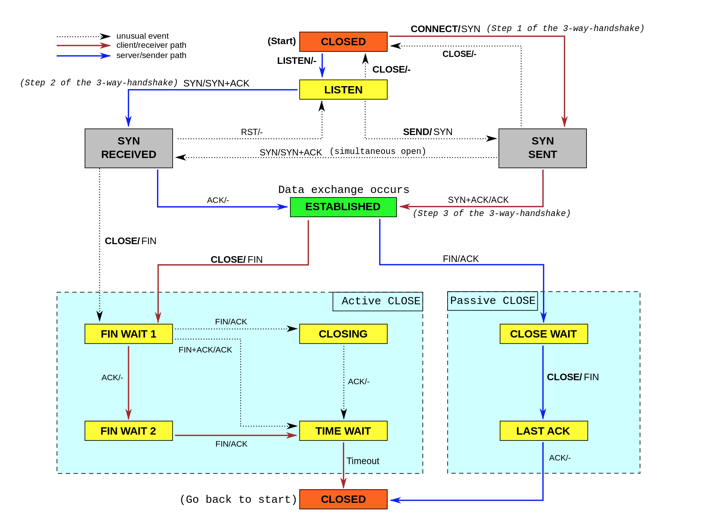

下面分几类情况详细说明:

第一类，在请求数比较大的场景下，你可能会看到大量处于 TIME_WAIT 状态的连接，它们会占用大量内存和端口资源。这时，我们可以优化与 TIME_WAIT 状态相关的内核选项，比如采取下面几种措施。

- 增大处于 TIME_WAIT 状态的连接数量 net.ipv4.tcp_max_tw_buckets ，并增大连接跟踪表的大小 net.netfilter.nf_conntrack_max。

- 减小 net.ipv4.tcp_fin_timeout 和 net.netfilter.nf_conntrack_tcp_timeout_time_wait ，让系统尽快释放它们所占用的资源。

- 开启端口复用 net.ipv4.tcp_tw_reuse。这样，被 TIME_WAIT 状态占用的端口，还能用到新建的连接中。

- 增大本地端口的范围 net.ipv4.ip_local_port_range 。这样就可以支持更多连接，提高整体的并发能力。

- 增加最大文件描述符的数量。你可以使用 fs.nr_open 和 fs.file-max ，分别增大进程和系统的最大文件描述符数；或在应用程序的 systemd 配置文件中，配置 LimitNOFILE ，设置应用程序的最大文件描述符数。

第二类，为了缓解 SYN FLOOD 等，利用 TCP 协议特点进行攻击而引发的性能问题，你可以考虑优化与 SYN 状态相关的内核选项，比如采取下面几种措施。

- 增大 TCP 半连接的最大数量 net.ipv4.tcp_max_syn_backlog ，或者开启 TCP SYN Cookies net.ipv4.tcp_syncookies ，来绕开半连接数量限制的问题（注意，这两个选项不可同时使用）。

- 减少 SYN_RECV 状态的连接重传 SYN+ACK 包的次数 net.ipv4.tcp_synack_retries。

第三类，在长连接的场景中，通常使用 Keepalive 来检测 TCP 连接的状态，以便对端连接断开后，可以自动回收。但是，系统默认的 Keepalive 探测间隔和重试次数，一般都无法满足应用程序的性能要求。所以，这时候你需要优化与 Keepalive 相关的内核选项，比如：

- 缩短最后一次数据包到 Keepalive 探测包的间隔时间 net.ipv4.tcp_keepalive_time；

- 缩短发送 Keepalive 探测包的间隔时间 net.ipv4.tcp_keepalive_intvl；

- 减少Keepalive 探测失败后，一直到通知应用程序前的重试次数 net.ipv4.tcp_keepalive_probes。

以下是关于TCP优化方法的整理表格（数值仅供参考，具体配置还要结合你的实际场景来调整）：

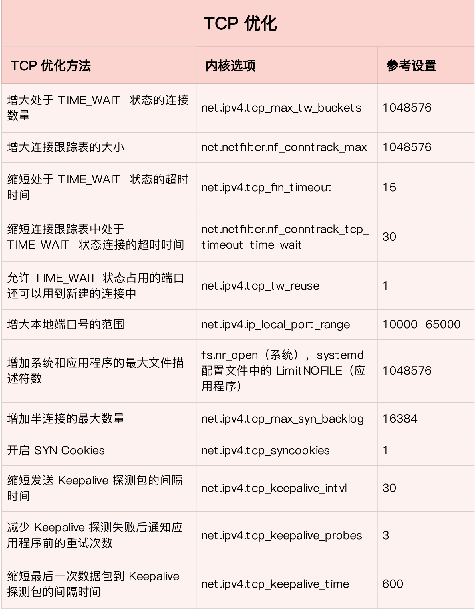

注意事项:

优化 TCP 性能时，你还要注意, 如果同时使用不同优化方法，可能会产生冲突。

比如，就像网络请求延迟的案例中我们曾经分析过的，服务器端开启 Nagle 算法，而客户端开启延迟确认机制，就很容易导致网络延迟增大。

另外，在使用 NAT 的服务器上，如果开启 net.ipv4.tcp_tw_recycle ，就很容易导致各种连接失败。实际上，由于坑太多，这个选项在内核的 4.1 版本中已经删除了。

2、**UDP协议优化**

UDP 提供了面向数据报的网络协议，它不需要网络连接，也不提供可靠性保障。所以，UDP 优化，相对于 TCP 来说，要简单得多。

以下总结一些常见的优化方案:

跟套接字部分提到的一样，增大套接字缓冲区大小以及 UDP 缓冲区范围；

跟前面 TCP 部分提到的一样，增大本地端口号的范围；

根据 MTU 大小，调整 UDP 数据包的大小，减少或者避免分片的发生。

##### 网络层

网络层，负责网络包的封装、寻址和路由，包括 IP、ICMP 等常见协议。在网络层，最主要的优化，其实就是对路由、 IP 分片以及 ICMP 等进行调优。

第一种，从路由和转发的角度出发，你可以调整下面的内核选项。

- 在需要转发的服务器中，比如用作 NAT 网关的服务器或者使用 Docker 容器时，开启 IP 转发，即设置 net.ipv4.ip_forward = 1。

- 调整数据包的生存周期 TTL，比如设置 net.ipv4.ip_default_ttl = 64。注意，增大该值会降低系统性能。

- 开启数据包的反向地址校验，比如设置 net.ipv4.conf.eth0.rp_filter = 1。这样可以防止 IP 欺骗，并减少伪造 IP 带来的 DDoS 问题。

第二种，从分片的角度出发，最主要的是调整 MTU（Maximum Transmission Unit）的大小。

通常，MTU 的大小应该根据以太网的标准来设置。以太网标准规定，一个网络帧最大为 1518B，那么去掉以太网头部的 18B 后，剩余的 1500 就是以太网 MTU 的大小。

在使用 VXLAN、GRE 等叠加网络技术时，要注意，网络叠加会使原来的网络包变大，导致 MTU 也需要调整。

比如，就以 VXLAN 为例，它在原来报文的基础上，增加了 14B 的以太网头部、 8B 的 VXLAN 头部、8B 的 UDP 头部以及 20B 的 IP 头部。换句话说，每个包比原来增大了 50B。

所以，我们就需要把交换机、路由器等的 MTU，增大到 1550， 或者把 VXLAN 封包前（比如虚拟化环境中的虚拟网卡）的 MTU 减小为 1450。

另外，现在很多网络设备都支持巨帧，如果是这种环境，你还可以把 MTU 调大为 9000，以提高网络吞吐量。

第三种，从 ICMP 的角度出发，为了避免 ICMP 主机探测、ICMP Flood 等各种网络问题，你可以通过内核选项，来限制 ICMP 的行为。

- 比如，你可以禁止 ICMP 协议，即设置 net.ipv4.icmp_echo_ignore_all = 1。这样，外部主机就无法通过 ICMP 来探测主机。

- 或者，你还可以禁止广播 ICMP，即设置 net.ipv4.icmp_echo_ignore_broadcasts = 1。

##### 链路层

链路层负责网络包在物理网络中的传输，比如 MAC 寻址、错误侦测以及通过网卡传输网络帧等。自然，链路层的优化，也是围绕这些基本功能进行的。接下来，我们从不同的几个方面分别来看。

由于网卡收包后调用的中断处理程序（特别是软中断），需要消耗大量的 CPU。所以，将这些中断处理程序调度到不同的 CPU 上执行，就可以显著提高网络吞吐量。这通常可以采用下面两种方法。

- 比如，你可以为网卡硬中断配置 CPU 亲和性（smp_affinity），或者开启 irqbalance 服务。

- 再如，你可以开启 RPS（Receive Packet Steering）和 RFS（Receive Flow Steering），将应用程序和软中断的处理，调度到相同CPU 上，这样就可以增加 CPU 缓存命中率，减少网络延迟。

另外，现在的网卡都有很丰富的功能，原来在内核中通过软件处理的功能，可以卸载到网卡中，通过硬件来执行。

- **TSO**（TCP Segmentation Offload）和 UFO（UDP Fragmentation Offload）：在 TCP/UDP 协议中直接发送大包；而TCP 包的分段（按照 MSS 分段）和 UDP 的分片（按照 MTU 分片）功能，由网卡来完成 。

- **GSO**（Generic Segmentation Offload）：在网卡不支持 TSO/UFO 时，将 TCP/UDP 包的分段，延迟到进入网卡前再执行。这样，不仅可以减少 CPU 的消耗，还可以在发生丢包时只重传分段后的包。

- **LRO**（Large Receive Offload）：在接收 TCP 分段包时，由网卡将其组装合并后，再交给上层网络处理。不过要注意，在需要 IP 转发的情况下，不能开启 LRO，因为如果多个包的头部信息不一致，LRO 合并会导致网络包的校验错误。

- **GRO**（Generic Receive Offload）：GRO 修复了 LRO 的缺陷，并且更为通用，同时支持 TCP 和 UDP。

- **RSS**（Receive Side Scaling）：也称为多队列接收，它基于硬件的多个接收队列，来分配网络接收进程，这样可以让多个 CPU 来处理接收到的网络包。

- **VXLAN** 卸载：也就是让网卡来完成 VXLAN 的组包功能。

最后，对于网络接口本身，也有很多方法，可以优化网络的吞吐量。

- 比如，你可以开启网络接口的多队列功能。这样，每个队列就可以用不同的中断号，调度到不同 CPU 上执行，从而提升网络的吞吐量。

- 再如，你可以增大网络接口的缓冲区大小，以及队列长度等，提升网络传输的吞吐量（注意，这可能导致延迟增大）。

- 你还可以使用 Traffic Control 工具，为不同网络流量配置 QoS。

到这里，我就从应用程序、套接字、传输层、网络层，再到链路层，分别介绍了相应的网络性能优化方法。通过这些方法的优化后，网络性能就可以满足绝大部分场景了。

最后，别忘了一种极限场景。还记得我们学过的的 C10M 问题吗？

在单机并发 1000 万的场景中，对Linux 网络协议栈进行的各种优化策略，基本都没有太大效果。因为这种情况下，网络协议栈的冗长流程，其实才是最主要的性能负担。

这时，我们可以用两种方式来优化。

第一种，使用 DPDK 技术，跳过内核协议栈，直接由用户态进程用轮询的方式，来处理网络请求。同时，再结合大页、CPU 绑定、内存对齐、流水线并发等多种机制，优化网络包的处理效率。

第二种，使用内核自带的 XDP 技术，在网络包进入内核协议栈前，就对其进行处理，这样也可以实现很好的性能。


#### 总结

在优化网络的性能时，我们可以结合 Linux 系统的网络协议栈和网络收发流程，从应用程序、套接字、传输层、网络层再到链路层等，对每个层次进行逐层优化。

实际上，在分析和定位网络瓶颈时，也是基于这些网络层进行的。而定位出网络性能瓶颈后，就可以根据瓶颈所在的协议层，进行优化。具体而言：

- 在应用程序中，主要是优化 I/O 模型、工作模型以及应用层的网络协议；

- 在套接字层中，主要是优化套接字的缓冲区大小；

- 在传输层中，主要是优化 TCP 和 UDP 协议；

- 在网络层中，主要是优化路由、转发、分片以及 ICMP 协议；

- 最后，在链路层中，主要是优化网络包的收发、网络功能卸载以及网卡选项。

如果这些方法依然不能满足你的要求，那就可以考虑，使用 DPDK 等用户态方式，绕过内核协议栈；或者，使用 XDP，在网络包进入内核协议栈前进行处理。


## 参考资料

- [Linux性能优化实战_Linux_性能调优-极客时间](https://time.geekbang.org/column/intro/140)

- [我认知中的营销活动及其系统 | 人人都是产品经理](https://www.woshipm.com/marketing/5373629.html)